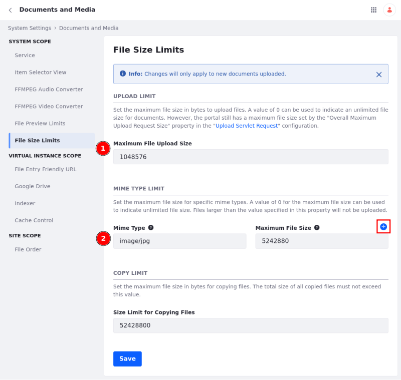
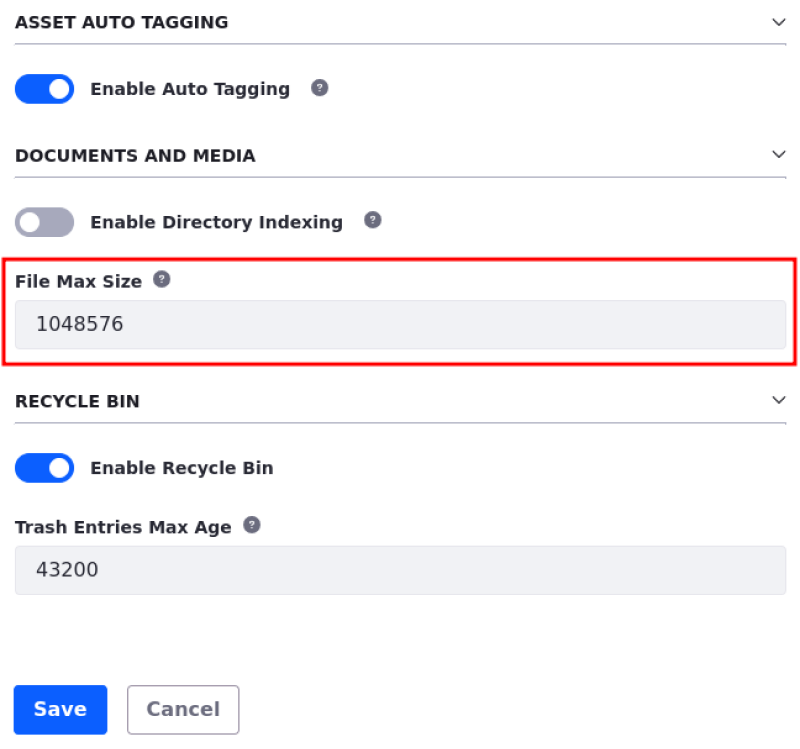

---
taxonomy-category-names:
- Digital Asset Management
- Documents and Media
- Liferay Self-Hosted
- Liferay PaaS
- Liferay SaaS
uuid: df97d97c-2c02-496a-b67b-754cd5bdf120
---

# Limiting File Size

You can configure file size limits in Documents and Media. Set a maximum file upload size or for more granularity, define file size limits based on [MIME Types](https://developer.mozilla.org/en-US/docs/Web/HTTP/Basics_of_HTTP/MIME_types). This can take effect across various scopes: system, instance, specific sites, and asset libraries.

## Limiting File Size at the System and Instance Levels

1. Open the *Global Menu* (), go to the *Control Panel* tab, and click *Instance Settings* under Configuration.

   If you have a standalone (i.e., non-Cloud) installation, you can set system-level settings. Click *System Settings* under Configuration instead and follow the remaining steps.

   !!! note
       The system-level file size limit overrides the instance-level limit. Similarly, limits set in higher scopes override those set in lower scopes, such as asset libraries.

1. Click *Documents and Media* under Content and Data.

1. Select *File Size Limits* under System Scope.

1. You can set the Upload Limit and the MIME Type limit for the system and instance.

## Limiting File Size in a Specific Site

1. Navigate to the site, open the *Site Menu* (), expand *Configuration*, and go to *Site Settings*.

1. Click *Documents and Media* under Content and Data.

1. Select *File Size Limits* under System Scope.

1. You can set the Upload Limit (1) and the MIME Type limit (2) for the site.

## Limiting File Size in a Specific Asset Library

1. Open the *Global Menu* (), go to the *Applications* tab, and click *Asset Libraries* under Content.

1. Open the Asset Library you want to configure.

1. Select *Asset Library Settings*.

1. In the General tab, you can set the File Max Size for the asset library under Documents and Media.

## Setting the Maximum File Upload Size

For all scopes, you can set a maximum file upload size in bytes.

1. Follow the steps above to navigate to the relevant settings based on the scope.

1. Set the *Maximum File Upload Size* option for system, instance, and sites levels, or the *File Max Size* option for asset libraries.

   Set this value to `0` to allow unlimited file size for documents.

   !!! important
       The portal has a maximum file size set by the Overall Maximum Upload Request Size property in the Upload Servlet Request. The default value is `104857600` bytes (100 MB).

       To change this value, open the *Global Menu*, go to the *Control Panel*, and click *System Settings*. Under Platform, select *Infrastructure*, then click *Upload Servlet Request*. Update the *Overall Maximum Upload Request Size* field and save the new value.

## Setting a MIME Type Limit

For system, instance, and site scopes, you can set a maximum file size for specific MIME Types.

1. Use the instructions in  to navigate to the relevant settings based on the scope.

1. In the MIME Type field, add the MIME Type you want to restrict (e.g., `image/png`), and set the maximum file size for that MIME Type.

   Set this value to `0` to allow unlimited file size for documents.

   !!! important
       Ensure that the MIME Types are supported and configured under System Settings &rarr; Documents and Media &rarr; Service under System Scope.

1. To add restrictions for other MIME Types, click *Add* () next to the Maximum File Size field and repeat the previous step.

## Related Topics

- [File Storage](../../../system-administration/file-storage.md)
- [Managing Files](./managing-files.md)
- [Creating Documents](./creating-documents.md)
