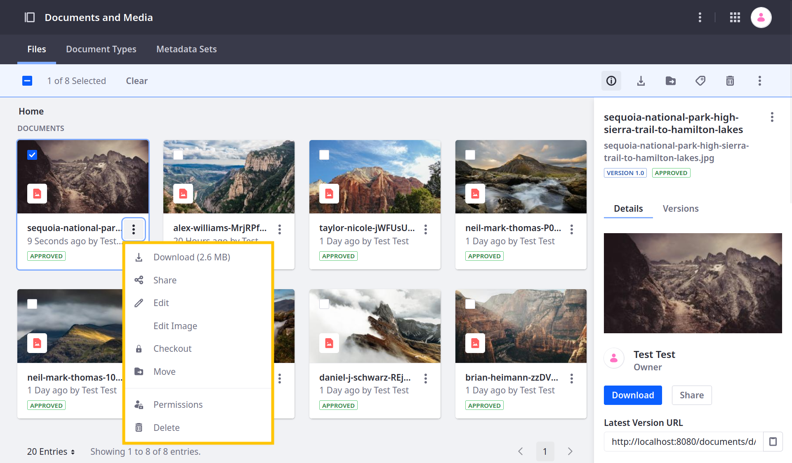

---
taxonomy-category-names:
- Digital Asset Management
- Documents and Media
- Liferay Self-Hosted
- Liferay PaaS
- Liferay SaaS
uuid: 7630fcb9-2bb3-43a5-bfbe-7f41c9f35a3f
---

# Managing Files

Once you've added files to your document library, you can manage them via the Documents and Media UI. To access management actions for a file, select it or click *Actions* () next to it.

| Option                                                                                                 | Description                                                                                                                                                                                                                                                                                                                                           |
| :----------------------------------------------------------------------------------------------------- | :---------------------------------------------------------------------------------------------------------------------------------------------------------------------------------------------------------------------------------------------------------------------------------------------------------------------------------------------------- |
| Checkout/Checkin ( / ) | Check out or check in the file. When you check out a file, only you can make changes to it. When you check in a file, your edits are published and others can edit the file again. See [Managing Document Changes with Checkout](../publishing-and-sharing/managing-document-access/managing-document-changes-with-checkout.md) for more information. |
| Delete ()                                                 | Move the file to the [Recycle Bin](../../recycle-bin/recycle-bin-overview.md).                                                                                                                                                                                                                                                                        |
| Download ()                                              | Download the file to your local machine.                                                                                                                                                                                                                                                                                                              |
| Edit ()                                                          | Edit the file entry. Here you can change the following entry details: the stored file, entry title, file name, description, document type, display page template, tags, categories, expiration date, friendly URL, and related assets. Note that modifying the file increments its version minor.                                                     |
| Edit Image                                                                                             | Open the image editor. See [Editing Images](./editing-images.md) for more information.                                                                                                                                                                                                                                                                |
| Edit Tags ()                                                      | Edit the tags assigned to the selected file. See [Tagging Content and Managing Tags](../../tags-and-categories/tagging-content-and-managing-tags.md) for more information.                                                                                                                                                                            |
| Info ()                                                   | After selecting the file, click the *Info* icon view detailed file information in a side panel. See [Info Panel Reference](#info-panel-reference) for more information.                                                                                                                                                                               |
| Move ()                                                   | Relocate the file to a different folder.                                                                                                                                                                                                                                                                                                              |
| Permissions ()                                     | Manage file permissions for user roles. See [Documents and Media Permissions Reference](../publishing-and-sharing/managing-document-access/documents-and-media-permissions-reference.md) for more information.                                                                                                                                        |
| Share ()                                                       | Share the file with other users. See [Sharing Files](../publishing-and-sharing/managing-document-access/sharing-documents-with-other-users.md) for more information.                                                                                                                                                                                  |

!!! tip
    Using folders can provide additional organization and file management capabilities, including workflow and permissions. See [Using Folders](./using-folders.md) for more information.

## Info Panel Reference

In the Info Panel, file information is organized into two tabs: [Details](#details-tab) and [Versions](#versions-tab).

### Details Tab

The *Details* tab includes the following information.

| Field                            | Description                                                                                                                                                                                                                                                                                                                                               |
| :------------------------------- | :-------------------------------------------------------------------------------------------------------------------------------------------------------------------------------------------------------------------------------------------------------------------------------------------------------------------------------------------------------- |
| Owner                            | The file entry's owner.                                                                                                                                                                                                                                                                                                                                   |
| Latest Version URL               | The URL for accessing the newest version of the entry's file.                                                                                                                                                                                                                                                                                             |
| WebDAV URL                       | The WebDAV URL for accessing the entry's file via desktop. See [Accessing Documents with WebDAV](../publishing-and-sharing/accessing-documents-with-webdav.md) for more information.                                                                                                                                                                      |
| Document Type                    | The entry's document type.                                                                                                                                                                                                                                                                                                                                |
| Extension                        | The entry's file extension.                                                                                                                                                                                                                                                                                                                               |
| Size                             | The entry's file size.                                                                                                                                                                                                                                                                                                                                    |
| Modified                         | The user who last modified the file entry and when it was last modified.                                                                                                                                                                                                                                                                                  |
| Created                          | The user who created the file entry and when it was created.                                                                                                                                                                                                                                                                                              |
| Expiration Date                  | When the file entry expires.                                                                                                                                                                                                                                                                                                                              |
| Review Date                      | When the file entry is set for review.                                                                                                                                                                                                                                                                                                                    |
| Location                         | The folder for the file entry.                                                                                                                                                                                                                                                                                                                            |
| Ratings                          | The file entry's average user rating.                                                                                                                                                                                                                                                                                                                     |
| Automatically Extracted Metadata | Any and all metadata automatically extracted from the file. When adding new documents or viewing existing documents, Liferay uses the TIKA library to automatically extract the file's metadata. The extracted details depend on your file's type and the metadata written to it. In the case of audio or video files, the media's duration is displayed. |

### Versions Tab

The *Versions* tab lists all saved versions of the selected file entry. Click *Actions* () for a version to access the following settings.

| Option   | Description                                                                                                  |
| :------- | :----------------------------------------------------------------------------------------------------------- |
| Delete   | Permanently remove the version from the entry's history.                                                     |
| Download | Download the file for the selected version.                                                                  |
| Revert   | Restore the file entry to the selected version. Reverting to an earlier version creates a new major version. |
| View     | View the selected version.                                                                                   |

See [Checking Out and Editing Files](../publishing-and-sharing/managing-document-access/managing-document-changes-with-checkout.md) for more information about file versions.

## Related Topics

- [Documents and Media](../../documents-and-media.md)
- [Uploading Files](./uploading-files.md)
- [Documents and Media UI Reference](../documents-and-media-ui-reference.md)
