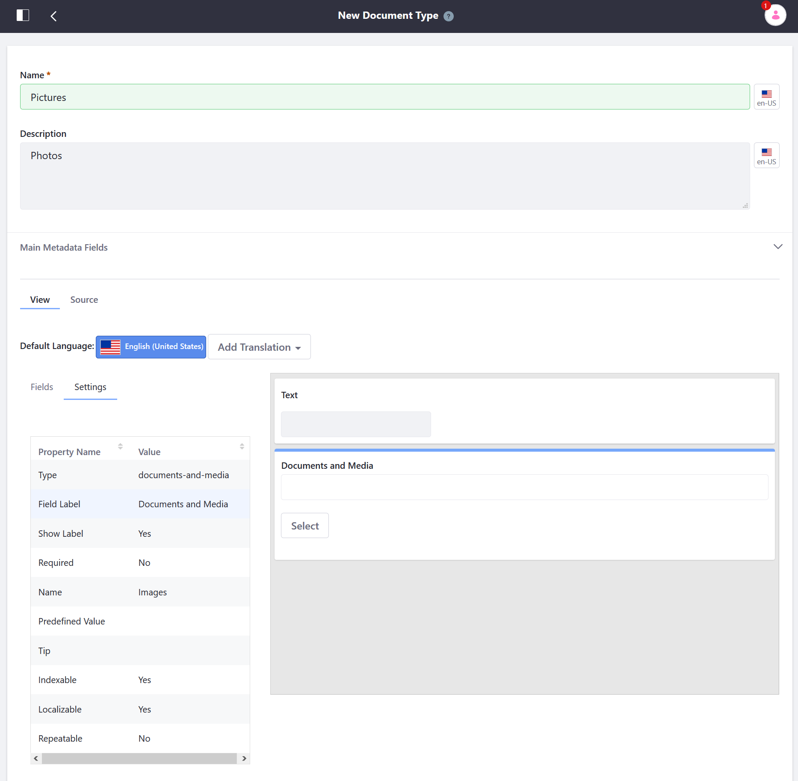

---
taxonomy-category-names:
- Digital Asset Management
- Documents and Media
- Liferay Self-Hosted
- Liferay PaaS
- Liferay SaaS
uuid: 4e674e72-10be-403f-a38d-3fb01d5bd7d3
---

# Defining Document Types

In Liferay, Document Types are templates used for uploading files and categorizing them in Documents and Media. These templates are created using metadata fields and provide additional, searchable information for uploaded files.

!!! tip
    Default document types are generated when you first start a virtual instance or create a new company. To prevent their creation in future instances or companies, navigate to *Control Panel* &rarr; *System Settings* &rarr; *Documents and Media*, uncheck *Add Default Structures*, and click *Save*.

    This setting only applies to new instances or companies created thereafter.

To define a custom Document Type,

1. Navigate to the Documents and Media application in a site or asset library.

   To access Documents and Media in a site, open the *Site Menu* () and go to *Content & Data* &rarr; *Documents and Media*.

   

   To access Documents and Media in an asset library, navigate to any library where it's enabled and click on *Documents and Media*.

   

1. Open the *Document Types* tab.

1. Click *New* to access the New Document Type form.

1. Enter a *name* for the Document Type.

1. In the Builder tab, drag and drop the desired fields into the designated drop zone.

   

   Each field is highly configurable, with basic and advanced options.

   If desired, you can create field groups by dragging and dropping fields on top of one another. Each group can also be configured as a unit.

   

   !!! note
       All custom Document Types have the following fields: Upload File, Title, File Name, and Description. Fields added to a custom Document Type appear in addition to these default fields.

1. (Optional) Click on the *Details* tab, and enter a *description*.

1. (Optional) Click on the *Additional Metadata Fields* tab and select any existing [Metadata Sets](./defining-metadata-sets.md) you want to add to the new Document Type.

1. (Optional) Click on the *Permissions* tab, and configure who can view, edit, and manage the new Document Type.

   

1. Click on *Save*.

Once saved, the new Document Type can now be accessed in the Documents and Media tab, where you can use it to start a new upload.

When the Document Type is selected, users see your configured metadata fields. See [Uploading Files](../uploading-files.md) for more information.

## For Liferay 7.3.x and Earlier Versions

1. Open the *Product Menu* () then click the compass icon () on the *Site Administration* menu.

1. Select the site where the form is created.

1. Click *Content & Data*  &rarr; *Documents and Media*.

1. Click the *Document Types* tab.

1. Click the *Add button* (). The *New Document Type* form appears.

1. Enter a name and a description.

1. Expand the *Main Metadata Fields* section.

1. Drag and drop the metadata fields into the editor.

   

1. Expand the *Additional Metadata Fields*.

1. Select a metadata set to associate with the document type. To learn more, see [Defining Metadata Sets](./defining-metadata-sets.md).

   

1. Click *Save*.

The new Document Type is now available when adding a document via the Documents and Media's *Add* menu.

When users create new files of the document type, they're presented with metadata fields to describe the document.

## Related Topics

- [Documents and Media](../../../documents-and-media.md)
- [Defining Metadata Sets](./defining-metadata-sets.md)
