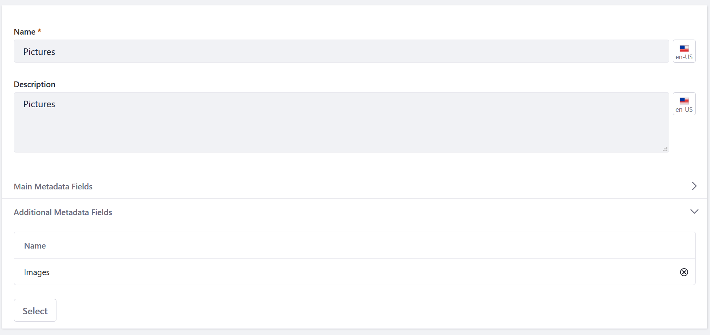

---
taxonomy-category-names:
- Digital Asset Management
- Documents and Media
- Liferay Self-Hosted
- Liferay PaaS
- Liferay SaaS
uuid: 504f6c05-207b-40b7-a714-7056721272f3
---

# Defining Document Types for Liferay 7.3 and Earlier Versions

In Liferay, Document Types are templates used for uploading files and categorizing them in Documents and Media. These templates are created using metadata fields and provide additional, searchable information for uploaded files.

To define document types for Liferay 7.3 and earlier versions,

1. Open the *Product Menu* () then click the compass icon () on the *Site Administration* menu.

1. Select the site where the form is created.

1. Click *Content & Data*  &rarr; *Documents and Media*.

1. Click the *Document Types* tab.

1. Click the *Add button* (). The *New Document Type* form appears.

1. Enter a name and a description.

1. Expand the *Main Metadata Fields* section.

1. Drag and drop the metadata fields into the editor.

   

1. Expand the *Additional Metadata Fields*.

1. Select a metadata set to associate with the document type. To learn more, see [Defining Metadata Sets](../defining-metadata-sets.md).

   

1. Click *Save*.

The new Document Type is now available when adding a document via the Documents and Media's *Add* menu.

When users create new files of the document type, they're presented with metadata fields to describe the document.

## Related Topics

- [Defining Document Types](../defining-document-types.md)
