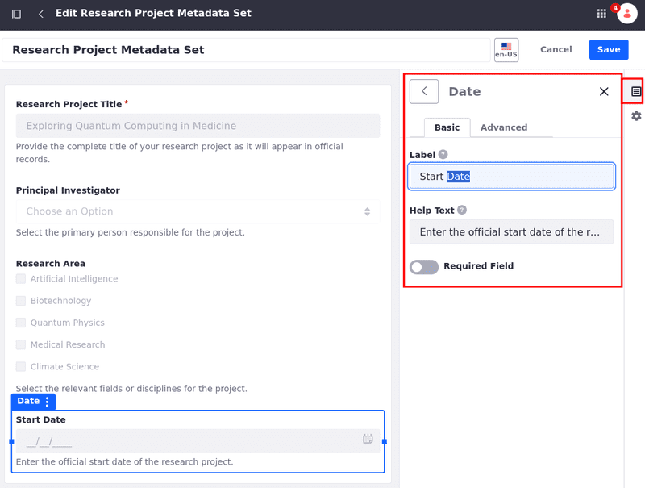

---
toc:
  - ./defining-metadata-sets/defining-metadata-sets-for-liferay-73-and-earlier-versions.md
taxonomy-category-names:
- Digital Asset Management
- Documents and Media
- Liferay Self-Hosted
- Liferay PaaS
- Liferay SaaS
uuid: 665d0c03-9f34-426c-a2b1-4146546397e3
---

# Defining Metadata Sets

With Documents and Media, you can define reusable groups of metadata fields that can be added to custom Document Types. Once created, these Metadata Sets can be selected while [creating or editing a Document Type](./defining-document-types.md) and are added after any fields defined directly in the Document Type form.

To define a new Metadata Set,

1. Navigate to the Documents and Media application in a site or asset library.

   To access Documents and Media in a site, open the *Site Menu* () and go to *Content & Data* &rarr; *Documents and Media*.

   

   To access Documents and Media in an asset library, navigate to any library where it's enabled and click on *Documents and Media*.

   

1. Open the *Metadata Sets* tab.

1. Click *New* to access the New Metadata Sets form.

1. Enter a *name* for the Metadata Set.

1. In the *Builder* tab, drag and drop the desired fields into the designated drop zone.

   Each field is highly configurable, with Basic and Advanced options. If desired, you can create field groups by dragging and dropping fields on top of one another. These groups can also be configured.

   

1. (Optional) Click on the *Properties* tab, and enter a *description*.

1. Click on *Save*.

The following fields are available in the Builder tab on the right:

| Field              | Description                                                         |
|:-------------------|:--------------------------------------------------------------------|
| Text               | Enter a single line/multiple lines of text.                         |
| Select from list   | Select an option from a drop-down list.                             |
| Single Selection   | Select an option from a list using radio buttons.                   |
| Multiple Selection | Select one or multiple options using checkboxes.                    |
| Grid               | Select options from a matrix.                                       |
| Date               | Enter a date.                                                       |
| Numeric            | Enter a number. You can set the numeric type as integer or decimal. |
| Boolean            | Check the check box.                                                |
| Image              | Send an image file.                                                 |
| Rich Text          | Use a WYSIWYG editor to create rich text content.                   |
| Upload             | Send documents and media files.                                     |
| Color              | Specify a color.                                                    |
| Web Content        | Select a Web Content article.                                       |
| Geolocation        | Specify a location to associate with the document.                  |
| Link to Page       | Link to another page in the same site.                              |
| Separator          | Add a separator to organize the content.                            |

Once saved, the new Metadata Set can be accessed and selected when creating or editing Document Types. See [Defining Document Types](./defining-document-types.md) or more information.

## Editing Metadata Sets

You can edit your fields to reflect their intended metadata. For example, a text field's default label is *Text*. If you want to use the text field as a title, for instance, then you should change the field's label to *Title*. Besides the Label field, you can also configure the default values, variable names, mouse-over tips, widths, and other settings. Some fields have a *Required* setting for specifying whether users must populate the field. If a field's *Repeatable* setting is *Yes*, users can add multiple consecutive instances of the field to the document's metadata.

1. Click on the field on the editor. This automatically opens the *Builder* tab on the right.

1. Edit the fields and enter new values.

   

1. Click *Save* when finished.

## Related Topics

- [Creating Document Types](./defining-document-types.md)
