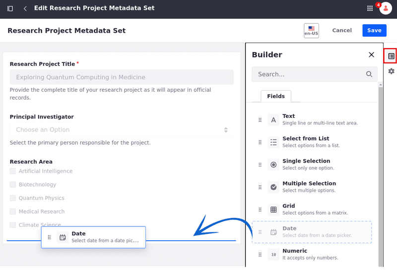

---
toc:
  - ./defining-metadata-sets/defining-metadata-sets-for-liferay-73-and-earlier-versions.md
taxonomy-category-names:
- Digital Asset Management
- Documents and Media
- Liferay Self-Hosted
- Liferay PaaS
- Liferay SaaS
uuid: 665d0c03-9f34-426c-a2b1-4146546397e3
---

# Defining Metadata Sets

With Documents and Media, you can define reusable groups of metadata fields that can be added to custom Document Types. Once created, these Metadata Sets can be selected while [creating or editing a Document Type](./defining-document-types.md) and are added after any fields defined directly in the Document Type form.

To define a new Metadata Set,

1. Navigate to the Documents and Media application in a site or asset library.

   To access Documents and Media in a site, open the *Site Menu* () and go to *Content & Data* &rarr; *Documents and Media*.

   

   To access Documents and Media in an asset library, navigate to any library where it's enabled and click on *Documents and Media*.

   

1. Open the *Metadata Sets* tab.

1. Click *New* to access the New Metadata Sets form.

1. Enter a *name* for the Metadata Set.

1. In the *Builder* tab, drag and drop the desired fields into the designated drop zone.

   Each field is highly configurable, with Basic and Advanced options. If desired, you can create field groups by dragging and dropping fields on top of one another. These groups can also be configured.

   

1. (Optional) Click on the *Properties* tab, and enter a *description*.

1. Click on *Save*.

Once saved, the new Metadata Set can be accessed and selected when creating or editing Document Types. See [Defining Document Types](./defining-document-types.md) or more information.

## Related Topics

- [Creating Document Types](./defining-document-types.md)
