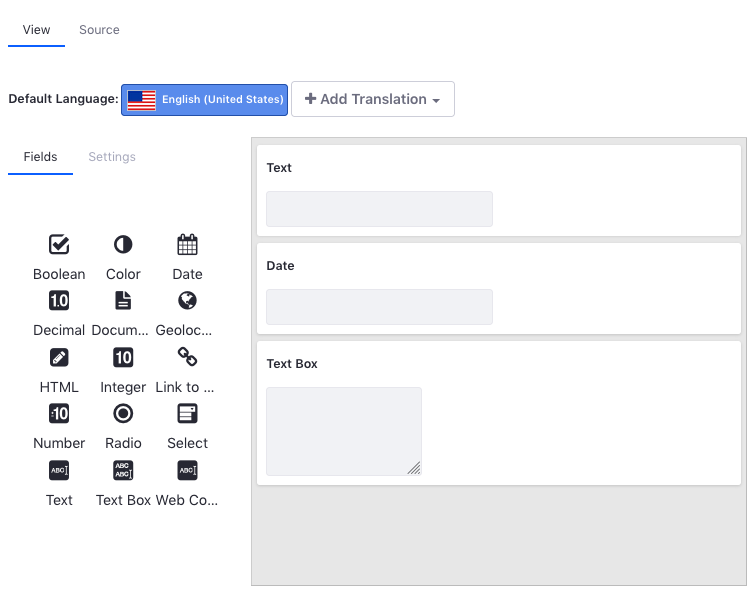
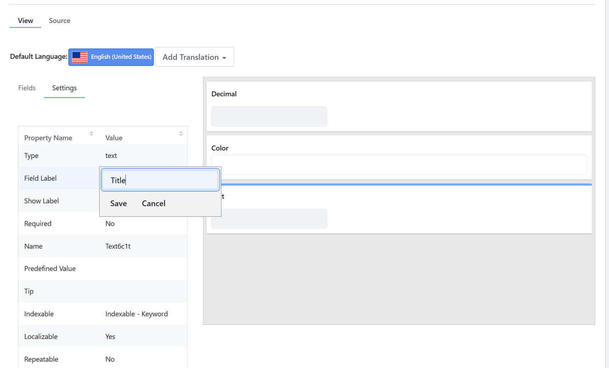
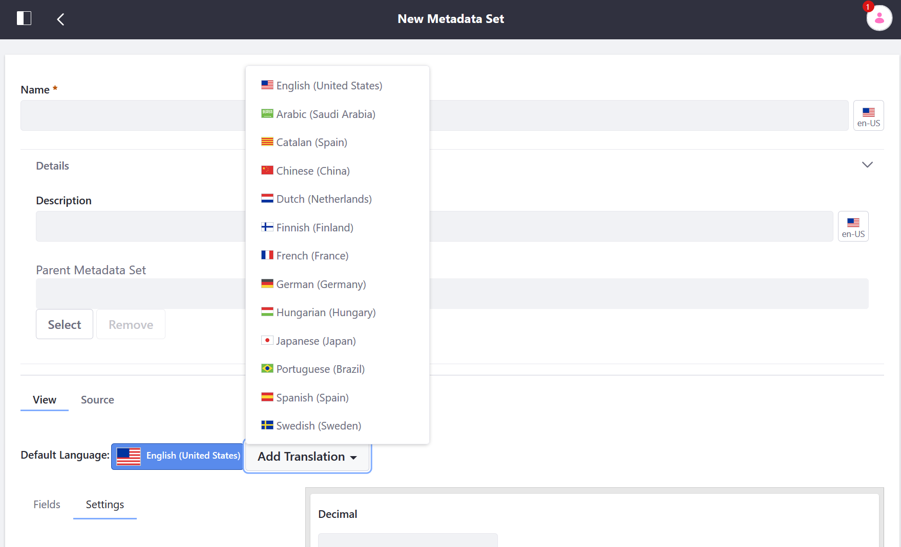
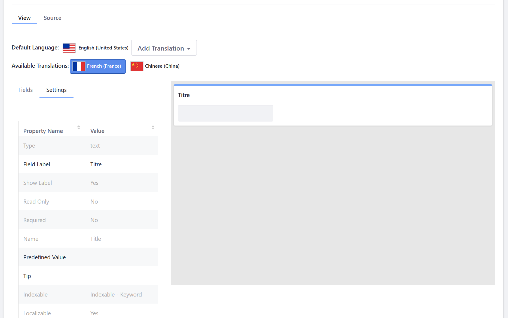

---

taxonomy-category-names:
- Digital Asset Management
- Documents and Media
- Liferay Self-Hosted
- Liferay PaaS
- Liferay SaaS
uuid: 194ed126-5122-4573-a7f0-85a9840611e9
---

# Defining Metadata Sets For Liferay 7.3 and Earlier Versions

With Documents and Media, you can define reusable groups of metadata fields that can be added to custom Document Types. Once created, these Metadata Sets can be selected while [creating or editing a Document Type for Liferay 7.3 and earlier versions](../defining-document-types/defining-document-types-for-liferay-73-and-earlier-versions.md) and are added after any fields defined directly in the Document Type form.

To define a new Metadata Set,

1. Open the *Product Menu* () then click the compass icon () on the *Site Administration* menu.

1. Select the site where the form is created.

1. Click *Content & Data*  &rarr; *Documents and Media*.

1. Click the *Metadata Sets* tab.

1. Click the *Add* button (). The New Metadata Set form appears.

1. Enter a name.

1. Expand the *Details* section.

1. Enter a description for the new Metadata Set.

1. Leave the **Parent Metadata** field blank if this is a parent. To select a Metadata Set to extend, click the *Select* button for *Parent Metadata Set* and then select the desired Metadata Set.

1. Drag and drop the metadata fields into the editor.

   

1. Click *Save*.

The following metadata fields are available:

| Metadata Field Type | Description                                                                                                 |
| :------------------ | :---------------------------------------------------------------------------------------------------------- |
| Boolean             | Check the check box                                                                                         |
| Color               | Specify a color.                                                                                            |
| Date                | Enter a date.                                                                                               |
| Decimal             | Enter a decimal number up to 2 decimal points.                                                              |
| Documents and Media | Select a file from a Documents and Media library.                                                           |
| Geolocation         | Specify a location to associate with the document.                                                          |
| HTML                | Use a WYSIWYG editor to enter HTML to enhance the content.                                                  |
| Integer             | Enter an integer                                                                                            |
| Link to Page        | Link to another page in the same site.                                                                      |
| Number              | Enter a decimal number or an integer.                                                                       |
| Radio               | Displays several clickable options but only one option can be selected at a time.                           |
| Select              | This is like the radio field except that the options are hidden and must be accessed from a drop-down menu. |
| Text                | Enter a single line of text.                                                                                |
| Text Box            | Enter multiple lines of text or separate paragraphs.                                                        |
| Web Content         | Select a Web Content article.                                                                               |

## Editing Metadata Sets

You can edit your fields to reflect their intended metadata. For example, a text field's default label is *Text*. If you want to use the text field as a title, for instance, then you should change the field's label to *Title*. Besides the Label field, you can also configure the default values, variable names, mouse-over tips, widths, and other settings. Some fields have a *Required* setting for specifying whether users must populate the field. If a field's *Repeatable* setting is *Yes*, users can add multiple consecutive instances of the field to the document's metadata.

1. Click on the field on the canvas. This automatically selects the *Settings* tab on the left.

1. To edit a setting value, double-click it in the Settings table and enter the new value.

   

1. Click *Save* when finished.

## Translating a Metadata Set

You can translate each of a metadata set's field values to any supported locales.

1. Click *Add Translation*.

1. Click on the language (for example: *French (France)*). Repeat to add another locale.

   

1. Once added to the Available Translations section, click on the flag representing the language.

1. Modify the desired values.

   

1. Click *Save* when finished.

## Related Topics

- [Defining Metadata Sets](../defining-metadata-sets.md)