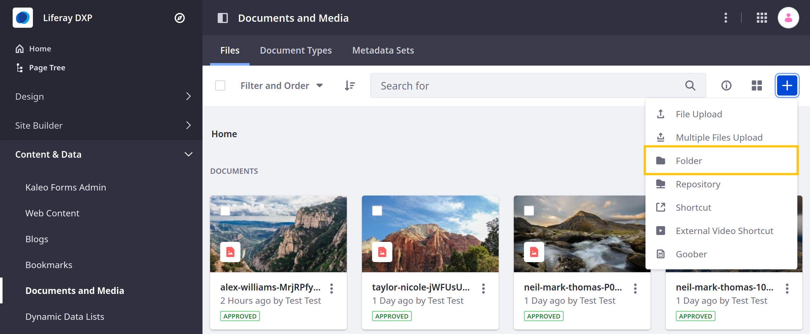
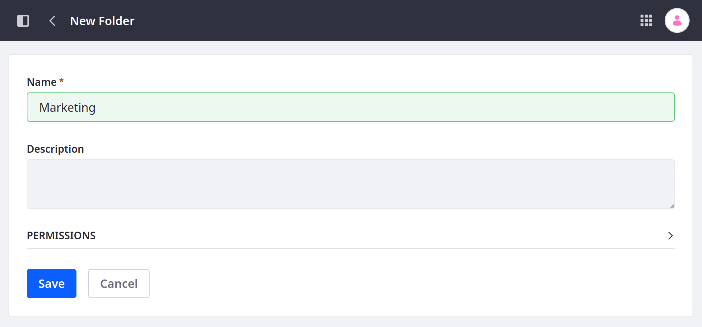
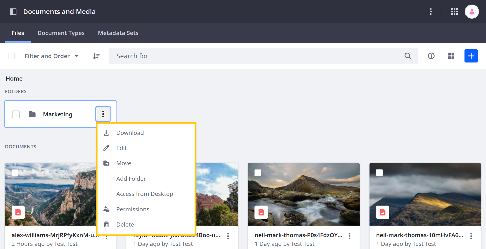
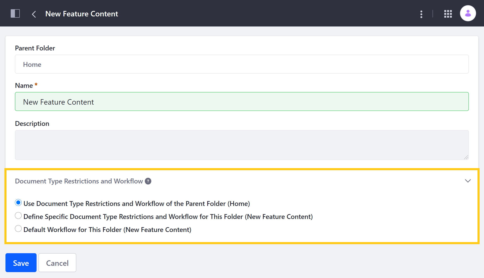
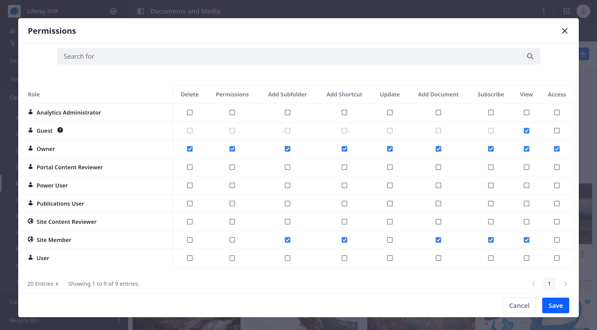

---
taxonomy-category-names:
- Digital Asset Management
- Documents and Media
- Liferay Self-Hosted
- Liferay PaaS
- Liferay SaaS
uuid: 4e440ea1-b447-4c5f-90e6-09a3ce0bbfcd
---

# Using Folders

By default, uploaded files are stored in the Documents and Media root folder (i.e., *Home*), but you can create additional folders to organize and manage your files. Each folder can have its own workflow configuration, so you can define review and approval processes for its files. You can also configure a folder's permissions to ensure only authorized users can access its files.

## Adding Folders

1. Open the *Documents and Media* application in the desired site or asset library.

1. Click *New* and select *Folder*.

   

1. Enter a name for your new folder.

1. (Optional) Enter a folder description.

1. (Optional) Configure permissions for the folder.

   

1. Click *Save* to create your new folder.

Once created, the folder appears in the Documents and Media application. You can create subfolders by opening the desired folder and repeating the above process.

## Folder Options

Once you have created a folder, click *Actions* () next to the folder to access the following options.

| Action              | Description                                                                                   |
| :------------------ | :-------------------------------------------------------------------------------------------- |
| Download            | Download the folder as a zip file.                                                            |
| Edit                | Edit the folder's name, description, document type restrictions, and workflow.                |
| Move                | Move the folder with its files to another folder.                                             |
| Add Folder          | Add a subfolder to the selected folder.                                                       |
| Access from Desktop | View the folder's [WebDAV URL](../publishing-and-sharing/accessing-documents-with-webdav.md). |
| Permissions         | Edit permissions for the folder.                                                              |
| Delete              | Move the folder and its files to the Recycle Bin.                                             |

## Configuring Workflows for Folders

After creating a folder, you can configure its [workflow](../../../process-automation/workflow/introduction-to-workflow.md) settings to determine the approval process for all additions and edits made to the folder's content. These options are available when editing the folder. See [Using Workflow with Documents and Media](../publishing-and-sharing/using-workflow-with-documents-and-media.md) for more information.

## Configuring Folder Permissions

If desired, you can configure folder permissions to restrict access to its files. See the [Documents and Media Permissions Reference](../publishing-and-sharing/managing-document-access/documents-and-media-permissions-reference.md) and [Roles and Permissions](../../../users-and-permissions/roles-and-permissions/understanding-roles-and-permissions.md) for more information.

## Related Topics

- [Using Workflow with Documents and Media](../publishing-and-sharing/using-workflow-with-documents-and-media.md)
- [Uploading Files](./uploading-files.md)
- [Publishing Documents](../publishing-and-sharing/publishing-documents.md)
- [Enabling Xuggler and ImageMagick for previews](../../../system-administration/using-the-server-administration-panel/configuring-external-services.md)
