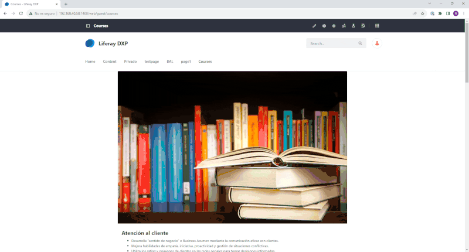
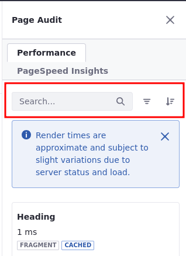

---
taxonomy-category-names:
- Content Management System
- Content Performance
- Liferay Self-Hosted
- Liferay PaaS
- Liferay SaaS
uuid: 1c7ea087-074c-4b44-933b-fb49cb364c0a
---
# About the Page Audit Tool

!!! important
    This feature is currently behind a beta feature flag. See [Beta Feature Flags](../../system-administration/configuring-liferay/feature-flags.md#beta-feature-flags) for more information.

The Page Audit tool displays performance-related information about the server render time, component type, component's origin, and cache status as well as warning messages about potential performance issues.

You need, at least, two [permissions](../../users-and-permissions/roles-and-permissions.md) to view and use the Page Audit tool. Configure them under Site and Asset Library Administration &rarr; Site Builder &rarr; Pages:

1. *Access in Site and Asset Library Administration* under General Permissions.

1. *Update* permission under Pages.

## Using the Page Audit Tool

The Page Audit tool () appears on the applications bar at the top of the page.

1. Click the *Page Audit* tool icon to open a sidebar where the information is displayed on the right.

   Under the Performance tab appears a list of all components on the page.

   Each component has an information card showing the component's name, render time (in milliseconds), type (a label that identifies the type: fragment, collection, or widget), and cache status along with icons to interact with the component.

   Under PageSpeed Insights, you can see specific recommendations for Liferay DXP if you have Google's [PageSpeed Insights](./analyze-seo-and-accessibility-on-pages.md) service configured (an API key is required).

1. Hover over the card to highlight the component in the page.

1. Click *Locate* () to find and center the component on the page.

1. With Fragments, click *Open* () to navigate to the fragment library.

1. (Optional) Click on a card to display [warnings and basic information](#warnings-and-basic-information) about the component.

1. (Optional) Use the [available tools](#performance-tab-tools) (Search, Filter, and Sort) to organize or find components.

## Performance Tab Tools

Under the Performance tab are tools to facilitate your navigation.

**Search:** Search for specific components by their names.

**Filter:** Filter by navigation (All or From Master - components from a Master page), cache status (Cached or Not Cached), or component type (e.g., Fragment, Widget, or Collection).

**Sort:** Sort components by render time. By default, items are ordered from slower to faster render time.

## Warnings and Basic Information

Click on a component card to display warnings and basic information about the component.

### Warnings

Warnings indicate possible performance issues with page components. It also includes suggestions to solve the problem and optimize your page.

Here's a list of warnings:

| Component                   | Warning                                                                                                                                                                   | Possible Solution                                                             |
|:----------------------------|:--------------------------------------------------------------------------------------------------------------------------------------------------------------------------|:------------------------------------------------------------------------------|
| Collection Display Fragment | Pagination is disabled. This setting can affect page performance severely if the number of collection items is above 200. We strongly recommend using pagination instead. | Enable pagination for your collection display                                 |
| Image Fragment              | Big image file size used. Please, consider configuring adaptive media, lazy loading, or reducing the image size.                                                          | Configure adaptive media, enable lazy loading, or upload a smaller image file |

### Basic Information

The component card displays basic information about the component. Here's a list of details covered:

!!! warning
    Render time is an approximation and subject to slight variations depending on various factors (e.g., server status and load).

| Detail             | Description                                                                                       |
|:-------------------|:--------------------------------------------------------------------------------------------------|
| Server Render Time | The render time in milliseconds                                                                   |
| Component Type     | The component type: Fragment, Widget, or Collection                                               |
| Origin             | The origin of the component (e.g. This Page if it is originated in the same page it is displayed) |
| Cache Status       | The component's cache status: Cached or Not Cached                                                |

## Related Topics

- [About the Content Performance Tool](./about-the-content-performance-tool.md)
- [Analyze SEO and Accessibility on Pages](./analyze-seo-and-accessibility-on-pages.md)