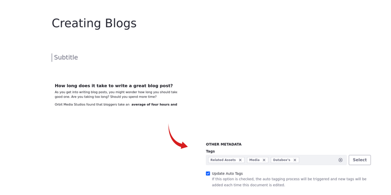
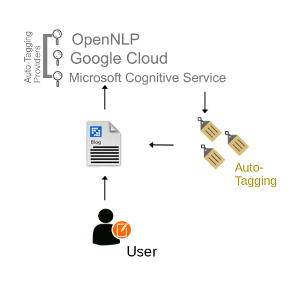

---
toc:
  - ./auto-tagging/configuring-asset-auto-tagging.md
  - ./auto-tagging/auto-tagging-assets.md
  - ./auto-tagging/auto-tagging-images.md
taxonomy-category-names:
- Content Management System
- Categories and Tags
- Liferay Self-Hosted
- Liferay PaaS
- Liferay SaaS
uuid: a9274b09-7106-430d-927f-26472612acd4
---

# Auto-Tagging

If you have a lot of content that's untagged, you can help your users find that content more easily by *auto-tagging* it. Liferay can use a local or cloud-based service to analyze and then automatically assign tags to your content, whether it be text-based or images. Auto-tagging enables faceting your content in search by determining related tags, which makes your content much easier for users to find. 

For example, if you have a user with a lot of untagged blog entries, rather than go through all that content and tag it yourself, you can configure an auto-tagging provider to spare your time.

Auto-tagging can be configured at three levels: *Global*, *Virtual Instance*, and *Site*:

**Global (System Settings)**: Enable or disable auto-tagging for the Liferay server. At the global level, you set a default configuration for all virtual instances. This is not available in Liferay Cloud SaaS. 

**Virtual Instance (Instance Settings)**: Override auto-tagging configurations set at the global level. This setting determines the default configuration for all instance sites.

**Site**: Override auto-tagging configurations set at the global and instance levels.

Liferay connects to one of three providers (*OpenNLP, Google Cloud*, and *Microsoft Cognitive Service*) to auto-tag images, text-based documents, text-based web content, or blog entries. Choose a provider to examine the content and generate the relevant tags.

:::{grid-item-card} Configuring Asset Auto-Tagging
:link: ./auto-tagging/configuring-asset-auto-tagging.md
:::
:::{grid-item-card} Auto-Tagging Assets
:link: ./auto-tagging/auto-tagging-assets.md
:::
:::{grid-item-card} Auto-Tagging Images
:link: ./auto-tagging/auto-tagging-images.md
:::
