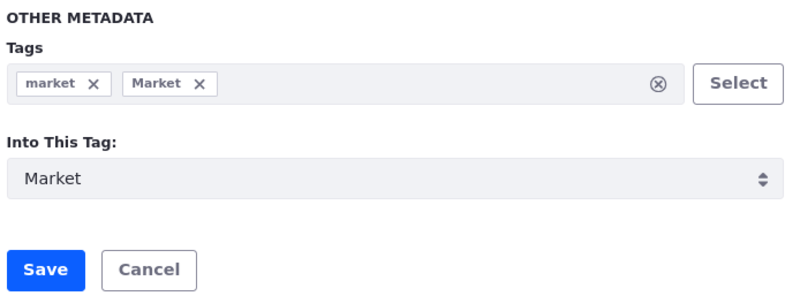

---
taxonomy-category-names:
- Content Management System
- Categories and Tags
- Liferay Self-Hosted
- Liferay PaaS
- Liferay SaaS
uuid: 48295c24-00df-4baf-a05e-25f531a5cb70
---
# Tagging Content and Managing Tags

Tags are keywords you can use to organize your assets and describe specific information about their content. Tags tell website visitors what the content is about so they can find relevant information through search or navigation. For more information about tags in Liferay DXP and the different usage scenarios, see [Organizing Content with Categories and Tags](./organizing-content-with-categories-and-tags.md).

## Tagging Content

Use the Categorization section in the sidebar panel to tag assets as you create new content.

1. Create or edit the content you want to tag.

1. In the sidebar panel, select the *Properties* tab.

1. Under the Categorization section and Other Metadata subsection, click *Select* next to Tags.

   

1. Select the tags you want to use from the list of existing tags and click *Done*.

1. If you want to create new tags for the content, type the new tag in the *Tags* field and press Enter.

## Managing Tags

You can manage tags under the Categorization panel in the Site Menu. From here, you can create new tags or customize the existing ones.

!!! note
    Only site administrators can manage tags in the Tags panel.

1. Open the *Site Menu* () and navigate to *Categorization* &rarr; *Tags*.

1. To create a new tag, click *Add Tag* ().

1. Type your new tag and click *Save*.

!!! important
    Tags in {bdg-secondary}`Liferay DXP 2024.Q1+/Portal 7.4 GA112+` are case-sensitive, stored and displayed exactly as entered.

    For backward compatibility, tags created before this version remain in lowercase.

    Also note that the search and autocomplete functions are case-insensitive, displaying all related entries. Conversely, filtering is case-sensitive, showing results only for the specific case selected.

1. To edit an existing tag, click *Actions* () next to the tag's name and select *Edit*.

1. If you want to merge one or more tags,

   1. Check the box next to the tags you want to merge and click *Merge* ().

   1. Select the tag where you want to merge in the *Into This Tag* drop-down menu.

   1. Click *Save*.

      

## Related Topics

- [Organizing Content with Categories and Tags](./organizing-content-with-categories-and-tags.md)
- [Defining Categories and Vocabularies for Content](./defining-categories-and-vocabularies-for-content.md)
