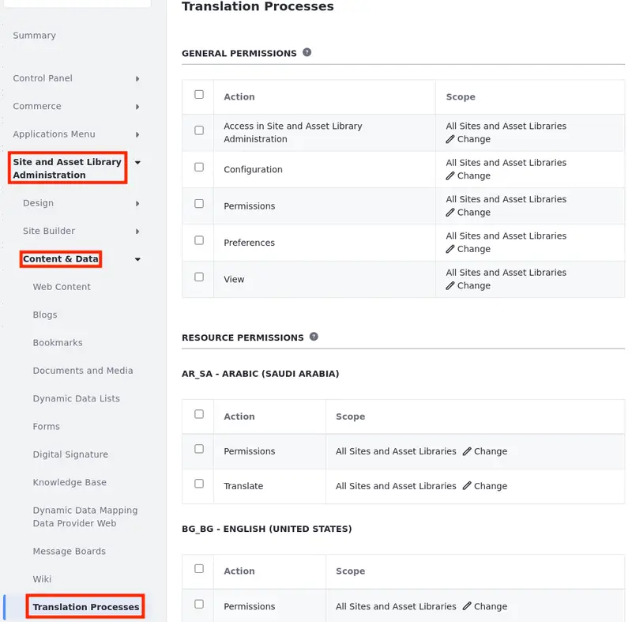

---
taxonomy-category-names:
- Content Management System
- Content Translations
- Liferay Self-Hosted
- Liferay PaaS
- Liferay SaaS
uuid: 807f6b22-c079-41e4-ac6c-38c2bf46e44b
---

# Managing Translation Permissions

The required permissions for translating content pages and web content depend on the translation method:

- Manual translation requires either Update permissions for the resource type, or Translate permissions for one or more languages.

- Exporting and importing translations requires Update permissions for the resource type.

## Assigning Update Permissions

Users with Update permissions for pages and web content can translate them manually into any available language. They can also export them as XLIFF files for translation and then import the translations when finished. See [Defining Role Permissions](../../users-and-permissions/roles-and-permissions/defining-role-permissions.md) to learn how to assign these permissions at the application level.

## Assigning Translate Permissions

Translate permissions are language-specific and grant access to the Translate action for content pages and web content. Users with Translate permissions can only use languages they've been assigned. Once granted, these permissions cannot be restricted by individual assets.

!!! note
    The languages available for translation are determined by your instance's localization settings. See [Initial Instance Localization](../../installation-and-upgrades/setting-up-liferay/initial-instance-localization.md) and [Virtual Instance Localization](../../system-administration/configuring-liferay/virtual-instances/localization.md) for more information.

Follow these steps to assign Translate permissions for specific languages:

1. Open the *Global Menu* (), go to the *Control Panel* tab, and click *Roles*.

1. Click *Actions* () for the desired role and select *Edit*.

   Alternatively, you can click *Add* () to create a new role for translations.

1. Click the *Define Permissions* tab and go to *Site and Asset Library Administration* &rarr; *Content & Data* &rarr; *Translation Processes* in the permissions sidebar menu.

1. Use the checkboxes to assign the desired language permissions to the selected role.

   

1. Click *Change* () under the Scope column to adjust the permission's scope. By default, the change applies to all sites and asset libraries, but you can customize it to specific ones.

   Browse recently used sites in the Recent tab, all sites in My Sites, and asset libraries in Asset Libraries to select the scope.

   You can repeat this process to select additional sites or asset libraries, expanding the scope of permissions.

1. Click *Save* at the bottom of the page.

Users with the configured role can now manually translate web content and content page experiences into the specified languages.

## Related Topics

- [Translating Content Pages](./translating-content-pages.md)
- [Translating Web Content](./translating-web-content.md)
