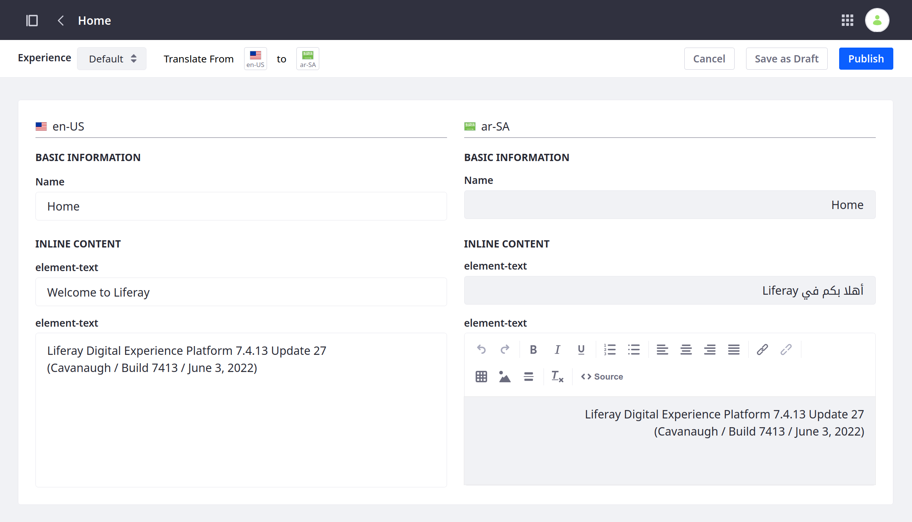
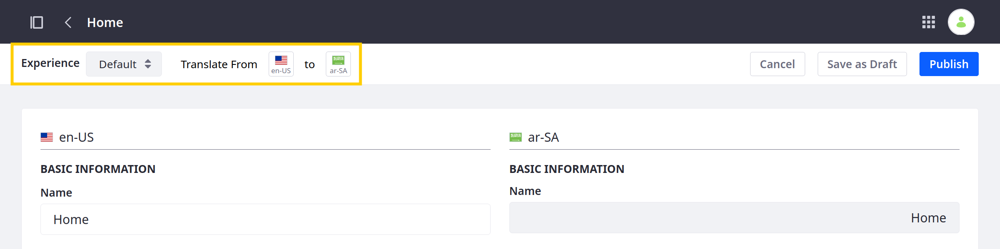
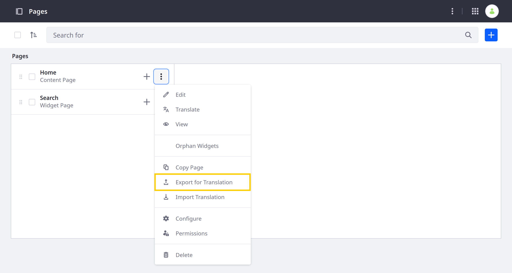
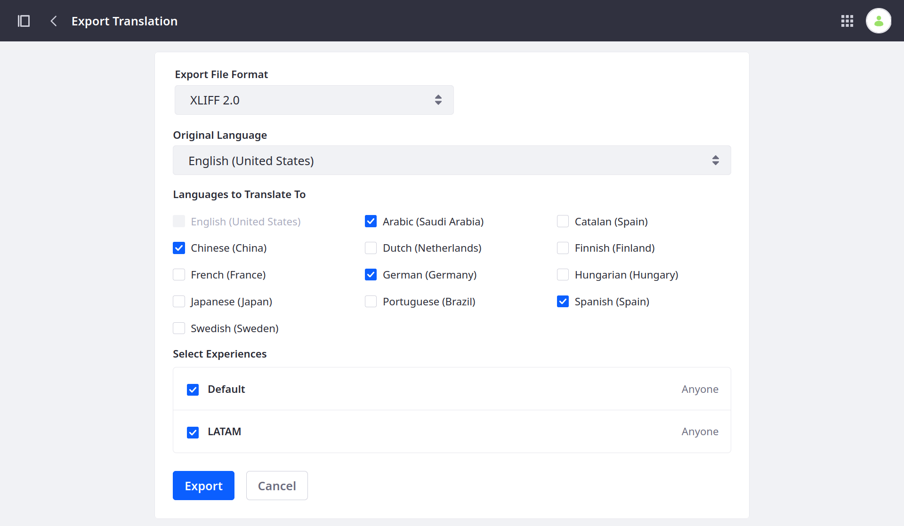
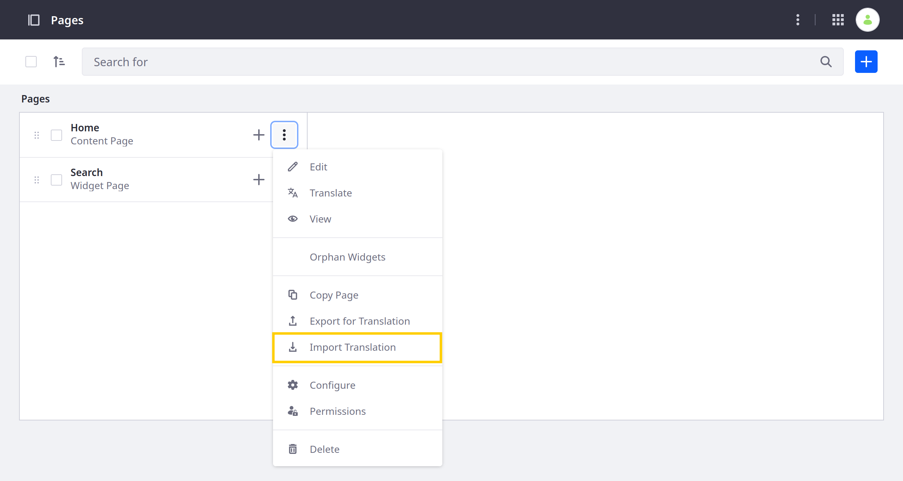
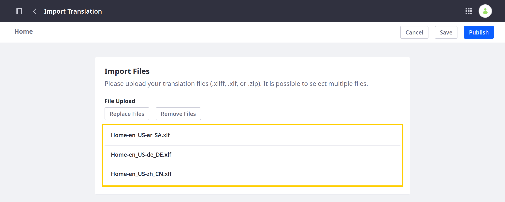
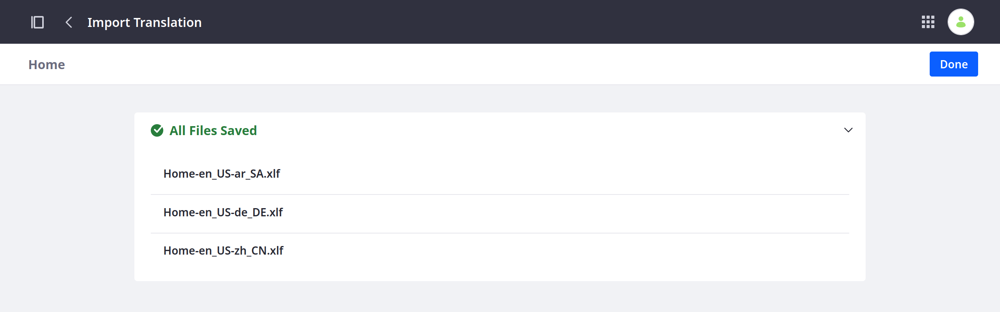
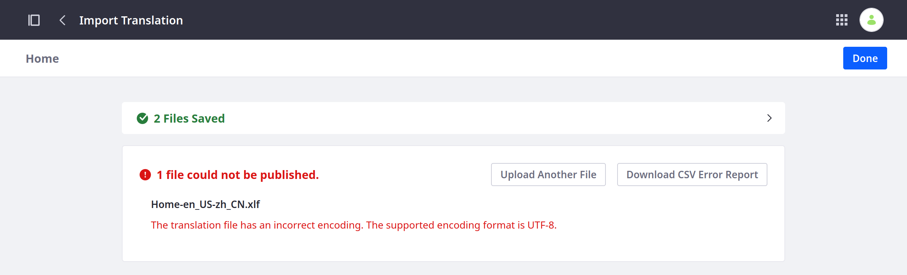

---
taxonomy-category-names:
- Content Management System
- Content Translations
- Content Pages
- Liferay Self-Hosted
- Liferay PaaS
- Liferay SaaS
uuid: f2b9e469-c8cc-44ca-a7e6-cff4d6dbe2b4
---

# Translating Content Pages

{bdg-secondary}`Liferay 7.4 U15+ and GA15+`

Liferay provides integrated tools for translating *content pages*, so you can create engaging, localized experiences for your global users. With these tools, you can manually translate content page experiences or import translations as XLIFF files.

!!! important
    When translating a content page, users can only translate a page's name and inline fragment text (e.g. HTML, Header, etc.). They cannot translate widgets or mapped fragment fields.

If desired, you can [enable a custom workflow](./enabling-workflows-for-translations.md) to direct the review and publishing process for translations.

!!! note
    The languages available for translation are determined by your instance's localization settings. See [Initial Instance Localization](../../installation-and-upgrades/setting-up-liferay/initial-instance-localization.md) and [Virtual Instance Localization](../../system-administration/configuring-liferay/virtual-instances/localization.md) for more information.

## Manually Translating Content Pages

!!! note
    To manually translate content page experiences, users must have either *View* and *Update* permissions for content pages or Translation permissions for one or more languages. See [Managing Translation Permissions](./managing-translation-permissions.md) for more information.

Follow these steps to manually translate content page experiences:

1. Open the *Site Menu* (), expand *Site Builder*, and go to *Pages*.

1. Click *Actions* () for the content page you want to translate and select *Translate*.

   This redirects you to the translation interface, where you can view the content's original text alongside your translation.

   The left column displays the language you're translating from, and the right column provides editable fields you can use for your translation.

   

1. Select the *experience* and *language* you want to translate.

   Users with Page Update permissions can translate the original text into any language.

   Users with translate permissions can only translate the origin text into languages for which they have permission.

   !!! important
       Switching between page experiences discards all unsaved changes. To avoid losing work, save your changes before switching to a different experience.

   

1. Enter your translation for available fields.

1. Click *Publish* or *Save as Draft*.

   Publishing your translations applies them to the content page and saves it as a draft.

   Also, if a workflow is enabled, publishing translations initiates the review process before they're applied to the page and saved as a draft.

   Alternatively, you can click *Save as Draft* to apply your translations at a later time.

## Exporting and Importing Translations

!!! note
    To export pages for translation or import XLIFF translations, you must have *View* and *Update* permissions for the selected page. See [Managing Translation Permissions](./managing-translation-permissions.md) for more information.

With Liferay, you can export content page experiences for translation as `.xliff` or `.xlf` files. You can send these files to translators and then import the translations together as a `.zip` file or individually as `.xliff` or `.xlf` files.

!!! important
    Liferay supports both XLIFF 1.2 and 2.0 files. However, it may not support all features and capabilities those formats provide.

### Exporting Pages for Translation

1. Open the *Site Menu* (), expand *Site Builder*, and go to *Pages*.

1. Click *Actions* () for the content page you want to translate and select *Export for Translation*. This opens a modal window for configuring your export.

   

1. Select an export format: *XLIFF 1.2* or *XLIFF 2.0*.

1. Select the content page's original language.

1. Select the languages you want to translate to.

1. Select the experiences you want to translate.

   

1. Click *Export*.

Liferay generates a ZIP archive that contains an XLIFF file for each selected experience. You can then use these files with compatible translation software.

### Importing Page Translations

1. Open the *Site Menu* (), expand *Site Builder*, and go to *Pages*.

1. Click *Actions* () for the translated content page and select *Import Translation*.

   

1. Select the `.xliff`, `.xlf`, and `.zip` files you want to import.

   

   !!! important
       While Liferay supports importing XLIFF files created using the [Export for Translation](#exporting-pages-for-translation) action, it cannot guarantee the successful import of files generated by other means.

1. Click *Publish*.

   If import is successful, Liferay displays a success message with the imported files. The translations are applied to the content page and the page is saved as a draft. If workflow is enabled, the translations must be approved before they're applied to the page.

   

   However, if errors occur during import, Liferay notifies you of the failing files and provides a downloadable CSV error report.

   

## Translating Content Pages Using Third Party Services

If you've enabled Liferay's integration with [Google Cloud Translation](./using-third-parties-for-translation.md#enabling-google-cloud-translation), [Amazon Translate](./using-third-parties-for-translation.md#enabling-amazon-translate), or [Microsoft Translator](./using-third-parties-for-translation.md#enabling-microsoft-translator), you can use them to automatically translate Web Content. See [Using Third Parties for Translation](./using-third-parties-for-translation.md) for more information.

## Related Topics

- [Translating Web Content](./translating-web-content.md)
- [Using Third Parties for Translation](./using-third-parties-for-translation.md)
- [Enabling Workflows for Translations](./enabling-workflows-for-translations.md)
