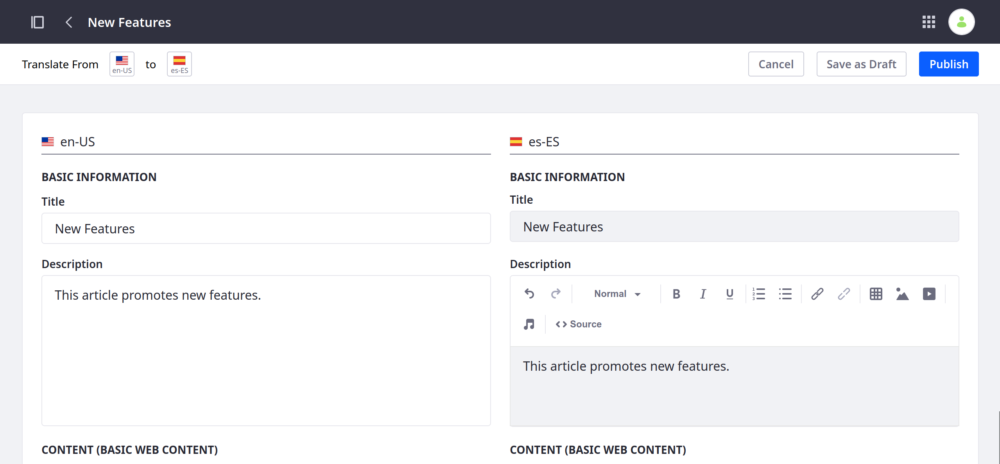
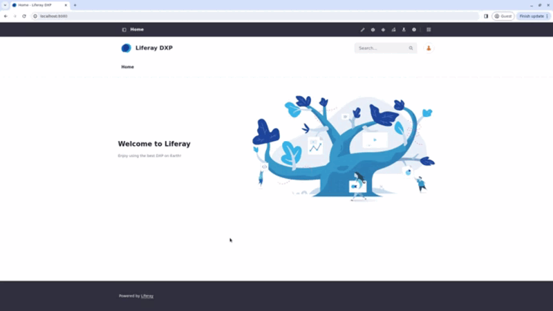
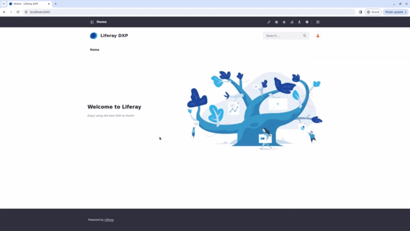
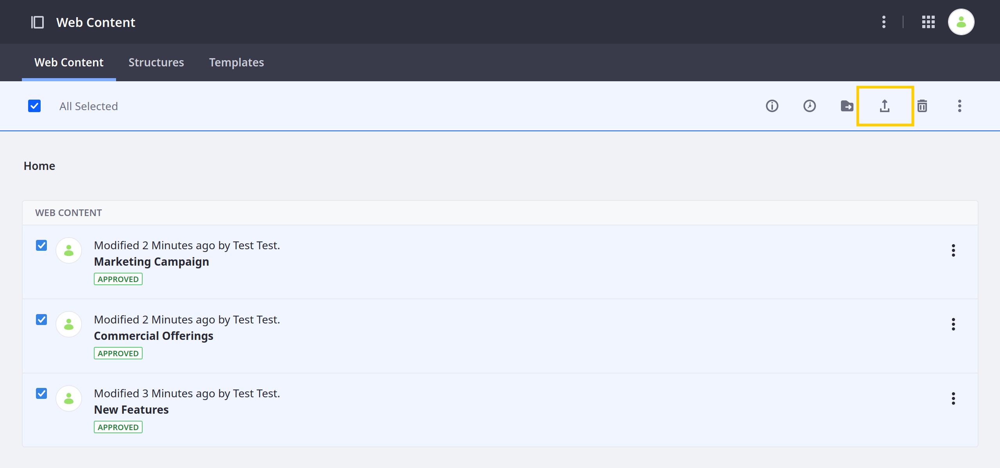
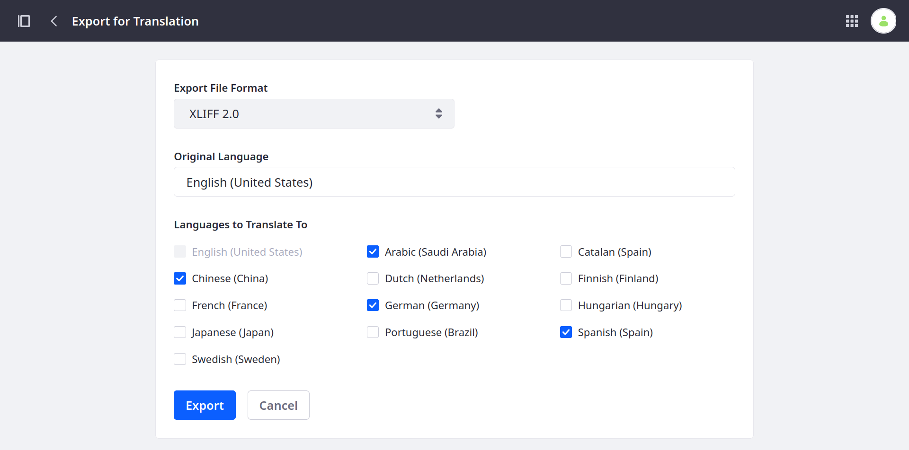
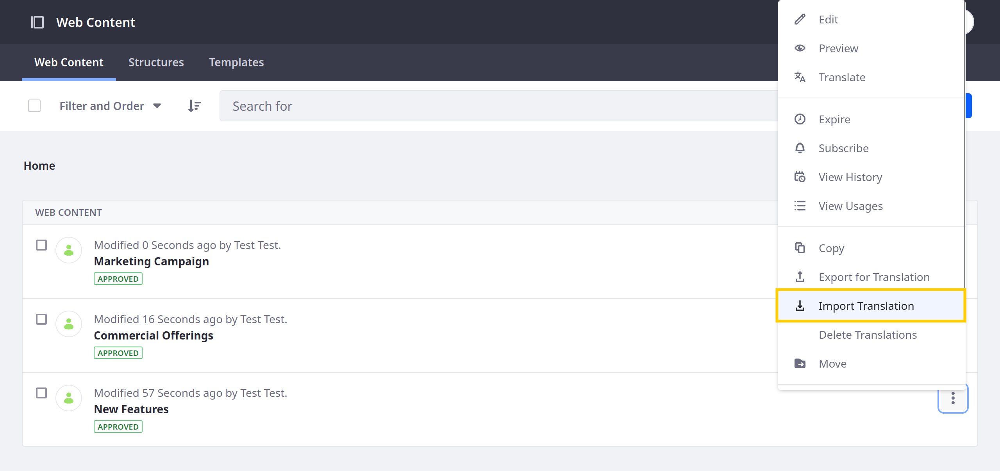
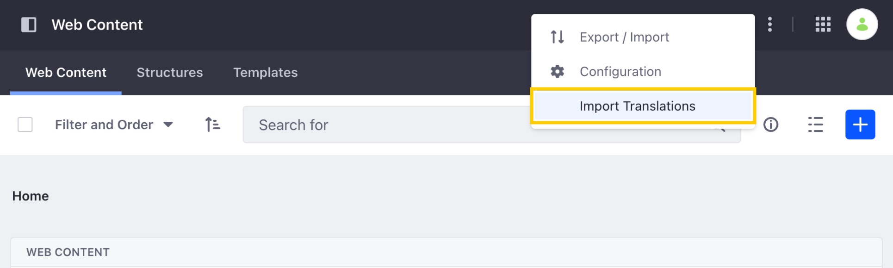
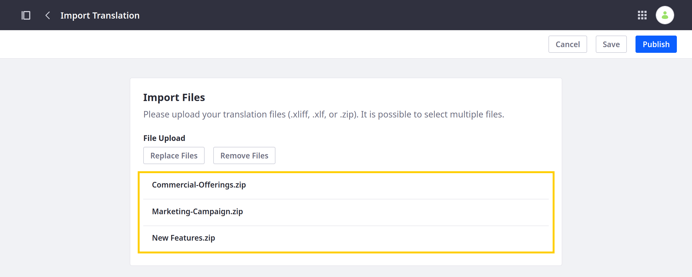
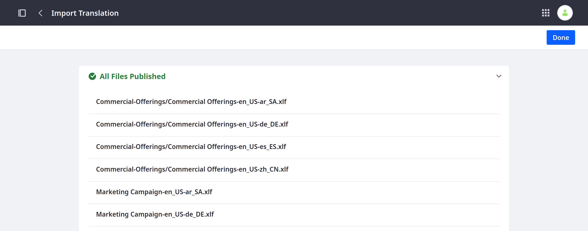
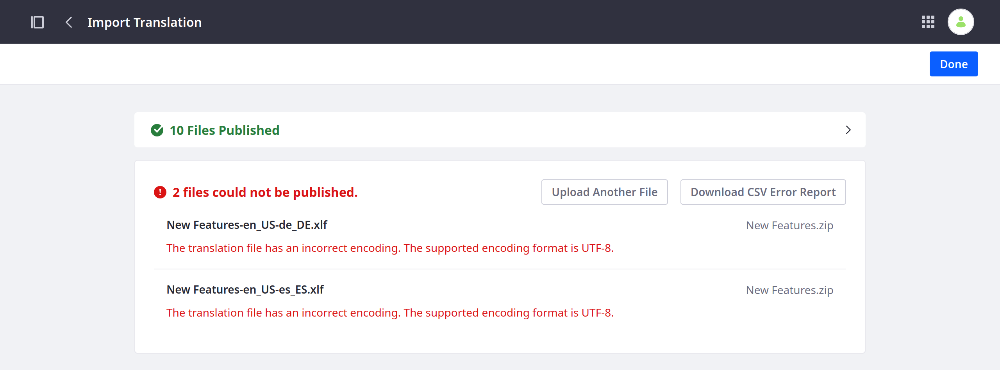

---
taxonomy-category-names:
- Content Management System
- Content Translations
- Web Content and Structures
- Liferay Self-Hosted
- Liferay PaaS
- Liferay SaaS
uuid: 6f717fa5-9cf3-426e-9df3-b59517a62dc7
---

# Translating Web Content

{bdg-secondary}`Liferay DXP/Portal 7.3+`

Liferay provides integrated tools for translating web content articles, so you can create engaging, localized content for your global users. With these tools, you can manually translate web content or import translations as XLIFF files.

If desired, you can [enable a custom workflow](./enabling-workflows-for-translations.md) to direct the review and publishing process for translations.

!!! note
    The languages available for translation are determined by your instance's localization settings. See [Initial Instance Localization](../../installation-and-upgrades/setting-up-liferay/initial-instance-localization.md) and [Virtual Instance Localization](../../system-administration/configuring-liferay/virtual-instances/localization.md) for more information.

## Manually Translating Content

!!! note
    To translate web content manually, users must have either View and Update permissions for the asset or Translation permissions for one or more languages. See [Managing Permissions for Translation](./managing-translation-permissions.md) for more information.

Use the [translation interface](#manually-translating-web-content-articles-using-the-translation-interface) in the web content article's action menu, or translate its fields while [creating/editing one](#manually-translating-web-content-articles-during-creationedition).

### Manually Translating Web Content Articles Using the Translation Interface

1. Open the *Site Menu* (), expand *Content & Data*, and go to *Web Content*.

1. Select the *Web Content* tab. Click *Actions* () for the content you want to translate, and select *Translate*.

   The translation interface appears, where you can view the content's original text alongside your translation.

   The left column displays the language you're translating from, and the right column provides editable fields you can use for your translation.

   

1. Select the language you want to translate.

   !!! important
       Users with content `Update` permissions can translate the original text into any language.

       Users with `Translate` permissions can only translate the origin text into languages for which they have permission.

1. Enter your translation for the available fields.

   !!! note
       The friendly URL for translations remains empty unless filled in by the user. If the friendly URL is left empty, the default language's friendly URL is used.

1. Click *Publish* to create a new version of the web content article or initiate a workflow, if it's enabled.

   Alternatively, click *Save as Draft* to save and publish your translation later.

   

### Manually Translating Web Content Articles During Creation/Edition

{bdg-secondary}`Liferay DXP 2024.Q1+/Portal 7.4 GA112+`

!!! important
    The translation status feature is currently behind a release feature flag (LPS-114700). Read [Release Feature Flags](../../system-administration/configuring-liferay/feature-flags.md#release-feature-flags) for more information. Other features may differ without this feature flag.

1. Create or start editing web content.

1. On the editing page, click the *flag icon + language code* in the upper left corner to see available languages and their translation statuses.

   There are three available statuses: Not Translated, {bdg-secondary}`Liferay DXP 2024.Q2+` Translating, and Translated.

   {bdg-secondary}`Liferay DXP 2024.Q2+` The Translating status indicates two numbers, the number of fields that were translated and the total number of fields. It's presented as a badge next to the selected language. Once all fields are translated, the badge changes to Translated.

   {bdg-secondary}`Liferay DXP 2024.Q2+` The title and metadata information (i.e. Description and Friendly URL) count as information that must be translated if you want to completely translate your web content article.

!!! tip
    If you didn't define the field as Localizable, the field and its localization are disabled when translating the web content article.

1. Choose a language and translate the fields.

1. Publish or save the article as a draft to save the modifications.

!!! note
    When adding a new repeatable fieldset on a web content article with existing translations, changes to the default content don't propagate to translations automatically. This prevents unintended overwriting of already translated content.

## Translating Web Content Articles Using Third Party Services

If you've enabled Liferay's [Google Cloud Translation](https://cloud.google.com/translate/docs/setup), [Amazon Translate](https://docs.aws.amazon.com/translate/latest/dg/what-is.html), or [Microsoft Translator](https://docs.microsoft.com/en-us/azure/cognitive-services/translator/) integration, you can use them to translate web content automatically. See [Using Third Parties for Translation](./using-third-parties-for-translation.md) for more information.

## Exporting and Importing Translations

!!! note
    To translate content page experiences manually, users must have `View` and `Update` permissions for content pages or Translation permissions for one or more languages. See [Managing Translation Permissions](./managing-translation-permissions.md) for more information.

With Liferay, you can export web content for translation as `.xliff` or `.xlf` files. You can send these files to translators and then import the translations together as a `.zip` file or individually as `.xliff` or `.xlf` files.

!!! important
    Liferay supports both XLIFF 1.2 and 2.0 files. However, it may not support all features and capabilities those formats provide.

### Exporting Content for Translation

1. Open the *Site Menu* () and navigate to *Content & Data* &rarr; *Web Content*.

1. Click *Actions* () for the content you want to translate and select *Export for Translation*. This opens a modal window for configuring your export.

   

   {bdg-secondary}`Liferay Portal 7.4 GA26+` You can also select multiple articles and click the *Export for Translation* button.

   

1. Select an export format: *XLIFF 1.2* or *XLIFF 2.0*.

1. Select the web content's original language.

1. Select the languages you want to translate to.

   

1. Click *Export*.

Liferay generates a ZIP archive that contains an XLIFF file for each selected language. You can then use these files with compatible translation software.

### Importing Content Translations

1. Open the *Site Menu* () and navigate to *Content & Data* &rarr; *Web Content*.

1. Click *Actions* () for the translated web content and select *Import Translation*.

   

   {bdg-secondary}`Liferay Portal 7.4 GA26+` You can also import translations for multiple articles at once by clicking the *Actions* button () in the Application Bar and selecting *Import Translations*.

   

1. Select the `.xliff`, `.xlf`, and `.zip` files you want to import.

   

   !!! important
       While Liferay supports importing XLIFF files created using the [Export for Translation](#exporting-content-for-translation) action, it cannot guarantee the successful import of files generated by other means.

1. Click *Publish*.

   If successful, Liferay displays a success message with the imported files. The web content is updated with all changes included in the translation files. If workflow is enabled, this change must be approved as with other content updates.

   

   However, if errors occur during import, Liferay notifies you of the failing files and provides a downloadable CSV error report.

   

## Related Topics

- [Translating Content Pages](./translating-content-pages.md)
- [Using Third Parties for Translation](./using-third-parties-for-translation.md)
- [Enabling Workflows for Translations](./enabling-workflows-for-translations.md)
