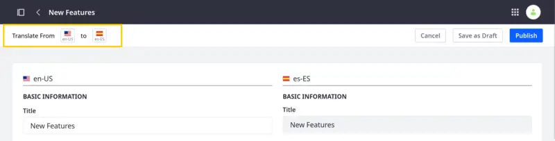
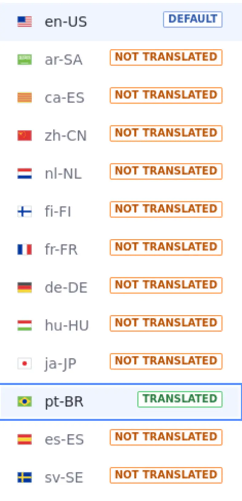
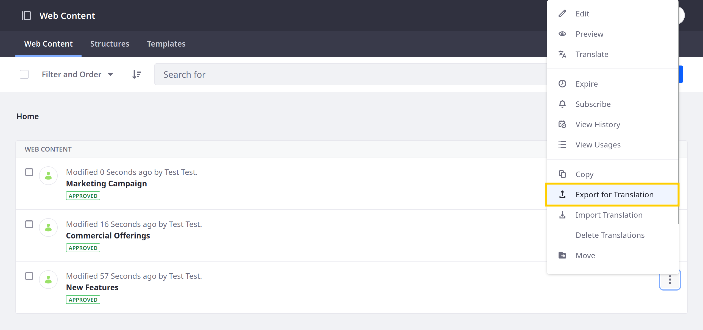

---
taxonomy-category-names:
- Content Management System
- Content Translations
- Web Content and Structures
- Localization
- Liferay Self-Hosted
- Liferay PaaS
- Liferay SaaS
uuid: 6f717fa5-9cf3-426e-9df3-b59517a62dc7
---
# Translating Web Content

{bdg-secondary}`Liferay DXP/Portal 7.3+`

Liferay provides integrated tools for translating web content articles, so you can create engaging, localized content for your global users. With these tools, you can manually translate web content or import translations as XLIFF files.

If desired, you can [enable a custom workflow](./enabling-workflows-for-translations.md) to direct the review and publishing process for translations.

```{note}
The languages available for translation are determined by your instance's localization settings. See [Initial Instance Localization](../../installation-and-upgrades/setting-up-liferay/initial-instance-localization.md) and [Virtual Instance Localization](../../system-administration/configuring-liferay/virtual-instances/localization.md) for more information.
```

## Manually Translating Content

```{note}
To manually translate web content, users must have either View and Update permissions for the asset or Translation permissions for one or more languages. See [Managing Permissions for Translation](./managing-translation-permissions.md) for more information.
```

1. Open the *Site Menu* () and navigate to *Content & Data* &rarr; *Web Content*.

1. Click *Actions* () for the content you want to translate and select *Translate*.

   This redirects you to the translation interface, where you can view the content's original text alongside your translation.

   The left column displays the language you're translating from, and the right column provides editable fields you can use for your translation.

   

1. Select the language you want to translate.

   ```{important}
   Users with content Update permissions can translate the original text into any language.

   Users with translate permissions can only translate the origin text into languages for which they have permission.
   ```

   

1. Enter your translation for the available fields.

   ```{note}
   The friendly URL for translations remains empty unless filled in by the user. If the friendly URL is left empty, the default language's friendly URL is used.
   ```

1. Click *Publish* to create a new version of the web content or initiate a workflow, if it's enabled.

   Alternatively, click *Save as Draft* to save and publish your translation later.

## Publishing Translated Web Content Using Localizable Fields

Translated web content in localizable fields can be different structurally from the content displayed in the original language. Liferay does this so your changes don't override content that has been already translated. To see how this works, follow these steps:

1. In Web Content, go to Structures and Click *Add*.

1. Create a structure using a repeatable fieldset. For example, add a Text and an Image field to your fieldset. Make them both required and click *Save*.

1. Add the fieldset to your new structure and make it repeatable.

1. In the upper left corner, click the flag icon and click *Manage Translations*.

1. Click *Add* () and add a language of your choice. Click *Done*.

1. Name your structure and click *Save*. 

1. Now navigate to Web Content and click *New*. Select the structure you just created.

1. Enter a value for your text field and select an image. 

1. In the upper left corner, click the flag icon and click the language previously chosen as your translation. Notice that the content in the fieldset has not changed. The same happens when you duplicate the fieldset using the default language; the secondary language's content doesn't change. Now change the translation back to the default language and name your web content. Click *Publish*.

1.  Click *Actions* () next to your web content and click *Translate*.

1. On Translate From in the upper corner, select the language chosen in the structure creation. Click *Publish*.

1. Click your web content to enter edit mode.

1. In the upper left corner, click the flag icon. See that the secondary language has the Translated message next to it.



1. Using your default language, click *Duplicate* () once more and enter a value for the text field and select an image.

1. In the upper left corner, click the flag icon and select the translated language. You can see that the content selected for the duplicated fieldset is not present when using this translation.

This behavior frees you to manage your translations independently from the original language.

## Exporting and Importing Translations

```{note}
To translate content page experiences manually, users must have either View and Update permissions for content pages or Translation permissions for one or more languages. See [Managing Translation Permissions](./managing-translation-permissions.md) for more information.
```

With Liferay, you can export web content for translation as `.xliff` or `.xlf` files. You can send these files to translators and then import the translations together as a `.zip` file or individually as `.xliff` or `.xlf` files.

```{important}
Liferay supports both XLIFF 1.2 and 2.0 files. However, it may not support all features and capabilities those formats provide.
```

### Exporting Content for Translation

1. Open the *Site Menu* () and navigate to *Content & Data* &rarr; *Web Content*.

1. Click *Actions* () for the content you want to translate and select *Export for Translation*. This opens a modal window for configuring your export.

   

   In Liferay Portal 7.4 GA26+, you can select multiple articles and click the *Export for Translation* button.

   

1. Select an export format: *XLIFF 1.2* or *XLIFF 2.0*.

1. Select the web content's original language.

1. Select the languages you want to translate to.

   

1. Click *Export*.

Liferay generates a ZIP archive that contains an XLIFF file for each selected language. You can then use these files with compatible translation software.

### Importing Content Translations

1. Open the *Site Menu* () and navigate to *Content & Data* &rarr; *Web Content*.

1. Click *Actions* () for the translated web content and select *Import Translation*.

   

   In Liferay Portal 7.4 GA26+, you can import translations for multiple articles at once by clicking the *Actions* button () in the Application Bar and selecting *Import Translations*.

   

1. Select the `.xliff`, `.xlf`, and `.zip` files you want to import.

   

   ```{important}
   While Liferay supports importing XLIFF files created using the [Export for Translation](#exporting-content-for-translation) action, it cannot guarantee the successful import of files generated by other means.
   ```

1. Click *Publish*.

   If successful, Liferay displays a success message with the imported files. The web content is updated with all changes included in the translation files. If workflow is enabled, this change must be approved as with other content updates.

   

   However, if errors occur during import, Liferay notifies you of the failing files and provides a downloadable CSV error report.

   

## Translating Web Content Using Third Party Services

If you've enabled Liferay's integration with [Google Cloud Translation](https://cloud.google.com/translate/docs/setup), [Amazon Translate](https://docs.aws.amazon.com/translate/latest/dg/what-is.html), or [Microsoft Translator](https://docs.microsoft.com/en-us/azure/cognitive-services/translator/), you can use them to automatically translate web content. See [Using Third Parties for Translation](./using-third-parties-for-translation.md) for more information.

## Related Topics

[Translating Content Pages](./translating-content-pages.md)

[Using Third Parties for Translation](./using-third-parties-for-translation.md)

[Enabling Workflows for Translations](./enabling-workflows-for-translations.md)
