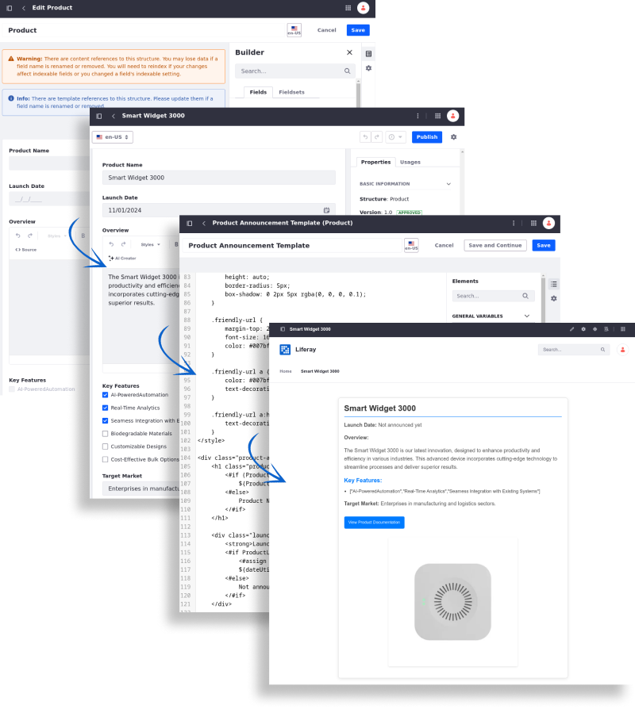

---
toc:
  - ./web-content/web-content-articles.md
  - ./web-content/web-content-structures.md
  - ./web-content/web-content-templates.md
  - ./web-content/developer-guide.md
taxonomy-category-names:
- Content Management System
- Web Content and Structures
- Liferay Self-Hosted
- Liferay PaaS
- Liferay SaaS
uuid: 1b4e41e3-950f-497b-911b-c058157e3c9c
---

# Web Content

You can create, manage, and publish various content types seamlessly through Liferay's robust content management system.

Discover how to craft compelling [web content articles](./web-content/web-content-articles.md) tailored to your audience, define consistent [structures](./web-content/web-content-structures.md) to streamline the writing process, and create [templates](./web-content/web-content-templates.md) to display content the way you want.

Get started by exploring how to [create a web content article](./web-content/web-content-articles/creating-web-content-articles.md), [a web content structure](./web-content/web-content-structures/creating-web-content-structures.md), and [design a web content template](./web-content/web-content-templates/creating-web-content-templates.md) that aligns with your content strategy.

