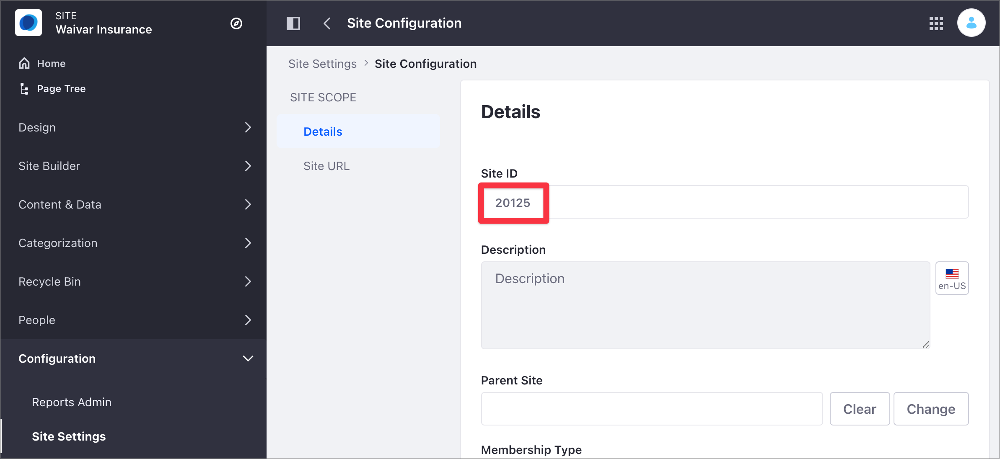

---

taxonomy-category-names:
- Content Management System
- Web Content and Structures
- API Development
- Liferay Self-Hosted
- Liferay PaaS
- Liferay SaaS
uuid: 0e4115ae-4688-439d-a40f-e9399f0f167d

---

# Advanced Web Content API

Using the Liferay DXP REST services, you can create and manage your site's structured content. Structured content is [web content](../web-content-articles/creating-web-content-articles.md) that uses a web content structure (or structure). A structure defines the information, such as author(s), a summary, and the content included in an article. Structures ensure that the article includes all the required information. For more information on structures, read [Web Content Structures](../web-content-structures.md).

Use a pre-built Liferay DXP Docker image with several [cURL](https://curl.haxx.se/) and Java code samples to learn more about structures and structured content.

!!! note
    See [Consuming REST Services](../../../headless-delivery/consuming-apis/consuming-rest-services.md) for an overview of using the REST API in Liferay DXP and [Web Content API Basics](./web-content-api-basics.md) for an introduction to the web content API.

## Setting Up Your Environment

```{include} /_snippets/run-liferay-dxp.md
```

Then, download and unzip the [sample project](https://resources.learn.liferay.com/dxp/latest/en/content-authoring-and-management/web-content/developer-guide/liferay-m7b2.zip):

```bash
curl https://resources.learn.liferay.com/dxp/latest/en/content-authoring-and-management/web-content/developer-guide/liferay-m7b2.zip -O
```

```bash
unzip liferay-m7b2.zip
```

!!! note
    These scripts use basic authentication and are designed for testing. Do not use basic authentication in a production Liferay DXP environment.

### Identify the Site ID

1. Open the Site menu (), expand *Configuration*, and go to *Site Settings*.

1. Under the Platform section, click *Site Configuration*.

   For Liferay DXP versions 7.3 and earlier, click the *General* tab.

1. Find the site identifier under Site ID.

   

### Adding the Images to Liferay DXP

Start with an article containing different content fields, including images. To add these images to the article,

1. Open the Site menu (), expand *Content & Data*, and go to *Documents and Media*.

1. Click *New* and select *Multiple Files Upload*.

1. Drag and drop the `foo.png`, `bar.png`, and `goo.png` images from the [sample project folder](https://resources.learn.liferay.com/dxp/latest/en/content-authoring-and-management/web-content/developer-guide/liferay-m7b2.zip) onto the drop area.

1. Click *Publish*.

Alternatively, use the `Documents_POST_ToSites.sh` script to upload each image separately using the REST API's `Document` service.

```bash
curl \
   "http://localhost:8080/o/headless-delivery/v1.0/sites/${1}/documents" \
   --form "file=@${2}" \
   --header "Content-Type: multipart/form-data" \
   --request "POST" \
   --user "test@liferay.com:learn"
```

This example posts the `foo.png` image, using the site ID (`{1}`) and the relative image file path (`{2}`) as parameters:

| Method | Service    | Endpoint                     |
|:-------|:-----------|:-----------------------------|
| GET    | `Document` | `/v1.0/sites/${1}/documents` |

```bash
./Documents_POST_ToSites.sh "../images/foo.png" 20125
```

| Parameter # | Description           |
|:------------|:----------------------|
| $1          | `siteId`              |
| $2          | Relative path to file |

The JSON output includes the image identifier in the `id` field:

```json
{
   ...
   "encodingFormat" : "image/png",
   "externalReferenceCode" : "44339",
   "fileExtension" : "png",
   "id" : 44339,
   ...
   "title" : "foo.png"
}
```

For more information on working with documents using the REST API, see [Document API Basics](../../documents-and-media/developer-guide/document-api-basics.md).

Or you can use the `Documents_POST_ToSites` class. Navigate out of the curl folder and into the java folder. Compile the source files:

```bash
javac -classpath .:* *.java
```

Run the `Documents_POST_ToSites` class. Replace the `siteId` value with your site ID and the `filePath` value with the path to the `foo.png` image:

```bash
java -classpath .:* -DfilePath=1234 -DsiteId=5678 Documents_POST_ToSites
```

### Create the Sample Structure

!!! note
    You cannot create a structure programmatically using the REST API.

1. Open the *Site* menu (), expand *Content & Data*, and go to *Web Content*.

1. Select the *Structures* tab and click *New*.

1. Create a new structure with the following information:

   - Name: `Foo`
   - Fields (in this order): `Text`, `Image`, `Date`, `Single Selection`

1. Use these values for the Single Selection field:

   - First option value: `Foo`
   - Second option value: `Goo`

   

1. Click each structure field and update its Field Reference value (see table below). You can find the Field Reference values on the sidebar, under the Advanced section.

1. Click *Save*.

  | Field     | New Field Reference value  |
  |:----------|:---------------------------|
  | Text      | `TextReference`            |
  | Image     | `ImageReference`           |
  | Date      | `DateReference`            |
  | Selection | `SingleSelectionReference` |

  

For more information, see [Creating Web Content Structures](../web-content-structures/creating-web-content-structures.md).

### Create the Sample Templates

!!! note
    You cannot create a web content template programmatically using the REST API.

Create a template including the structure's `image` field:

1. Open the *Site* menu (), expand *Content & Data*, and go to *Web Content*.

1. Select the *Templates* tab and click *New*.

1. Type *Foo* as your template name.

1. From the Properties side panel, click *Add* () next to the structure field.

   

1. Select the *Foo* structure from the [previous section](#create-the-structure-sample).

1. Delete the default `<#-- -->` block comment included in the FreeMarker editor.

1. On the sidebar, click *Elements* ().

1. Under the Fields group, click the *Text*, *Image*, *Date*, and *Single Selection* fields to add them to your template. Ensure each field starts with a new line in the FreeMarker editor.

   

1. Click *Save*.

Create a second template without the structure's `image` field:

1. Under the Templates tab, click *Actions* () and select *Copy*.

   

1. Update the template's name to *Goo* and click *Copy*.

1. Under the Templates tab, click the new *Goo* template.

1. In the template editor, remove the image information `<#if (ImageReference.getData())></#if>` from the FreeMarker script.

1. Click *Save*.

 For more information, see [Creating Web Content Templates](../web-content-templates/creating-web-content-templates.md).

## Getting Web Content Structures From the Site

To retrieve all existing structures in a specified site, use the `ContentStructures_GET_FromSites.sh` script. This script uses the `ContentStructure` service with a `GET` HTTP method and the [site ID](#identify-the-site-id) parameter.

| Method | Service            | Endpoint                              |
|:-------|:-------------------|:--------------------------------------|
| GET    | `ContentStructure` | `/v1.0/sites/${1}/content-structures` |

```bash
./ContentStructures_GET_FromSites.sh 20125
```

| Parameter # | Description |
|:------------|:------------|
| $1          | `siteId`    |

In the JSON response, identify the structure `id` (`"id" : 43563`) and `name` (`"name" : "Foo"`). The `contentStructureFields` section describes the structure fields. This structure contains four different fields named `TextReference`, `ImageReference`, `DateReference`, and `SingleSelectionReference`.

```json
{
   "actions" : { },
   "facets" : [ ],
   "items" : [ {
      "availableLanguages" : [ "en-US" ],
      "contentStructureFields" : [ {
         "dataType" : "string",
         "inputControl" : "text",
         "label" : "Text",
         "localizable" : true,
         "multiple" : false,
         "name" : "TextReference",
         "nestedContentStructureFields" : [ ],
         "options" : [ ],
         "predefinedValue" : "",
         "repeatable" : false,
         "required" : false,
         "showLabel" : true
      }, {
         "dataType" : "image",
         "label" : "Image",
         "localizable" : true,
         "multiple" : false,
         "name" : "ImageReference",
         "nestedContentStructureFields" : [ ],
         "options" : [ ],
         "predefinedValue" : "{}",
         "repeatable" : false,
         "required" : false,
         "showLabel" : true
      }, {
         "dataType" : "date",
         "label" : "Date",
         "localizable" : true,
         "multiple" : false,
         "name" : "DateReference",
         "nestedContentStructureFields" : [ ],
         "options" : [ ],
         "predefinedValue" : "",
         "repeatable" : false,
         "required" : false,
         "showLabel" : true
      }, {
         "dataType" : "string",
         "inputControl" : "radio",
         "label" : "Single Selection",
         "localizable" : true,
         "multiple" : false,
         "name" : "SingleSelectionReference",
         "nestedContentStructureFields" : [ ],
         "options" : [ {
         "label" : "Foo",
         "value" : "Option13142925"
         }, {
         "label" : "Goo",
         "value" : "Option50805674"
         } ],
         "predefinedValue" : "[]",
         "repeatable" : false,
         "required" : false,
         "showLabel" : true
      } ],
      "creator" : {
         "additionalName" : "",
         "contentType" : "UserAccount",
         "familyName" : "Bowman",
         "givenName" : "David",
         "id" : 20129,
         "name" : "David Bowman"
      },
      "dateCreated" : "2021-08-25T07:52:46Z",
      "dateModified" : "2021-08-25T08:01:58Z",
      "description" : "",
      "id" : 43563,
      "name" : "Foo",
      "siteId" : 20125
   } ],
   "lastPage" : 1,
   "page" : 1,
   "pageSize" : 20,
   "totalCount" : 1
}
```

Alternatively, run the `ContentStructures_GET_FromSites` Java class:

```bash
java -classpath .:* -DsiteId=1234 ContentStructures_GET_FromSites
```

## Get the Images IDs

To obtain the IDs of [previously posted images](#adding-the-images-to-liferay-dxp), use the `Documents_GET_FromSites.sh` script. This script uses the `Document` service with a `GET` HTTP method and the [site ID](#identify-the-site-id) as parameter.

| Method | Service    | Endpoint                     |
|:-------|:-----------|:-----------------------------|
| GET    | `Document` | `/v1.0/sites/${1}/documents` |

```bash
./Documents_GET_FromSites.sh 20125
```

| Parameter # | Description |
|:------------|:------------|
| $1          | `siteId`    |

Alternatively, run the `Documents_GET_FromSites` Java class:

```bash
java -classpath .:* -DsiteId=1234 Documents_GET_FromSites
```

## Getting Web Content Templates From the Site

Use the `ContentTemplates_GET_FromSites` script to obtain all the site's templates. This script uses the `ContentTemplate` service with a `GET` HTTP method and the [site ID](#identify-the-site-id) as parameter.

| Method | Service           | Endpoint                             |
|:-------|:------------------|:-------------------------------------|
| GET    | `ContentTemplate` | `/v1.0/sites/${1}/content-templates` |

```bash
./ContentTemplates_GET_FromSites.sh 20125
```

| Parameter # | Description |
|:------------|:------------|
| $1          | `siteId`    |

The JSON response contains

- Two templates: `"name": "Foo"` and `"name": "Goo"`.

- The `contentStructureId` that links the structure to the template.

- The `templateScript` includes the script written in the specified `programmingLanguage`. In this example, FreeMarker is used.

- The `templateScript` field in the `Foo` template references the image field with `<#if (ImageReference.getData())></#if>`. The `Goo` template does not include this reference.

```json
{
   "actions" : {
      "get" : {
         "method" : "GET",
         "href" : "http://localhost:8080/o/headless-delivery/v1.0/sites/20125/content-templates"
      }
   },
   "facets" : [ ],
   "items" : [ {
      "actions" : {
         "get" : {
         "method" : "GET",
         "href" : "http://localhost:8080/o/headless-delivery/v1.0/sites/20125/content-templates/{contentTemplateId}"
         }
      },
      "availableLanguages" : [ "en-US" ],
      "contentStructureId" : 43563,
      "creator" : {
         "additionalName" : "",
         "contentType" : "UserAccount",
         "familyName" : "Bowman",
         "givenName" : "David",
         "id" : 20129,
         "name" : "David Bowman"
      },
      "dateCreated" : "2021-08-25T13:39:20Z",
      "dateModified" : "2021-08-25T13:39:20Z",
      "description" : "",
      "id" : "43823",
      "name" : "Foo",
      "programmingLanguage" : "ftl",
      "siteId" : 20125,
      "templateScript" : "<#if (TextReference.getData())??>\n\t${TextReference.getData()}\n</#if>\n<#if (ImageReference.getData())?? && ImageReference.getData() != \"\">\n\t\n</#if>\n<#assign DateReference_Data = getterUtil.getString(DateReference.getData())>\n\n<#if validator.isNotNull(DateReference_Data)>\n\t<#assign DateReference_DateObj = dateUtil.parseDate(\"yyyy-MM-dd\", DateReference_Data, locale)>\n\n\t${dateUtil.getDate(DateReference_DateObj, \"dd MMM yyyy - HH:mm:ss\", locale)}\n</#if>\n<#if (SingleSelectionReference.getData())??>\n\t${SingleSelectionReference.getData()}\n</#if>"
   }, {
      "actions" : {
         "get" : {
         "method" : "GET",
         "href" : "http://localhost:8080/o/headless-delivery/v1.0/sites/20125/content-templates/{contentTemplateId}"
         }
      },
      "availableLanguages" : [ "en-US" ],
      "contentStructureId" : 43563,
      "creator" : {
         "additionalName" : "",
         "contentType" : "UserAccount",
         "familyName" : "Bowman",
         "givenName" : "David",
         "id" : 20129,
         "name" : "David Bowman"
      },
      "dateCreated" : "2021-08-26T10:10:22Z",
      "dateModified" : "2021-08-26T14:08:53Z",
      "description" : "",
      "id" : "44177",
      "name" : "Goo",
      "programmingLanguage" : "ftl",
      "siteId" : 20125,
      "templateScript" : "<#if (TextReference.getData())??>\n\t${TextReference.getData()}\n</#if>\n<#assign DateReference_Data = getterUtil.getString(DateReference.getData())>\n\n<#if validator.isNotNull(DateReference_Data)>\n\t<#assign DateReference_DateObj = dateUtil.parseDate(\"yyyy-MM-dd\", DateReference_Data, locale)>\n\n\t${dateUtil.getDate(DateReference_DateObj, \"dd MMM yyyy - HH:mm:ss\", locale)}\n</#if>\n<#if (SingleSelectionReference.getData())??>\n\t${SingleSelectionReference.getData()}\n</#if>"
   } ],
   "lastPage" : 1,
   "page" : 1,
   "pageSize" : 20,
   "totalCount" : 2
}
```

Alternatively, run the `ContentTemplates_GET_FromSites` Java class:

```bash
java -classpath .:* -DsiteId=1234 ContentTemplates_GET_FromSites
```

## Getting a Web Content Template

To retrieve information about a specific template, use the `ContentTemplates_GET_ById.sh` cURL script, which requires the site and template IDs.

| Method | Service           | Endpoint                                  |
|:-------|:------------------|:------------------------------------------|
| GET    | `ContentTemplate` | `/v1.0/sites/${1}/content-templates/${2}` |

```bash
./ContentTemplates_GET_ById.sh 20125 43823
```

| Parameter # | Description         |
|:------------|:--------------------|
| $1          | `siteId`            |
| $2          | `contentTemplateId` |

Alternatively, run the `ContentTemplates_GET_ById` Java class. Replace the values with your site and template IDs:

```bash
java -classpath .:* -DcontentTemplateId=1234 -DsiteId=5678 ContentTemplates_GET_ById
```

## Posting a Web Content Article

Use the `StructuredContents_POST_ToSites.sh` cURL script to create a new article using the `POST` HTTP method, using the [sample structure you created](#create-the-sample-structure). The script requires the [site ID](#identifying-the-site-id), structure ID, and the [image ID](#getting-the-images-ids) for `foo.png` as parameters.

| Method | Service             | Endpoint                                   |
|:-------|:--------------------|:-------------------------------------------|
| PUT    | `StructuredContent` | `/v1.0/sites/{siteId}/structured-contents` |

```bash
./StructuredContents_POST_ToSites.sh 20125 43563 43795
```

cURL script parameters:

| Parameter # | Description          |
|:------------|:---------------------|
| $1          | `siteId`             |
| $2          | `imageId`            |
| $3          | `contentStructureId` |

To find your new article in Liferay DXP, open the *Site Menu* () &rarr; *Content & Data* &rarr; *Web Content*.


The script posts a new article with the following attributes:

- `"title" : "Able"`
- Four `contentFields` values defining the article's body:
  - Text string in `TextReference`.
  - Image in `ImageReference`.
  - Date information in `DateReference`.
  - Radio button control in `SingleSelectionReference`.

```json
{
   "actions" : {
      ...
   },
   "availableLanguages" : [ "en-US" ],
   "contentFields" : [ {
      "contentFieldValue" : {
         "data" : "This text describes Foo."
      },
      "dataType" : "string",
      "inputControl" : "text",
      "label" : "Text",
      "name" : "TextReference",
      "nestedContentFields" : [ ],
      "repeatable" : false
   }, {
      "contentFieldValue" : {
         "image" : {
         "contentType" : "Document",
         "contentUrl" : "/documents/20125/0/foo.png/50956e56-9571-8f73-ae6e-9fca20fe0e3a?t=1629897455431",
         "description" : "This text describes Foo's image.",
         "encodingFormat" : "image/png",
         "fileExtension" : "png",
         "id" : 43795,
         "sizeInBytes" : 6232,
         "title" : "Foo"
         }
      },
      "dataType" : "image",
      "label" : "Image",
      "name" : "ImageReference",
      "nestedContentFields" : [ ],
      "repeatable" : false
   }, {
      "contentFieldValue" : {
         "data" : "2021-08-30T00:00:00Z"
      },
      "dataType" : "date",
      "label" : "Date",
      "name" : "DateReference",
      "nestedContentFields" : [ ],
      "repeatable" : false
   }, {
      "contentFieldValue" : {
         "data" : "Foo"
      },
      "dataType" : "string",
      "inputControl" : "radio",
      "label" : "Single Selection",
      "name" : "SingleSelectionReference",
      "nestedContentFields" : [ ],
      "repeatable" : false
   } ],
   "contentStructureId" : 43563,
   "creator" : {
      "additionalName" : "",
      "contentType" : "UserAccount",
      "familyName" : "Bowman",
      "givenName" : "David",
      "id" : 20129,
      "name" : "David Bowman"
   },
   "customFields" : [ ],
   "dateCreated" : "2021-08-26T06:14:06Z",
   "dateModified" : "2021-08-26T06:14:06Z",
   "datePublished" : "2021-08-26T06:14:00Z",
   "description" : "",
   "externalReferenceCode" : "43847",
   "friendlyUrlPath" : "able",
   "id" : 43849,
   "key" : "43847",
   "keywords" : [ ],
   "numberOfComments" : 0,
   "relatedContents" : [ ],
   "renderedContents" : [ {
      "contentTemplateId" : "43823",
      "contentTemplateName" : "Foo",
      "markedAsDefault" : true,
      "renderedContentURL" : "http://localhost:8080/o/headless-delivery/v1.0/structured-contents/43849/rendered-content/43823"
   }, {
      "contentTemplateId" : "43868",
      "contentTemplateName" : "Goo",
      "markedAsDefault" : false,
      "renderedContentURL" : "http://localhost:8080/o/headless-delivery/v1.0/structured-contents/44060/rendered-content/43868"
   } ],
   "siteId" : 20125,
   "subscribed" : false,
   "taxonomyCategoryBriefs" : [ ],
   "title" : "Able",
   "uuid" : "01ace059-814a-132d-d46d-21737ef2ec53"
}
```

Alternatively, run the `StructuredContents_POST_ToSites` Java class. Replace the values with your structure, site, and image IDs:

```bash
java -classpath .:* -DcontentStructureId=1234 -DimageId=5678 -DsiteId=91011 StructuredContents_POST_ToSites
```

## Getting a Web Content Article Rendered with a Particular Template

An article is not linked to a particular template. The template defines how the article renders. You can use different templates for the same article. For more information, read [Web Content Structures](../web-content-structures.md).

!!! tip
    Because an article is not linked to a particular template, you cannot specify a template when you `POST` a new article (the HTTP `POST` method ignores the `renderedContents` section describing the template.)

Use the `./StructureContents_GET_RenderedContent_ById.sh` script to render the article using the chosen article and template. This script uses the `GET` HTTP method in the `StructuredContent` service.

| Method | Service             | Endpoint                                               |
|:-------|:--------------------|:-------------------------------------------------------|
| PUT    | `StructuredContent` | `/v1.0/structured-contents/${1}/rendered-content/${2}` |

```bash
./StructureContents_GET_RenderedContent_ById.sh 43849 43868
```

Here is the script output using the template with the `image` field:

```html
Foo<picture data-fileentryid="43795"><source media="(max-width:300px)" srcset="http://localhost:8080/o/adaptive-media/image/43795/Thumbnail-300x300/foo.png?t=1629897455431, /o/adaptive-media/image/43795/Preview-1000x0/foo.png?t=1629897455431 2x" /><source media="(max-width:600px) and (min-width:300px)" srcset="http://localhost:8080/o/adaptive-media/image/43795/Preview-1000x0/foo.png?t=1629897455431" /></picture>30 Aug 2021 - 00:00:00Option1314292
```

If you specify the template without the `image` field, the `<picture></picture>` information doesn't render in the output. Here is the script output when using the template without the `image` field:

```bash
./StructureContents_GET_RenderedContent_ById.sh 43849 43823
```

```html
Foo30 Aug 2021 - 00:00:00Option13142925
```

cURL scripts parameters:

| Parameter # | Description           |
|:------------|:----------------------|
| $1          | `structuredContentId` |
| $2          | `contentTemplateId`   |

Alternatively, run the `StructureContents_GET_RenderedContent_ById` Java class. Replace the values with your article and template IDs:

```bash
java -classpath .:* -DcontentTemplateId=1234 -DstructuredContentId=5678 StructureContents_GET_RenderedContent_ById
```

## Patching a Web Content Article

Use the `PATCH` HTTP method with the `StructuredContent` service to update the original article information partially. The `StructuredContents_PATCH_ById` script uses the article and structure identifiers to replace the article's title with `Charlie`.

| Method | Service             | Endpoint                                          |
|:-------|:--------------------|:--------------------------------------------------|
| PATCH  | `StructuredContent` | `/v1.0/structured-contents/{structuredContentId}` |

```bash
./StructuredContents_PATCH_ById.sh 43849 43563
```

cURL script parameters:

| Parameter # | Description           |
|:------------|:----------------------|
| $1          | `structuredContentId` |
| $2          | `contentStructureId`  |

Alternatively, run the `StructuredContents_PATCH_ById` Java class. Replace the value with your article ID:

```bash
java -classpath .:* -DstructuredContentId=1234 StructuredContents_PATCH_ById
```

## Putting a Web Content Article

Use the `PUT` HTTP method with the `StructuredContent` service to replace the original article information. The `StructuredContents_PUT_ById` script uses the article and structure identifiers to replace the article's name with `Baker` and the article's content from `Bar` to `Goo`.

| Method | Service             | Endpoint                                          |
|:-------|:--------------------|:--------------------------------------------------|
| PUT    | `StructuredContent` | `/v1.0/structured-contents/{structuredContentId}` |

```bash
./StructuredContents_PUT_ById.sh 43849 43563 43805
```

cURL script parameters:

| Parameter # | Description           |
|:------------|:----------------------|
| $1          | `structuredContentId` |
| $2          | `imageId`             |
| $3          | `contentStructureId`  |

Alternatively, run the `StructuredContents_PUT_ById` Java class. Replace the values with your article, image, and structure IDs:

```bash
java -classpath .:* -DcontentStructureId=1234 -DimageId=5678 -DstructuredContentId=91011 StructuredContents_PUT_ById
```

## Related Topics

- [Web Content API Basics](./web-content-api-basics.md)
- [Consuming REST Services](../../../headless-delivery/consuming-apis/consuming-rest-services.md)
- [Web Content Structures](../web-content-structures.md)
