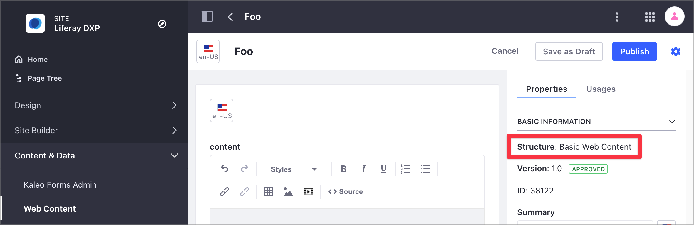
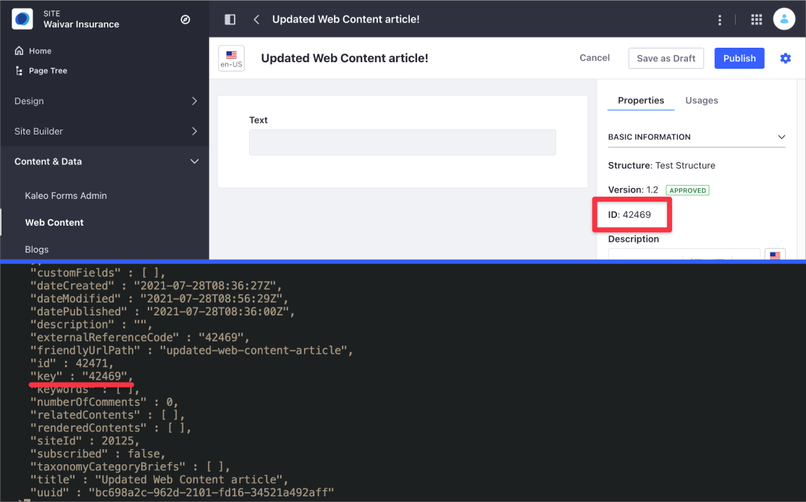

---
toc:
  - ./web-content-api-basics/web-content-api-basics-using-graphql.md
taxonomy-category-names:
- Content Management System
- Web Content and Structures
- API Development
- Liferay Self-Hosted
- Liferay PaaS
- Liferay SaaS
uuid: e5a69df2-30a5-4dbc-8467-e390dfc35aec
---

# Web Content API Basics

Using Liferay DXP REST services, you can create and manage structured content on your site. Structured content refers to [web content articles](../web-content-articles/creating-web-content-articles.md) that use a [web content structure](../web-content-structures.md) to enforce a consistent format and organization by defining the specific fields and information required for each article, such as author, summaries, and other relevant content elements.

!!! note
    While you can use a structure with a [web content template](../web-content-templates/creating-web-content-templates.md) to render structured content, a template is not required for creating structured content.

See the cURL and Java samples for structures and articles below. For more advanced examples of managing structured content, see [Advanced Web Content API](./advanced-web-content-api.md). For an overview of using the REST API in Liferay DXP, see [Consuming REST Services](../../../headless-delivery/consuming-apis/consuming-rest-services.md).

## Set Up Your Environment

```{include} /_snippets/run-liferay-portal.md
```

Then, follow these steps:

1. Download and unzip the [Web Content API Basics](./liferay-r4h9.zip) files:

   ```bash
   curl https://resources.learn.liferay.com/dxp/latest/en/content-authoring-and-management/web-content/developer-guide/liferay-r4h9.zip -O
   ```

   ```bash
   unzip liferay-r4h9.zip
   ```

   !!! note
       These scripts use basic authentication and are designed for testing. Do not use basic authentication in a production Liferay DXP environment.

1. Complete these steps to set up the environment:

   1. [Identify the Services to Consume](#identify-the-services-to-consume)
   1. [Identify the Site Id](#identify-the-site-id)
   1. [Create a Structure in the User Interface](#create-a-web-content-structure-in-the-user-interface)
   1. [Create an Article in the User Interface](#create-a-web-content-article-in-the-user-interface)

### Identify the Services to Consume

Use the following services in the Liferay DXP Headless Delivery API to manage web content:

- `StructuredContent` for articles.
- `ContentStructure` for structures.
- `ContentTemplate` for templates.

To view detailed information on these APIs, use your browser and access Liferay's API Explorer at `[server]:[port]/o/api` (e.g. http://localhost:8080/o/api). For more information, read [Consuming REST Services](../../../headless-delivery/consuming-apis/consuming-rest-services.md).

### Identify the Site ID

When signed in, [retrieve the site ID](../../../headless-delivery/consuming-apis/consuming-rest-services.md#identify-the-site-containing-the-data). Use this ID in several service calls. In this example, the ID is `20117`.

### Create a Web Content Structure in the User Interface

To create an article, you need a structure. When you create articles in the user interface without declaring a structure, Liferay DXP uses a default Basic Web Content structure.

!!! note
    The Basic Web Content structure is not visible in the Liferay DXP user interface.

Instead of using the Basic Web Content structure, create a new one:

1. Open the *Site Menu* (../../../images/icon-menu.png), expand *Content & Data*, and go to *Web Content*.

1. Select the *Structures* tab and click *New*.

1. Name it *Foo Structure*. In the Builder menu on the right, select, drag, and drop a *Text* field to the form area.

1. In the contextual menu that opens on the right, select the *Advanced* tab and change the *Field Reference* to `Content`.

1. Click *Save*.

For more information, see [Creating Structures](../web-content-structures/creating-structures.md).

### Create a Web Content Article in the User Interface

Now you can create an article based on the Foo Structure:

1. Open the *Site Menu* (../../../images/icon-menu.png), expand *Content & Data*, and go to *Web Content*.

1. Under the *Web Content* tab, click *New* and choose *Foo Structure*.

1. Enter *Foo Article* as the new name and click *Publish*.

   

For more information, see [Creating Web Content Articles](../web-content-articles/creating-web-content-articles.md).

## Get Web Content Articles From the Site

Use the REST API to retrieve a list of the site's articles by executing the following cURL script or Java class. Replace `1234` with your site's ID.

### StructuredContents_GET_FromSites.sh

The `StructuredContents_GET_FromSites.sh` cURL script lists all the site's articles. This script uses the `StructuredContent` service with a `GET` HTTP method, with the site ID as the only parameter.

| Method | Service             | Endpoint                                   |
|:-------|:--------------------|:-------------------------------------------|
| `GET`  | `StructuredContent` | `/v1.0/sites/{siteID}/structured-contents` |

```bash
./StructuredContents_GET_FromSites.sh 1234
```

| Parameter # | Description |
|:------------|:------------|
| `$1`        | `siteId`    |

Below is the partial JSON output generated by the script. In this output, you can see a single article identified by an `id` and a friendly URL in `friendlyUrlPath`. The article uses the structure in `contentStructureId`.

This structure has a single text field described in the `contentFieldValue` section under `contentFields`. When you include more elements in your structure, you can see additional `contentFieldValue` sections describing these elements.

```json
{
   {
   ...
   "items": [
      {
         ...
         "availableLanguages": [
         "en-US"
         ],
         "contentFields": [
         {
            "contentFieldValue": {
               "data": ""
            },
            "dataType": "string",
            "inputControl": "text",
            "label": "Text",
            "name": "Content",
            "nestedContentFields": [],
            "repeatable": false
         }
         ],
         "contentStructureId": 32122,
         "creator": {
         "additionalName": "",
         "contentType": "UserAccount",
         "familyName": "Administrator",
         "givenName": "Master",
         "id": 20123,
         "name": "Master Administrator"
         },
         "customFields": [],
         "dateCreated": "2024-10-02T11:29:20Z",
         "dateModified": "2024-10-02T11:29:20Z",
         "datePublished": "2024-10-02T11:29:00Z",
         "description": "",
         "externalReferenceCode": "0b1a40b2-687e-c88a-f8d9-5270ec94fdd6",
         "friendlyUrlPath": "foo-article",
         "id": 32147,
         "key": "32145",
         "keywords": [],
         "neverExpire": true,
         "numberOfComments": 0,
         "priority": 0,
         "relatedContents": [],
         "renderedContents": [],
         "siteId": 20117,
         "structuredContentFolderId": 0,
         "subscribed": false,
         "taxonomyCategoryBriefs": [],
         "title": "Foo Article",
         "uuid": "0b1a40b2-687e-c88a-f8d9-5270ec94fdd6"
      }
   ],
   "lastPage": 1,
   "page": 1,
   "pageSize": 20,
   "totalCount": 1
}
```

Review the following information in the JSON output:

- The output shows a single article identified by `id: 32147`, `title: Foo Article`, and the friendly URL `friendlyUrlPath: foo-article`.
- This article uses the Foo Structure identified by the `contentStructureId`.
- The structure has a single text field described in the `contentFieldValue` section under `contentFields`. When you include more elements in the structure, you can see additional `contentFieldValue` sections describing these elements.
- The `ID` value displayed in the user interface corresponds to the `key` property in the JSON output.

   

### StructuredContents_GET_FromSites.java

The `StructuredContents_GET_FromSites.java` class gets a list of articles by calling the structured content related services.

```{literalinclude} ./web-content-api-basics/resources/liferay-r4h9.zip/java/StructuredContents_GET_FromSites.java
   :dedent: 1
   :language: java
   :lines: 11-26
```

This class invokes the REST service using only three lines of code:

| Line (abbreviated)                                                                             | Description                                                                                        |
|:-----------------------------------------------------------------------------------------------|:---------------------------------------------------------------------------------------------------|
| `StructuredContentResource.Builder builder = ...`                                              | Gets a `Builder` for generating a `StructuredContentResource` service instance.                    |
| `StructuredContentResource structuredContentResource = builder.authentication(...).build();`   | Specifies basic authentication and generates a `StructuredContentResource` service instance.       |
| `Page<StructuredContent> page = structuredContentResource.getSiteStructuredContentsPage(...);` | Calls the `structuredContentResource.getSiteStructuredContentsPage` method and retrieves the data. |

Note that the project includes the `com.liferay.headless.delivery.client.jar` file as a dependency. You can find client JAR dependency information for all REST applications in the API explorer in your installation at `/o/api`.

!!! note
    The `main` method's comment demonstrates running the class.

The other example Java classes are similar to this one, but call different `StructuredContentResource` methods.

!!! important
    See [StructuredContentResource](https://github.com/liferay/liferay-portal/blob/[$LIFERAY_LEARN_PORTAL_GIT_TAG$]/modules/apps/headless/headless-delivery/headless-delivery-client/src/main/java/com/liferay/headless/delivery/client/resource/v1_0/StructuredContentResource.java) for service details.

## Get a Web Content Article

While the script in [the previous step](#get-web-content-articles-from-site) returns all the site's articles, you can get a specific article by using the `StructuredContents_GET_ById.[java|sh]` script/class and specifying the article's ID.

Commands:

Replace `[articleId]` and the value in `-DstructuredContentId=1234` with the article's ID

```bash
./StructuredContents_GET_ById.sh [articleId]
```

```bash
java -classpath .:* -DstructuredContentId=1234 StructuredContents_GET_ById
```

The `StructuredContent` fields appear in JSON.

## Get Web Content Structures From the Site

Use the REST API to retrieve a list of the site's structures by executing the following cURL script or Java class. Replace `[siteId]` and the value in `-DsiteId=1234` with the site ID.

!!! note
    The default Basic Web Content structure is not visible using this endpoint.

Commands:

```bash
./ContentStructures_GET_FromSite.sh [siteId]
```

```bash
java -classpath .:* -DsiteId=1234 ContentStructures_GET_FromSite
```

The site's `ContentStructures` appear in JSON. As the Basic Web Content structure is not visible, it doesn't show in the response:

```json
{
   "actions" : { },
   "facets" : [ ],
   "items" : [ {
      "availableLanguages" : [ "en-US" ],
      "contentStructureFields" : [ {
         "dataType" : "string",
         "inputControl" : "text",
         "label" : "Text",
         "localizable" : true,
         "multiple" : false,
         "name" : "Content",
         "nestedContentStructureFields" : [ ],
         "options" : [ ],
         "predefinedValue" : "",
         "repeatable" : false,
         "required" : false,
         "showLabel" : true
      } ],
      "creator" : {
         "additionalName" : "",
         "contentType" : "UserAccount",
         "familyName" : "Administrator",
         "givenName" : "Master",
         "id" : 20123,
         "name" : "Master Administrator"
      },
      "dateCreated" : "2024-10-01T18:34:15Z",
      "dateModified" : "2024-10-01T18:34:15Z",
      "description" : "",
      "id" : 32122,
      "name" : "Foo Structure",
      "siteId" : 20117
   } ],
   "lastPage" : 1,
   "page" : 1,
   "pageSize" : 20,
   "totalCount" : 1
}
```

You can see details about the `creator` of the structure, its `id`, `name`, and `contentStructureFields` where you can find information about the fields used in the structure.

## Get a Web Content Structure

Use the `ContentStructure` service to retrieve the description of a specific structure by providing its ID as a parameter.

### ContentStructures_GET_ById.sh

| Method | Service            | Endpoint                                        |
|:-------|:-------------------|:------------------------------------------------|
| `GET`  | `ContentStructure` | `/v1.0/content-structures/{contentStructureId}` |

```bash
./ContentStructures_GET_ById.sh 1234
```

| Parameter # | Description          |
|:------------|:---------------------|
| $1          | `contentStructureId` |

Below is the JSON output. You can identify the structure's `id` and `name`. The `contentStructureFields` section contains a description of the structure fields. Notice that this structure contains a single content field of type `string` and name `Content`.

```json
{
   "availableLanguages" : [ "en-US" ],
   "contentStructureFields" : [ {
      "dataType" : "string",
      "inputControl" : "text",
      "label" : "Text",
      "localizable" : true,
      "multiple" : false,
      "name" : "Content",
      "nestedContentStructureFields" : [ ],
      "options" : [ ],
      "predefinedValue" : "",
      "repeatable" : false,
      "required" : false,
      "showLabel" : true
   } ],
   "creator" : {
      "additionalName" : "",
      "contentType" : "UserAccount",
      "familyName" : "Administrator",
      "givenName" : "Master",
      "id" : 20123,
      "name" : "Master Administrator"
   },
   "dateCreated" : "2024-10-02T10:50:55Z",
   "dateModified" : "2024-10-02T10:50:55Z",
   "description" : "",
   "id" : 33862,
   "name" : "Foo Structure",
   "siteId" : 20117
}
```

Similarly, you can run the `ContentStructures_GET_ById` Java class:

```bash
java -classpath .:* -DcontentStructureId=1234 ContentStructures_GET_ById
```

The `ContentStructure` description appears in JSON.

## Post a Web Content Article

Use the `StructuredContents_POST_ToSite[java|sh]` script/class to create a new article using the Foo Structure.

### StructuredContents_POST_ToSite.sh

The `StructuredContents_POST_ToSite.sh` cURL script creates a new article using the `POST` HTTP method and the Foo Structure. The script uses the [site ID](#identifying-the-site-id) and the structure `ID` as parameters.

| Method | Service             | Endpoint                                   |
| :----- | :------------------ | :----------------------------------------- |
| `PUT`  | `StructuredContent` | `/v1.0/sites/{siteId}/structured-contents` |

```bash
./StructuredContents_POST_ToSite.sh [siteId] [structureId]
```

cURL script parameters:

| Parameter # | Description          |
| :---------- | :------------------- |
| $1          | `siteId`             |
| $2          | `contentStructureId` |

To find your new article in Liferay DXP, open the *Site Menu* () and go to *Content & Data* &rarr; *Web Content*.

Below is the partial JSON output generated by the script. The script posts a simple `<p>Goo</p>` HTML string using the Structure `contentField` `content` as reference.

```json
{
...
   "availableLanguages" : [ "en-US" ],
   "contentFields" : [ {
      "contentFieldValue" : {
         "data" : "<p>Goo</p>"
      },
      "dataType" : "string",
      "inputControl" : "text",
      "label" : "Text",
      "name" : "Content",
      "nestedContentFields" : [ ],
      "repeatable" : false
   } ],
   "contentStructureId" : 32122,
   "creator" : {
      "additionalName" : "",
      "contentType" : "UserAccount",
      "familyName" : "Administrator",
      "givenName" : "Master",
      "id" : 20123,
      "name" : "Master Administrator"
   },
   "customFields" : [ ],
   "dateCreated" : "2024-10-02T11:57:26Z",
   "dateModified" : "2024-10-02T11:57:26Z",
   "datePublished" : "2024-10-02T11:57:00Z",
   "description" : "",
   "externalReferenceCode" : "009a771b-2e71-de18-83e2-6ae165ce93c5",
   "friendlyUrlPath" : "goo-article",
   "id" : 32177,
   "key" : "32175",
   "keywords" : [ ],
   "neverExpire" : true,
   "numberOfComments" : 0,
   "priority" : 0.0,
   "relatedContents" : [ ],
   "renderedContents" : [ ],
   "siteId" : 20117,
   "structuredContentFolderId" : 0,
   "subscribed" : false,
   "taxonomyCategoryBriefs" : [ ],
   "title" : "Goo Article",
   "uuid" : "009a771b-2e71-de18-83e2-6ae165ce93c5"
}
```

Similarly, the `StructuredContents_POST_ToSite.java` class adds an article by calling the structured content related service.

Command:

Replace the values in `-DcontentStructureId=1234` and `-DsiteId=5678` with the structure's and the site's ID respectively.

```bash
java -classpath .:* -DcontentStructureId=1234 -DsiteId=5678 StructuredContents_POST_ToSite
```

The `StructuredContent` fields appear in JSON.

## Patch a Web Content Article

Use the `PATCH` method with the `StructuredContent` service to update the article. The `StructuredContent_PATCH_ById.[java|sh]` script/class uses the structured content identifier `id` to update the article's content from 'Goo' to 'Foo'.

Commands:

```bash
./StructuredContent_PATCH_ById.sh [articleId]
```

Replace the values in `-DcontentStructureId=1234` and `-DstructuredContentId=5678` with the structure's and the article's ID respectively.

```bash
java -classpath .:* -DcontentStructureId=1234 -DstructuredContentId=5678 StructuredContents_PATCH_ById
```

## Put a Web Content Article

Use the `PUT` method with the `StructuredContent` service to replace the original article's information. The `StructuredContents_PUT_ById.[java|sh]` script/class uses the article and structure identifiers to replace the article's name and the article's content from `Foo` to `Bar`.

Commands:

```bash
./StructuredContents_PUT_ById.sh [articleId] [structureId]
```

Replace the values in `-DcontentStructureId=1234` and `-DstructuredContentId=5678` with the structure's and the article's ID respectively.

```bash
java -classpath .:* -DcontentStructureId=1234 -DstructuredContentId=5678 StructuredContents_PUT_ById
```

## Delete a Web Content Article

Use the `DELETE` method with the `StructuredContent` service to delete an article. The `StructuredContents_DELETE_ById.[java|sh]` script/class example uses the article's `id` to delete it.

!!! important
   When you delete articles using the REST API, it's deleted permanently, without using the [Liferay DXP Recycle Bin](../../../content-authoring-and-management/recycle-bin/recycle-bin-overview.md).

Commands:

```bash
./StructuredContents_DELETE_ById.sh [articleId]
```

Replace the value in `-DstructuredContentId=1234` with the article's ID.

```bash
java -classpath .:* -DstructuredContentId=1234 StructuredContents_DELETE_ById
```

## More Web Content and Web Content Folder Services

The other cURL commands and Java classes demonstrate more `StructuredContent` and `StructuredContentFolder` services. You can find these in [Web Content API Basics](./liferay-r4h9.zip).

| File                                                            | Description                                |
|:----------------------------------------------------------------|:-------------------------------------------|
| `StructuredContentFolders_GET_ById.[java\|sh]`                  | Lists a web content folder's fields.       |
| `StructuredContentFolders_GET_FromSites.[java\|sh]`             | Lists all web content folders in the site. |
| `StructuredContentFolders_POST_ToSites.[java\|sh]`              | Posts a web content folder to a site.      |
| `StructuredContentFolders_PATCH_ById.[java\|sh]`                | Updates a web content folder.              |
| `StructuredContentFolders_PUT_ById.[java\|sh]`                  | Replaces a web content folder.             |
| `StructuredContentFolders_DELETE_ById.[java\|sh]`               | Deletes a web content folder.              |
| `StructuredContents_POST_ToStructuredContentFolders.[java\|sh]` | Posts a web content article to a folder.   |

!!! important
    When you delete a Web Content Folder using the REST API, the folder and its content are deleted permanently, without using the [Liferay DXP Recycle Bin](../../../content-authoring-and-management/recycle-bin/recycle-bin-overview.md).

## Related Topics

- [Web Content API Basics Using GraphQL](./web-content-api-basics/web-content-api-basics-using-graphql.md)
- [Advanced Web Content API](./advanced-web-content-api.md)
- [Consuming REST Services](../../../headless-delivery/consuming-apis/consuming-rest-services.md)
- [Web Content Structures](../web-content-structures.md)
