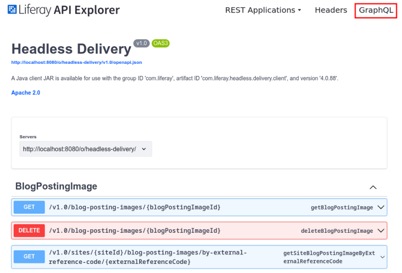
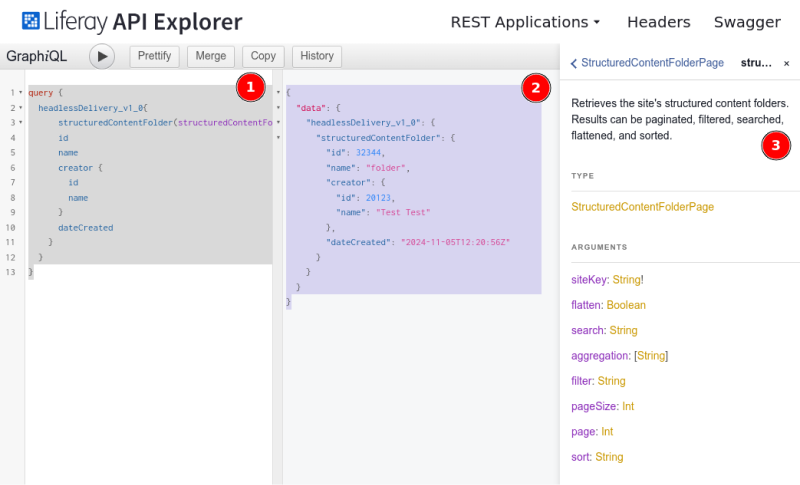

---
taxonomy-category-names:
- Content Management System
- Web Content and Structures
- API Development
- Liferay Self-Hosted
- Liferay PaaS
- Liferay SaaS
uuid: 6a184549-0cda-4dcc-bb52-574f71ca9aff
---

# Web Content API Basics Using GraphQL

Use Liferay DXP GraphQL services to manage web content by creating, retrieving, updating, and deleting structured content on your site. Structured content refers to [web content articles](../../web-content-articles/creating-web-content-articles.md) that follow a [defined structure](../../web-content-structures.md), ensuring consistency across articles.

!!! note
    While you can use a structure with a [web content template](../../web-content-templates/creating-web-content-templates.md) to render structured content, a template is not required for creating structured content.

For more advanced examples, refer to [Advanced Web Content API](../advanced-web-content-api.md). To get started with GraphQL in Liferay DXP, see [Consuming GraphQL APIs](../../../../headless-delivery/consuming-apis/consuming-graphql-apis.md).

## Set Up Your Environment

```{include} /_snippets/run-liferay-portal.md
```

Then, follow these steps:

1. Download and unzip the [Web Content API Basics](./liferay-r4h9.zip) files:

   ```bash
   curl https://resources.learn.liferay.com/dxp/latest/en/content-authoring-and-management/web-content/developer-guide/liferay-r4h9.zip -O
   ```

   ```bash
   unzip liferay-r4h9.zip
   ```

   !!! note
       These scripts use basic authentication and are designed for testing. Do not use basic authentication in a production Liferay DXP environment.

1. Complete these steps to set up the environment:

   1. [Identify the Services to Consume](#identify-the-services-to-consume)
   1. [Identify the Site Id](#identify-the-site-id)
   1. [Create a Structure in the User Interface](#create-a-web-content-structure-in-the-user-interface)
   1. [Create an Article in the User Interface](#create-a-web-content-article-in-the-user-interface)

### Identify the Services to Consume

Use the following services in the Liferay DXP Headless Delivery API to manage web content:

- `StructuredContent` for articles.
- `ContentStructure` for structures.
- `ContentTemplate` for templates.

To view detailed information on these APIs, use your browser and access Liferay API Explorer at `[server]:[port]/o/api` (e.g. `http://localhost:8080/o/api`). For more information, read [Consuming REST Services](../../../headless-delivery/consuming-apis/consuming-rest-services.md).

### Identify the Site ID

When signed in, [retrieve the site ID](../../../headless-delivery/consuming-apis/consuming-rest-services.md#identify-the-site-containing-the-data). Use this ID in several service calls. In this example, the ID is `20117`.

### Create a Web Content Structure in the User Interface

To create an article, you need a structure. When you create articles in the user interface without declaring a structure, Liferay DXP uses a default Basic Web Content structure.

!!! note
    The Basic Web Content structure is not visible in the Liferay DXP user interface.

Instead of using the Basic Web Content structure, create a new one:

1. Open the *Site Menu* (../../../images/icon-menu.png), expand *Content & Data*, and go to *Web Content*.

1. Select the *Structures* tab and click *New*.

1. Name it *Foo Structure*. In the Builder menu on the right, select, drag, and drop a *Text* field to the form area.

1. In the contextual menu that opens on the right, select the *Advanced* tab and change the *Field Reference* to `Content`.

1. Click *Save*.

For more information, see [Creating Structures](../web-content-structures/creating-structures.md).

### Create a Web Content Article in the User Interface

Now you can create an article based on the Foo Structure:

1. Open the *Site Menu* (../../../images/icon-menu.png), expand *Content & Data*, and go to *Web Content*.

1. Under the *Web Content* tab, click *New* and choose *Foo Structure*.

1. Enter *Foo Article* as the new name and click *Publish*.

For more information, see [Creating Web Content Articles](../web-content-articles/creating-web-content-articles.md).

## Get Web Content Articles from the Site

Use GraphQL services to retrieve a list of the site's articles. Access Liferay API Explorer to perform this action.

1. Navigate to Liferay API Explorer at `http://[host]:[port]/o/api`.

1. Click *GraphQL* at the top-right of the screen to open Liferay's [GraphiQL](https://github.com/graphql/graphiql) browser.

   

1. Add the following query to the left column, and replace `siteKey` with your site ID to fetch the `id`, `key`, `title`, `friendlyUrlPath`, and `contentStructureId` for the articles in the given site:

   ```graphql
   query {
      headlessDelivery_v1_0{
         structuredContents(siteKey: "20117") {
            items {
               id
               key
               title
               friendlyUrlPath
               contentStructureId
            }
         }
      }
   }
   ```

   !!! note
       With GraphQL you can specify the fields you need in your query response. You can adjust the queries/mutations in these examples by adding or removing fields to fit your requirements.

1. Click *Execute Query*. The response includes a list of article items with the queried information under each item:

   ```json
   {
      "data": {
         "structuredContents": {
            "items": [
            {
               "id": 32147,
               "key": "32145",
               "title": "Foo",
               "friendlyUrlPath": "foo",
               "contentStructureId": 32122
            }
            ]
         }
      }
   }
   ```

Below are examples of calling other GraphQL services.

## Get a Web Content Article

While the script in [the previous step](#get-web-content-articles-from-site) returns all the site's articles, you can get a specific article by using the `structuredContent(structuredContentId)` query and specifying the article's ID.

1. Click *GraphQL* in the top right corner, add the following query to the left column, and replace `structuredContentId` with your structure ID to fetch information about the `id`, `title`, `friendlyUrlPath`, and `contentStructureId`:

   ```graphql
   query {
      headlessDelivery_v1_0{
         structuredContent(structuredContentId: 32147) {
            id
            title
            friendlyUrlPath
            contentStructureId
         }
      }
   }
   ```

1. Click *Execute Query*. The response includes the structure item's queried information:

   ```json
   {
      "data": {
         "structuredContent": {
            "id": 32147,
            "title": "Foo",
            "friendlyUrlPath": "foo",
            "contentStructureId": 32122
         }
      }
   }
   ```

## Get Web Content Structures From the Site

Use the `contentStructures` query to retrieve a list of the site's structures.

1. Click *GraphQL* in the top right corner, add the following query to the left column, and replace `siteKey` with the site ID:

   ```graphql
   query{
      headlessDelivery_v1_0 {
         contentStructures(siteKey: "20117") {
            items {
            id
            name
            contentStructureFields {
               name
               label
               dataType
            }
            }
         }
      }
   }
   ```

1. Click *Execute Query*. The response returns what was informed in the query:

   ```json
   {
      "data": {
         "headlessDelivery_v1_0": {
            "contentStructures": {
            "items": [
               {
                  "id": 32122,
                  "name": "Foo",
                  "contentStructureFields": [
                  {
                     "name": "Content",
                     "label": "Text",
                     "dataType": "string"
                  }
                  ]
               }
            ]
            }
         }
      }
   }
   ```

## Get a Web Content Structure

Use the `contentStructure` query to retrieve the description of a specific structure by providing its ID as a parameter.

1. Click *GraphQL* in the top right corner, add the following mutation to the left column, and replace `siteKey` with the site ID and `contentStructureId` with the ID of the structure you want to use:

   ```graphql
   query{
      headlessDelivery_v1_0{
         contentStructure(contentStructureId: 32122){
            id
            name
            contentStructureFields{
               name
               label
               dataType
            }
         }
      }
   }
   ```

1. Click *Execute Query*. The response returns what was informed in the query:

   ```json
   {
      "data": {
         "headlessDelivery_v1_0": {
            "contentStructure": {
            "id": 32122,
            "name": "Foo"
            "contentStructureFields": [
               {
                  "name": "Content",
                  "label": "Text",
                  "dataType": "string"
               }
            ]
            }
         }
      }
   }
   ```

## Post a Web Content Article

Use the `createSiteStructuredContent` mutation to create a new article using the Foo Structure.

1. Click *GraphQL* in the top right corner, add the following mutation to the left column, and replace `siteKey` with the site ID and `contentStructureId` with the ID of the structure you want to use:

   ```graphql
   mutation {
      headlessDelivery_v1_0{
         createSiteStructuredContent(
            siteKey: "20117",
            structuredContent: {
               contentFields: [
               {
                  name: "Content",
                  contentFieldValue: {
                     data: "Goo"
                  }
               }
               ],
               contentStructureId: 32122,
               title: "Goo Article"
            }
         ) {
            id
            title
            contentFields {
               name
               contentFieldValue {
               data
               }
            }
         }
      }
   }
   ```

1. Click *Execute Query*. The response returns what was informed in the mutation:

   ```json
   {
      "data": {
         "createSiteStructuredContent": {
            "id": 32205,
            "title": "Goo Article",
            "contentFields": [
               {
               "name": "Content",
               "contentFieldValue": {
                  "data": "Goo"
               }
               }
            ]
         }
      }
   }
   ```

## Patch a Web Content Article

Use the `patchStructuredContent` mutation to update the article. It uses the structured content `id` to update the article's content from 'Goo' to 'Foo'.

1. Click *GraphQL* in the top right corner, add the following mutation to the left column, and replace `structuredContentId` with the article ID and `contentStructureId` with the ID of the structure you want to use:

   ```graphql
   mutation {
      headlessDelivery_v1_0{
         patchStructuredContent(
         structuredContentId: 32215,
         structuredContent: {
            contentStructureId: 32122,
            title: "Updated Goo Article"
            contentFields: [
               {
               name: "Content",
               contentFieldValue: {
                  data: "Foo"
               }
               }
            ]
         }
               ) {
            id
            title
            contentFields {
               name
               contentFieldValue {
               data
               }
            }
         }
      }
   }
   ```

1. Click *Execute Query*. The response returns what was informed in the mutation:

   ```json
   {
      "data": {
         "patchStructuredContent": {
            "id": 32215,
            "title": "Updated Goo Article",
            "contentFields": [
            {
               "name": "Content",
               "contentFieldValue": {
                  "data": "Foo"
               }
            }
            ]
         }
      }
   }
   ```

## Put a Web Content Article

Use the `updateStructuredContent` mutation to replace the original article's information. It uses the article and structure identifiers to replace the article's name and the article's content from `Foo` to `Bar`.

1. Click *GraphQL* in the top right corner, add the following mutation to the left column, and replace `structuredContentId` with the article ID and `contentStructureId` with the ID of the structure you want to use:

   ```graphql
   mutation {
      headlessDelivery_v1_0{
         updateStructuredContent(
         structuredContentId: 32215,
         structuredContent: {
            contentStructureId: 32122,
            title: "Bar Article"
            contentFields: [
               {
               name: "Content",
               contentFieldValue: {
                  data: "Bar"
               }
               }
            ]
         }
               ) {
            id
            title
            contentFields {
               name
               contentFieldValue {
               data
               }
            }
         }
      }
   }
   ```

1. Click *Execute Query*. The response returns what was informed in the mutation:

   ```json
   {
      "data": {
         "updateStructuredContent": {
            "id": 32215,
            "title": "Bar Article",
            "contentFields": [
            {
               "name": "Content",
               "contentFieldValue": {
                  "data": "Bar"
               }
            }
            ]
         }
      }
   }
   ```

## Delete a Web Content Article

Use the `deleteStructuredContent` mutation to delete an article. It uses the article's `id` to delete it.

!!! important
   When you delete articles using a GraphQL mutation, it's deleted permanently, without using the [Liferay DXP Recycle Bin](../../../content-authoring-and-management/recycle-bin/recycle-bin-overview.md).

1. Click *GraphQL* in the top right corner, add the following mutation to the left column, and replace `structuredContentId` with the article:

   ```graphql
   mutation {
      headlessDelivery_v1_0{
         deleteStructuredContent(structuredContentId: 32215)
      }
   }
   ```

1. Click *Execute Query*. The response returns a value indicating the deletion status:

   ```json
   {
      "data": {
         "deleteStructuredContent": true
      }
   }
   ```

## More Web Content and Web Content Folder Services

Use the following queries/mutations for more `StructuredContent` and `StructuredContentFolder` services.

| File                                                                                                          | Description                                      |
|:--------------------------------------------------------------------------------------------------------------|:-------------------------------------------------|
| `HeadlessDelivery_v1_0.structuredContentFolders: StructuredContentFolderPage`                                 | Lists a site's web content folders.             |
| `HeadlessDelivery_v1_0.structuredContentFolder: StructuredContentFolder`                                      | Retrieves a specific web content folder's details       |
| `MutationHeadlessDelivery_v1_0.createSiteStructuredContentFolder: StructuredContentFolder`                    | Adds a new web content folder to a site.            |
| `MutationHeadlessDelivery_v1_0.createStructuredContentFolderStructuredContentFolder: StructuredContentFolder` | Adds a new web content folder to an existing folder |
| `MutationHeadlessDelivery_v1_0.patchStructuredContentFolder: StructuredContentFolder`                         | Updates specific fields in a web content folder.                    |
| `MutationHeadlessDelivery_v1_0.updateStructuredContentFolder: StructuredContentFolder`                        | Replaces a web content folder with new data.                   |
| `MutationHeadlessDelivery_v1_0.deleteStructuredContentFolder: Boolean`                                        | Deletes a web content folder.                    |
| `MutationHeadlessDelivery_v1_0.createStructuredContentFolderStructuredContent: StructuredContent`             | Adds a new web content article to an existing folder.         |

!!! important
    Deleting a web content folder using a GraphQL mutation permanently removes the folder and its contents without using the [Liferay DXP Recycle Bin](../../../content-authoring-and-management/recycle-bin/recycle-bin-overview.md).

To use these endpoints,

1. Identify the query/mutation name.

   In `HeadlessDelivery_v1_0.structuredContentFolder: StructuredContentFolder`, `HeadlessDelivery_V1_0` is the namespace, `structuredContentFolder` is the query's name and `StructuredContentFolder` is the returned type.

   In `MutationHeadlessDelivery_v1_0.deleteStructuredContentFolder: Boolean`, `Mutation` indicates this is a mutation.

1. Use the query/mutation in GraphQL syntax (1). For `HeadlessDelivery_v1_0.structuredContentFolder: StructuredContentFolder`, the query would look like this:

   ```graphql
   query {
      headlessDelivery_v1_0{
            structuredContentFolder(structuredContentFolderId: 32344){
         }
      }
   }
   ```

   Use the GraphQL schema explorer (3) to understand which arguments to use.

1. Specify the return fields.

   ```graphql
   query {
      headlessDelivery_v1_0{
            structuredContentFolder(structuredContentFolderId: 32344){
            id
            name
            creator {
               id
               name
            }
            dateCreated
         }
      }
   }
   ```

1. Execute the query/mutation by clicking *Execute Query*. The response (2) should return the requested fields:

   ```json
   {
      "data": {
         "headlessDelivery_v1_0": {
            "structuredContentFolder": {
            "id": 32344,
            "name": "folder",
            "creator": {
               "id": 20123,
               "name": "Portal Administrator"
            },
            "dateCreated": "2024-11-05T12:20:56Z"
            }
         }
      }
   }
   ```

   

## Related Topics

- [Advanced Web Content API](./advanced-web-content-api.md)
- [Consuming REST Services](../../../headless-delivery/consuming-apis/consuming-rest-services.md)
- [Web Content Structures](../web-content-structures.md)
