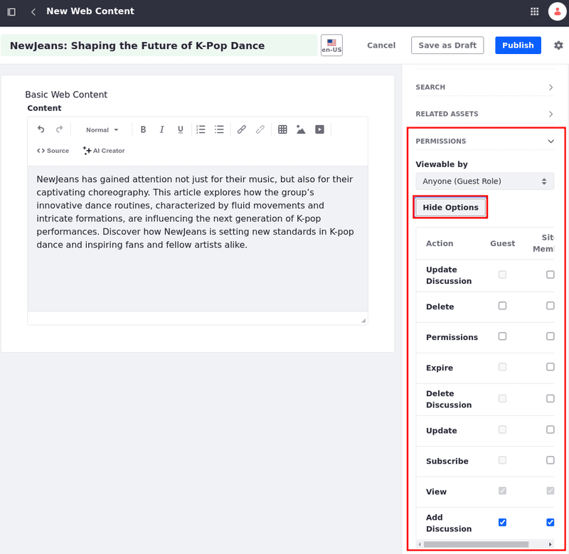

---
taxonomy-category-names:
- Content Management System
- Web Content and Structures
- Liferay Self-Hosted
- Liferay PaaS
- Liferay SaaS
uuid: 89efcf46-c68b-42f1-b33e-f41ba46002f2
---

# Adding a Basic Web Content Article

When you have a lot of content to publish on your site, Liferay's content management system helps you with practical and essential ways to manage it. Web content articles can be displayed through [widgets](../../../site-building/displaying-content/additional-content-display-options/using-the-web-content-display-widget.md), [fragments](../../../site-building/creating-pages/page-fragments-and-widgets/using-fragments.md), or [display pages](../../../site-building/displaying-content/using-display-page-templates/creating-and-managing-display-page-templates.md). See [Previewing Web Content Articles](./previewing-web-content-articles.md) to learn more.

Each web content article is based on a structure that defines its available fields. Liferay includes the Basic Web Content structure out-of-the-box, but you can create your own. See [Understanding Web Content Structures](../web-content-structures/understanding-web-content-structures.md) for more information.

## Creating a Basic Web Content Article

1. Open the Site Menu () and navigate to *Content & Data* &rarr; *Web Content*.

1. Under the Web Content tab, click *New* and select *Basic Web Content*.

1. Enter a *title* (required) for the new article and add the desired *content* to their respective fields.

   

1. Click *Publish*.

Your new article is created/submitted for [workflow](../../../process-automation/workflow.md)! You can now display your web content article on a page using the [Web Content Display widget](../../../site-building/displaying-content/additional-content-display-options/using-the-web-content-display-widget.md), for example.

!!! note
    The user who creates the first version of a web content article becomes its owner. If another user edits the content (which creates a new version), ownership isn't transferred.

## Publish With Permissions and Schedule Publications

<!-- Adjust this information once this feature is released. I can merge the sections into one. - Eric -->

{bdg-secondary}`Liferay DXP 2024.Q2+/Portal 7.4 GA126+`

!!! important
    This feature is currently behind a release feature flag (LPD-15596). Read [Release Feature Flags](../../../system-administration/configuring-liferay/feature-flags.md#release-feature-flags) for more information.

While creating/editing a web content article, you can view and set the web content article's visibility, view and set its permissions, and schedule its publication for a future date before publishing/submitting it for workflow.

### Setting the Web Content Article's Visibility and Permissions

1. Follow the steps to [create a web content article](#creating-a-basic-web-content-article).

1. Click *Publish* and select *Publish with Permissions*.

1. Choose who can view the web content article by selecting an option under Viewable By (i.e., Anyone (Guest Role), Site Members, or the content's Owner).

1. Click *More Options* to view available permissions. Assign them to guest users or site members. See [Assigning Permissions to Web Content Articles](./assigning-permissions-to-web-content-articles.md) to learn more about each permission.

1. Click *Publish*.

Once you publish your web content article, modify its permissions in one of two ways:

- While in the editing page (1), open the *Options* menu () at the top right corner and select *Permissions*.

- Or, in the Web Content application (2), open the article's *Actions* menu () and select *Permissions*.

### Scheduling A Web Content Article's Publication for a Future Date

1. Follow the steps to [create a web content article](#creating-a-basic-web-content-article).

1. Click *Publish* and select *Schedule Publication*.

1. Select a valid date and time for your publication (UTC standard is used as a reference).

1. While scheduling the publication, you can also choose who can view the web content article and define permissions for users.

1. Click *Schedule*.

The web content article is now tagged as scheduled, and you can see the selected date and time by hovering over the `?` icon next to the item.

Once the publication is scheduled, you can reschedule it by editing and setting a different time.

When you reschedule the same publication multiple times, you can view all versions and their publication schedule by going to the Web Content application screen and clicking the article's *Actions* menu () &rarr; *View History*.

!!! tip
    All rescheduled versions of the web content article are published. Note that later scheduled versions replace previous ones.

## Properties Tab

When creating or editing a Basic Web Content article, the following options appear in the sidebar menu's Properties tab:

| Property | Purpose | Additional Notes |
| :--- | :--- | :--- |
| **Basic Information** | See basic information about the article including the web content structure it is based on, version and status, ID, and a short editable description. | The structure cannot be edited once the article is created. See [Web Content Structures](../web-content-structures/understanding-web-content-structures.md) for more information. |
| **Default Template** | Select a default template to display this web content. | See [Creating Web Content Templates](../web-content-templates/creating-web-content-templates.md) for more information. |
| **Display Page Template** | Select a Display Page Template for this article, if one is desired. | See [Creating and Managing Display Page Templates](../../../site-building/displaying-content/using-display-page-templates/creating-and-managing-display-page-templates.md) for more information. |
| **Featured Image** | Select a small image to use as the article's thumbnail. | The image can come from a URL, uploaded from your system, or from files located in Documents and Media. |
| **Categorization** | Set any public or private categories, tags, or priority for the article. | See [Tagging Content](../../tags-and-categories/tagging-content-and-managing-tags.md) and [Organizing Content with Categories and Tags](../../tags-and-categories/organizing-content-with-categories-and-tags.md) for more information. |
| **Friendly URL** | Set a custom friendly URL for this article. | |
| **Schedule** | Schedule a date to display or expire the article, if desired. | See [Scheduling Web Content](./using-expiration-and-review-dates-in-web-content.md) for more information. |
| **Search** | Set whether this article will be indexed for search. | |
| **Related Assets** | Select any related assets, if desired. | |

## Related Topics

- [Creating and Managing Display Page Templates](../../../site-building/displaying-content/using-display-page-templates/creating-and-managing-display-page-templates.md)
- [Introduction to Web Content Structures](../web-content-structures/understanding-web-content-structures.md)
- [Filtering and Sorting Web Content Articles](./filtering-and-sorting-web-content-articles.md)
