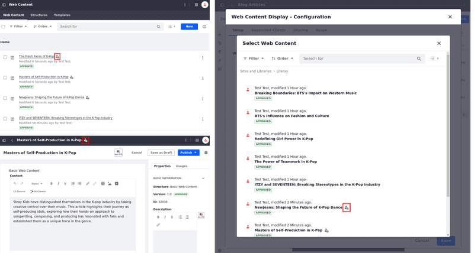

---
taxonomy-category-names:
- Content Management System
- Web Content and Structures
- Liferay Self-Hosted
- Liferay PaaS
- Liferay SaaS
uuid: 89efcf46-c68b-42f1-b33e-f41ba46002f2
---
# Adding a Basic Web Content Article

When you have a lot of content to publish on your site, Liferay's content management system helps you with practical and essential ways to manage it. Web content articles can be displayed through [widgets](../../../site-building/displaying-content/additional-content-display-options/using-the-web-content-display-widget.md), [fragments](../../../site-building/creating-pages/page-fragments-and-widgets/using-fragments.md), or [display pages](../../../site-building/displaying-content/using-display-page-templates/creating-and-managing-display-page-templates.md).

Each web content article is based on a structure that defines its available fields. Liferay includes the Basic Web Content structure out-of-the-box, but you can create your own. See [Understanding Web Content Structures](../web-content-structures/understanding-web-content-structures.md) for more information.

## Creating a Basic Web Content Article

1. Open the Site Menu () and navigate to *Content & Data* &rarr; *Web Content*.

1. Under the Web Content tab, click *Add* () and select *Basic Web Content*.

   .

1. Enter a *title* (required) for the new article and add the desired *content* to their respective fields.

   

1. Click *Publish*.

Now your new article is created! If it's inside a folder, an interactive path appears for easier navigation.


You can now display your web content article on a page using the [Web Content Display widget](../../../site-building/displaying-content/additional-content-display-options/using-the-web-content-display-widget.md), for example.

!!! note
    The user who creates the first version of a web content article becomes its owner. If another user edits the content (which creates a new version), ownership isn't transferred.

## Previewing Web Content Articles

You can preview your content using the selected default template or display page template before publishing, so you can make adjustments to ensure your content appears as intended to users.

### Previewing a Web Content Article Using a Template

1. In the properties tab, select a template to preview the web content article.

1. Click *Preview* (  ).

   

```{note}
 Only web content articles that have been published or saved as a draft can be previewed.
```

### Previewing a Web Content Articles Using a Display Page

You can preview web content using a display page template from any site or asset library.

1. In the properties tab, select a site and display page to preview the web content article.

1. Click*Preview* (  ).

   

```{note}
Selecting the Preview button saves a draft of the web content article before displaying the preview.
```

## Properties Tab

When creating or editing a Basic Web Content article, the following options appear in the sidebar menu's Properties tab:

| **Property** | **Purpose** | **Additional Notes** |
| :--- | :--- | :--- |
| **Basic Information** | See basic information about the article including the web content structure it is based on, version and status, ID, and a short editable description. | The structure cannot be edited once the article is created. See [Web Content Structures](../web-content-structures/understanding-web-content-structures.md) for more information. |
| **Default Template** | Select a default template to display this web content. | See [Creating Web Content Templates](../web-content-templates/creating-web-content-templates.md) for more information. |
| **Display Page Template** | Select a Display Page Template for this article, if one is desired. | See [Creating and Managing Display Page Templates](../../../site-building/displaying-content/using-display-page-templates/creating-and-managing-display-page-templates.md) for more information. |
| **Featured Image** | Select a small image to use as the article's thumbnail. | The image can come from a URL, uploaded from your system, or from files located in Documents and Media. |
| **Categorization** | Set any public or private categories, tags, or priority for the article. | See [Tagging Content](../../tags-and-categories/tagging-content-and-managing-tags.md) and [Organizing Content with Categories and Tags](../../tags-and-categories/organizing-content-with-categories-and-tags.md) for more information. |
| **Friendly URL** | Set a custom friendly URL for this article. | |
| **Schedule** | Schedule a date to display or expire the article, if desired. | See [Scheduling Web Content](./using-expiration-and-review-dates-in-web-content.md) for more information. |
| **Search** | Set whether this article will be indexed for search. | |
| **Related Assets** | Select any related assets, if desired. | |

## Related Topics

[Creating and Managing Display Page Templates](../../../site-building/displaying-content/using-display-page-templates/creating-and-managing-display-page-templates.md)

[Introduction to Web Content Structures](../web-content-structures/understanding-web-content-structures.md)

[Filtering and Sorting Web Content Articles](./filtering-and-sorting-web-content-articles.md)
