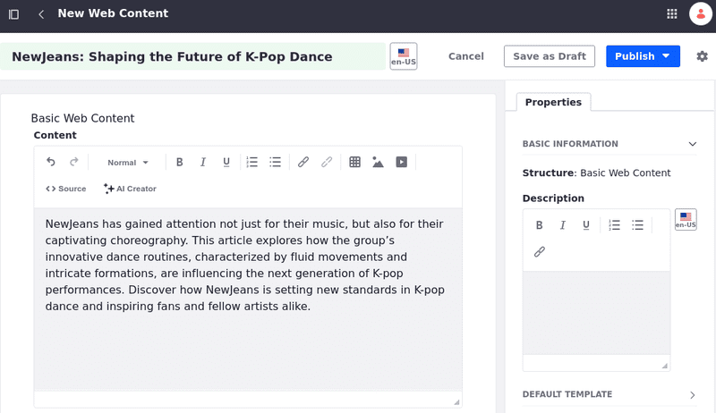
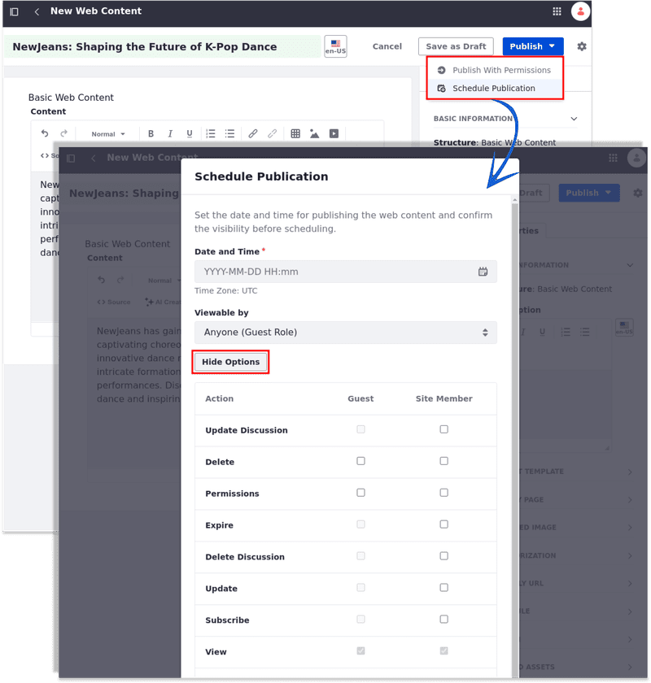
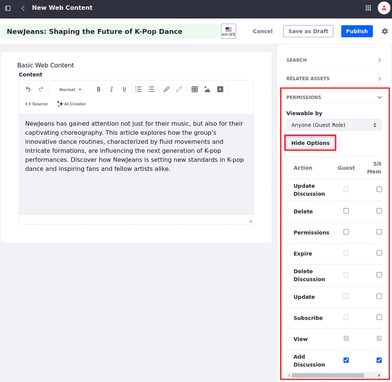
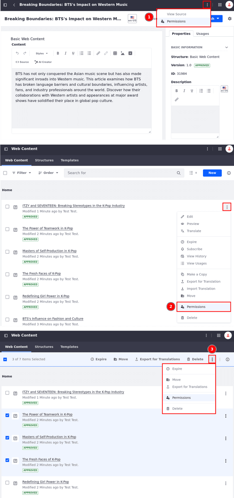
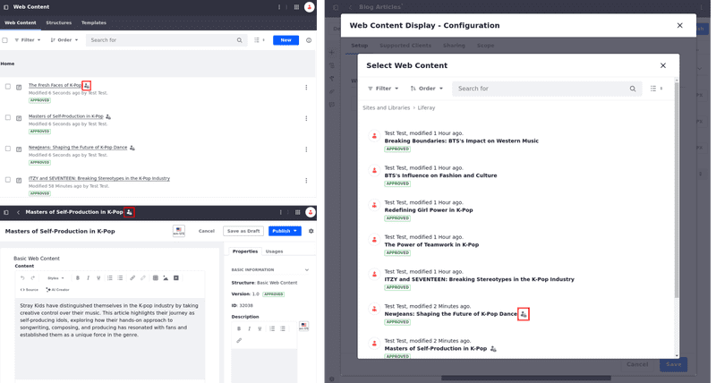
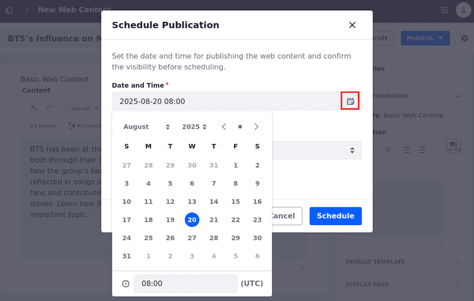
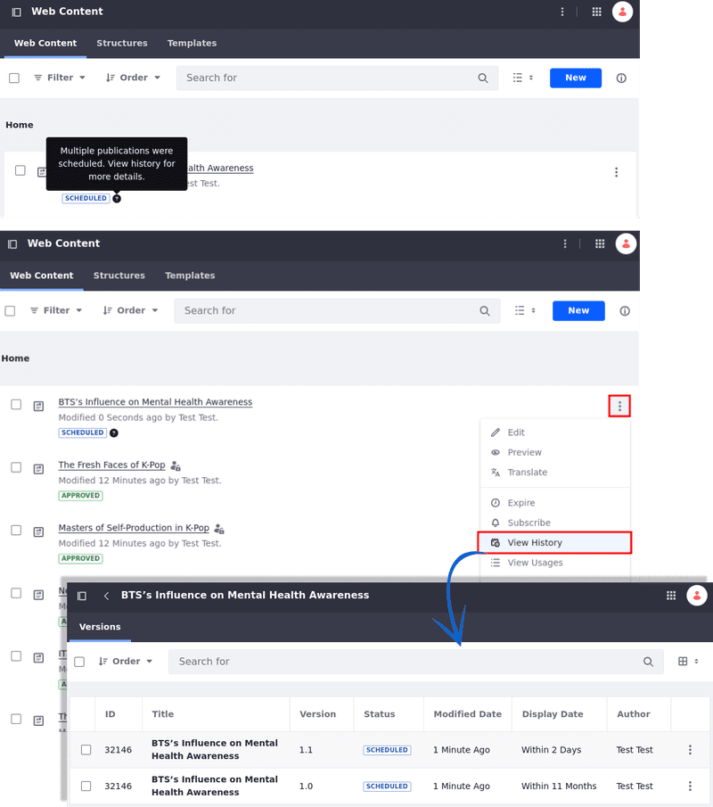
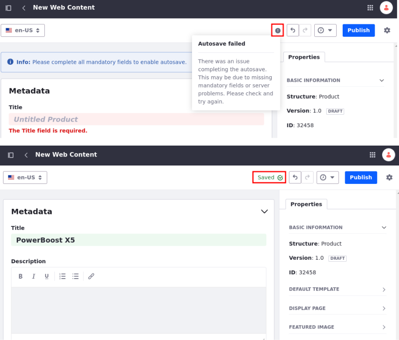
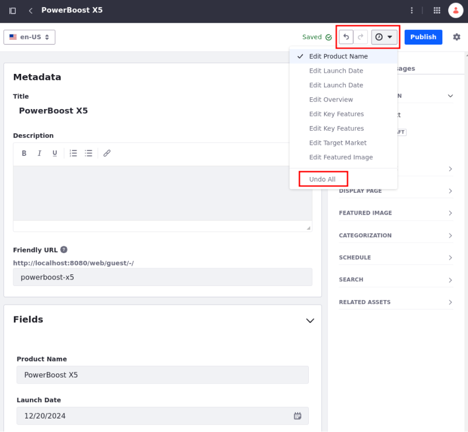

---
taxonomy-category-names:
- Content Management System
- Web Content and Structures
- Liferay Self-Hosted
- Liferay PaaS
- Liferay SaaS
uuid: 89efcf46-c68b-42f1-b33e-f41ba46002f2
---

# Creating Web Content Articles

When you have a lot of content to publish on your site, Liferay's content management system helps you with practical and essential ways to manage it. Web content articles can be published through [widgets](../../../site-building/displaying-content/additional-content-display-options/using-the-web-content-display-widget.md), [fragments](../../../site-building/creating-pages/page-fragments-and-widgets/using-fragments.md), or [display pages](../../../site-building/displaying-content/using-display-page-templates/creating-and-managing-display-page-templates.md). See [Previewing Web Content Articles](./previewing-web-content-articles.md) to learn more.

Each web content article is built upon a structure that defines its available fields. You can use the out-of-the-box Basic Web Content structure or create a custom structure tailored to your specific needs. See [Web Content Structures](../web-content-structures.md) for more information on creating and managing structures.

## Creating a Basic Web Content Article

1. Open the Site Menu () and navigate to *Content & Data* &rarr; *Web Content*.

1. Under the Web Content tab, click *New* and select *Basic Web Content*.

1. Enter a *Title* (required) for the new article and add the desired *Content* to their respective fields.

   

1. Click *Publish*.

Your new article is created! You can now publish your web content article on a page using the [Web Content Display widget](../../../site-building/displaying-content/additional-content-display-options/using-the-web-content-display-widget.md), for example.

!!! note
    The user who creates the first version of a web content article becomes its owner. If another user edits the content (which creates a new version), ownership isn't transferred.

While creating/editing a web content article, you can view and set the web content article's visibility, view and set its permissions, and schedule its publication for a future date before publishing/submitting it for workflow.

## Setting the Web Content Article's Visibility and Permissions

{bdg-secondary}`Liferay DXP 2024.Q2+/Portal 7.4 GA120+`

!!! important
    Currently, this feature is behind a release feature flag (LPD-15596). Read [Release Feature Flags](../../../system-administration/configuring-liferay/feature-flags.md#release-feature-flags) for more information.

1. Follow the steps to [create a web content article](#creating-a-basic-web-content-article).

1. Click *Publish* and select *Publish with Permissions*.

1. Choose who can view the web content article by selecting an option under Viewable By (i.e., Anyone (Guest Role), Site Members, or the content's Owner).

1. Click *More Options* to view available permissions. Assign them to guest users or site members. See [Assigning Permissions to Web Content Articles](./assigning-permissions-to-web-content-articles.md) to learn more about each permission.

1. Click *Publish*.

To set the web content article's visibility and permissions before {bdg-secondary}`Liferay DXP 2024.Q2+/Portal 7.4 GA120+`,

1. Follow the steps to [create a web content article](#creating-a-basic-web-content-article).

1. At the bottom right of the Properties tab, select an available *Viewable by* option under Permissions: Anyone (Guest Role), Site Members, or Owner.

1. Set permissions for Guests and Site Members by clicking *More Options*. See [Assigning Permissions to Web Content Articles](./assigning-permissions-to-web-content-articles.md) to learn more.

   

1. Click *Publish*.

Once you publish your web content article, it becomes accessible to any user with a guest role. However, you can restrict the article's [visibility](#setting-the-web-content-articles-visibility-and-permissions) to specific user roles or modify [permissions](./assigning-permissions-to-web-content-articles.md) in one of three ways:

- In the editing page (1), open the *Options* menu () at the top right corner and select *Permissions*.

- In the Web Content application (2), open the article's *Actions* () and select *Permissions*.

- {bdg-secondary}`Liferay DXP 2024.Q2+/Portal 7.4 GA120+` In the Web Content application (3), select the checkbox next to the article you want to manage (or articles if you want to [assign permissions in bulk](./assigning-permissions-to-web-content-articles.md#setting-web-content-articles-permissions-in-bulk)) and click *Permissions* at the top options bar.

{bdg-secondary}`Liferay DXP 2024.Q2+/Portal 7.4 GA120+` When an article has restricted visibility, the Not Visible to Guest Users icon () appears next to the article's name in various situations, such as in the web content article application while in List or Table view modes, when editing the article, or when selecting an article for a web content display fragment.

!!! tip
    If the Not Visible to Guest Users icon does not appear after managing the view permission for web content articles in the web content article application, try refreshing your page.

## Scheduling A Web Content Article's Publication for a Future Date

{bdg-secondary}`Liferay DXP 2024.Q2+/Portal 7.4 GA120+`

!!! important
    Currently, this feature is behind a release feature flag (LPD-15596). Read [Release Feature Flags](../../../system-administration/configuring-liferay/feature-flags.md#release-feature-flags) for more information.

1. Follow the steps to [create a web content article](#creating-a-basic-web-content-article).

1. Click *Publish* and select *Schedule Publication*.

1. Select a valid date and time for your publication (UTC standard is used as a reference).

1. While scheduling the publication, you can also choose who can view the web content article and define permissions for users.

1. Click *Schedule*.

The web content article is now tagged as scheduled, and you can see the selected date and time by hovering over the `?` icon next to the item.

Once the publication is scheduled, you can reschedule it by editing and setting a different time.

When you reschedule the same publication multiple times, you can view all versions and their publication schedule by navigating to the Web Content application screen and clicking the article's *Actions* menu () &rarr; *View History*.

!!! tip
    All rescheduled versions of the web content article are published. Note that versions scheduled later replace previous ones.

## Using the Auto-Save, Undo/Redo, and History Features

{bdg-secondary}`Liferay DXP 2024.Q4+`

!!! important
    Currently, this feature is behind a release feature flag (LPD-11228). Read [Release Feature Flags](../../../system-administration/configuring-liferay/feature-flags.md#release-feature-flags) for more information.

!!! warning
    {bdg-secondary}`Breaking Change` The Save as a Draft button has been removed.

The auto-save feature in the Web Content application automatically saves your work after you fill in the title and required fields, so manual saving isn’t necessary.

Note that auto-save applies only to the article's content, not the settings under the Properties tab.

The Auto-Save indicator, Undo/Redo buttons, and History menu appear next to the Publish button.

If auto-save isn't active, the icon appears as (). Once auto-save is active, the icon changes to ().

You can use the Undo/Redo buttons to move through changes made during your current session. Additionally, you can use the History menu to find and apply specific changes within the same session.

You can revert all changes made during the session by selection *Undo All* from the History menu.

!!! warning
    While auto-saved data is preserved between sessions, you can only access specific changes through the Undo/Redo buttons or History menu during the current session. Once you leave the editor or refresh the page, these features no longer track changes from previous sessions.

## Properties Tab

When creating or editing a Basic Web Content article, the following options appear in the sidebar menu's Properties tab:

| Property | Purpose | Additional Notes |
| :--- | :--- | :--- |
| **Basic Information** | See basic information about the article including the web content structure it is based on, version and status, ID, and a short editable description. | The structure cannot be edited once the article is created. See [Web Content Structures](../web-content-structures.md) for more information. |
| **Default Template** | Select a default template to display this web content. | See [Creating Web Content Templates](../web-content-templates/creating-web-content-templates.md) for more information. |
| **Display Page Template** | Select a Display Page Template for this article, if one is desired. | See [Creating and Managing Display Page Templates](../../../site-building/displaying-content/using-display-page-templates/creating-and-managing-display-page-templates.md) for more information. |
| **Featured Image** | Select a small image to use as the article's thumbnail. | The image can come from a URL, uploaded from your system, or from files located in Documents and Media. |
| **Categorization** | Set any public or private categories, tags, or priority for the article. | See [Tagging Content](../../tags-and-categories/tagging-content-and-managing-tags.md) and [Organizing Content with Categories and Tags](../../tags-and-categories/organizing-content-with-categories-and-tags.md) for more information. |
| **Friendly URL** | Set a custom friendly URL for this article. | |
| **Schedule** | Schedule a date to display or expire the article, if desired. | See [Scheduling Web Content](./using-expiration-and-review-dates-in-web-content.md) for more information. |
| **Search** | Set if this article is indexed for search. | |
| **Related Assets** | Select any related assets, if desired. | |

!!! important
    To avoid potential SEO issues or disruptions in searches caused by URL changes, ensure unique friendly URLs for each piece of content and its translations.

    When a duplicate friendly URL is created, a warning message is displayed and a suffix is appended to the friendly URL to maintain uniqueness (e.g., `new-product` becomes `new-product-1`).

    This prevents the same URL from pointing to different content in different languages, especially when the locale prefix is not used in URLs.

<!-- Maybe there should be a translating-web-content-articles.md doc and this admonition could be moved there. Eric -->

!!! note
    Before {bdg-secondary}`Liferay DXP 2024.Q2+/Portal 7.4 GA120+`, the Permissions option appears in the Properties tab only when first creating an article.

## Related Topics

- [Creating and Managing Display Page Templates](../../../site-building/displaying-content/using-display-page-templates/creating-and-managing-display-page-templates.md)
- [Web Content Structures](../web-content-structures.md)
- [Filtering and Sorting Web Content Articles](./filtering-and-sorting-web-content-articles.md)
