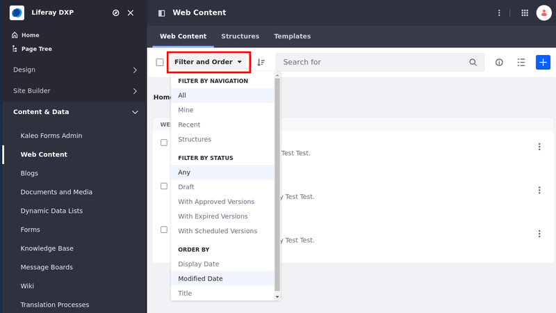
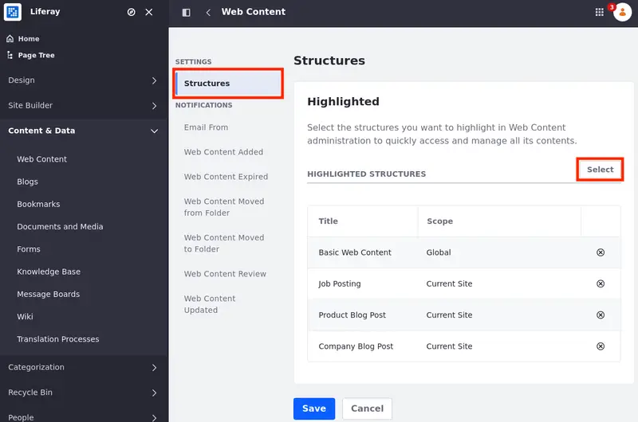
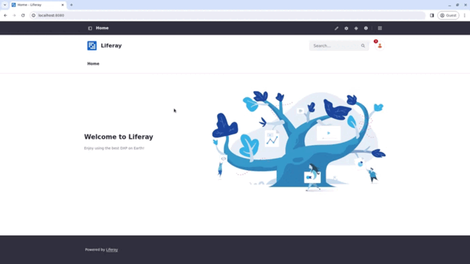
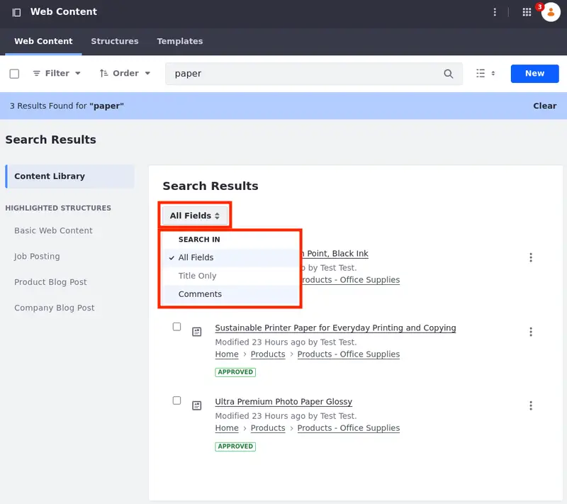

---
taxonomy-category-names:
- Content Management System
- Web Content and Structures
- Liferay Self-Hosted
- Liferay PaaS
- Liferay SaaS
uuid: c423446a-0ecb-4cf4-b455-93be58860e71
---
# Filtering and Sorting Web Content Articles

The web content application shows a list of all the web content articles you can access under the Web Content tab. The filtering and sorting options help you find and review items faster.

When viewing all assets, assets in a specific folder, assets resulting from a web content search, or in the Web Content view of an Asset Library, you can use four different filter and sort options. In addition, as of Liferay DXP 2024.Q1+/Portal 7.4 GA112+, you can filter web content articles through highlighted web content structures and search for keywords only in the title, comments, or all fields:

- {bdg-secondary}`Liferay DXP 2024.Q1+/Portal 7.4 GA112+` [Filter by Highlighted Web Content Structure](#filter-by-highlighted-web-content-structure)
- [Filter by Navigation](#filter-by-navigation)
- [Filter by Status](#filter-by-status)
- [Filter by Type](#filter-by-type)
- [Order by](#order-by)
- {bdg-secondary}`Liferay DXP 2024.Q1+/Portal 7.4 GA112+` [Filter Search Results](#filter-search-results)

You can combine (single or multiple) filters and order your results for an enhanced experience. For example, if you select the `Product Advertisement Blog Post` [highlighted structure](#filter-by-highlighted-web-content-structures) and the [Mine](#filter-by-navigation), [Draft](#filter-by-status), [order by Title](#order-by), and the [Ascending order](#order-by) filters, you obtain a list of your articles that use the `Product Advertisement Blog Post` web content structure, are in Draft status, and are ordered by title in ascending alphabetical order.

!!! note
    (**Breaking Change**) All filtering options apply exclusively to the current folder or highlighted structure. Web content articles located elsewhere are not included in the filtered results.

    If you initiate a new search, the filters reset, and the search extends to all assets in the folder.

## Filter by Highlighted Web Content Structure

{bdg-secondary}`Liferay DXP 2024.Q1+/Portal 7.4 GA112+`

You can select web content structures and see only web content articles that belong to those selected structures. To choose which structures to highlight,

1. Open the *Site Menu* (), expand *Content & Data*, and click *Web Content*.

1. Click *Options* () at the top right corner and select *Configuration*.

1. Under Settings, select *Structures* and click *Select* to choose structures to highlight.

   

1. Select the structures you want to highlight and click *Add*.

With the highlighted structures selected, a menu appears on the left with the Content Library option and the selected structures under the Highlighted Structures section.

The Content Library option shows all web content articles and their folder hierarchy whereas the highlighted structure shows all articles using that specific structure regardless of folder hierarchy.

## Filter by Navigation

When you filter by navigation, you filter the web content articles you have permission to view in the selected folder or highlighted structure.

{bdg-secondary}`Liferay DXP 2024.Q1+/Portal 7.4 GA112+` You can apply a single filter or multiple filters. You can also select multiple categories/tags.

| Filter Option                                           | Description                                                                                                                                                                                                                                                                                                |
|:--------------------------------------------------------|:-----------------------------------------------------------------------------------------------------------------------------------------------------------------------------------------------------------------------------------------------------------------------------------------------------------|
| All                                                     | All web content articles and folders.                                                                                                                                                                                                                                                                      |
| Mine                                                    | Web content articles created by the logged-in user.                                                                                                                                                                                                                                                        |
| Recent                                                  | Recent web content articles created by the logged-in user and ordered by creation date. The content is organized in sections based on their creation dates, including today, the last 7 days, the last 30 days, and older content. The [order by](#order-by) option is unavailable when using this filter. |
| Structures                                              | Filters web content articles based on [web content structure](../web-content-structures.md).                                                                                                                                                                                                               |
| {bdg-secondary}`Liferay DXP 2024.Q1+/GA112+` Categories | Filters web content articles based on [category](../../tags-and-categories/defining-categories-and-vocabularies-for-content.md).                                                                                                                                                                           |
| {bdg-secondary}`Liferay DXP 2024.Q1+/GA112+` Tags       | Filters web content articles based on assigned [tags](../../tags-and-categories/tagging-content-and-managing-tags.md).                                                                                                                                                                                     |

!!! note
    {bdg-secondary}`Liferay DXP 2024.Q1+/Portal 7.4 GA112+` By default, the Mine filter is ordered by create date. This way, you can see the most recent articles first.

## Filter by Status

When you filter by status, you filter the web content articles you have permission to view in the selected folder based on their publication status.

| Filter Option                                          | Description                                                      |
|:-------------------------------------------------------|:-----------------------------------------------------------------|
| Any                                                    | All web content articles, regardless of publication status.      |
| Draft                                                  | All web content articles that have been saved but not published. |
| {bdg-secondary}`Liferay DXP 2024.Q1+/GA112+` Approved  | All web content articles with Approved status.                   |
| {bdg-secondary}`Liferay DXP 2024.Q1+/GA112+` Expired   | All web content articles with Expired status.                    |
| {bdg-secondary}`Liferay DXP 2024.Q1+/GA112+` Scheduled | All web content articles with Scheduled status.                  |

!!! note
    (**Breaking Change**) Prior to Liferay DXP 2024.Q1+/Portal 7.4 GA112+, the Approved, Expired, and Scheduled filters were called With Approved/Expired/Scheduled Versions and returned any web content with at least one version in the selected status.

## Filter by Type

When you filter by type, you filter the web content articles you have permission to view in the selected folder and choose to view all versions or only the last versions of the web content articles.

| Filter Option                                            | Description                            |
|:---------------------------------------------------------|:---------------------------------------|
| {bdg-secondary}`Liferay DXP 2024.Q1+/GA112+` Web Content | Web content articles' latest versions. |
| {bdg-secondary}`Liferay DXP 2024.Q1+/GA112+` Versions    | All web content articles' versions.    |

## Order by

These options sort the screen content based on the selected criteria. You can use these after using one of the content filters to organize the filter results.

| Filter Option                                           | Description                                               |
|:--------------------------------------------------------|:----------------------------------------------------------|
| Display Date                                            | Sorts web content articles by the last display date.      |
| Modified Date                                           | Sorts web content articles by the last modification date. |
| Create Date                                             | Sorts web content articles by their creation date.        |
| Title                                                   | Sorts web content articles alphabetically.                |
| {bdg-secondary}`Liferay DXP 2024.Q1+/GA112+` Ascending  | Sorts the applied filter's result in ascending order.     |
| {bdg-secondary}`Liferay DXP 2024.Q1+/GA112+` Descending | Sorts the applied filter's result in descending order.    |

## Filter Search Results

Once you use the search bar to search for specific keywords, use these options to further enhance your search results.

| Filter Option | Description                                                             |
|:--------------|:------------------------------------------------------------------------|
| All Fields    | Searches for the keywords in all fields of web content articles.        |
| Title Only    | Searches for the keywords only in the titles of web content articles.   |
| Comments      | Searches for the keywords only in the comments of web content articles. |

## Related Topics

- [Adding a Basic Web Content Article](./adding-a-basic-web-content-article.md)
- [Understanding Web Content Structures](../web-content-structures/understanding-web-content-structures.md)
- [Creating Web Content Templates](../web-content-templates/creating-web-content-templates.md)
