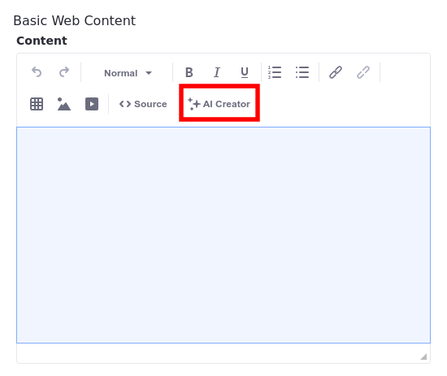

---
taxonomy-category-names:
- Content Management System
- Web Content and Structures
- Liferay Self-Hosted
- Liferay PaaS
- Liferay SaaS
uuid: 1fad3ffb-9d93-4a8b-baad-20382b53a17d
---
# Generating Text Content Using AI

{bdg-secondary}`Liferay DXP 2023.Q4+/Portal 7.4 GA98+`

Web content provides integration with OpenAI's ChatGPT engine using the AI Creator tool. With an OpenAI API key configured for your instance or site, you can use the AI Creator feature in the Web Content editor. Once configured, you can begin generating content to work with, in a few clicks.

## Enabling AI Creator

To begin, you must add an API key to authenticate your access to ChatGPT. You can [add it to a Liferay instance](#adding-an-api-key-to-a-liferay-instance) through *Instance Settings* or add it [to a specific site](#adding-an-api-key-to-a-specific-site).

### Adding an API Key to a Liferay Instance

1. Open the *Global Menu* () and navigate to the *Control Panel* tab &rarr; *Instance Settings* (under Configuration).

1. Click *AI Creator* under *Content and Data*.

1. Paste your OpenAI API key into the *API Key* field.

1. Click *Save*.

### Adding an API Key to a Specific Site

By adding an API key in the scope of a specific site, you can use different keys for each site or disable a key in a specific site.

1. Open the *Product Menu* () and select *Configuration* &rarr; *Site Settings*.

1. Click *AI Creator* under *Content and Data*.

1. Paste your OpenAI API key into the *API Key* field.

1. Click *Save*.

!!! note
    You can enable or disable the AI Creator button by toggling the Enable OpenAI to Create Content checkbox. If you choose to disable the feature, the button does not appear in the Web Content editor.

## Using AI Creator

After [enabling the feature flag and configuring the API Key](#enabling-ai-creator), AI Creator becomes available in the web content editor. To begin generating content, follow these steps:

1. Open the *Global Menu*() and select your site on the right.

1. Open the *Product Menu* () and select the *Web Content* app under Content & Data.

1. Click *Add* () to create a Basic Web Content article.

1. Click *AI Creator*.

    

1. In the AI Creator modal window, fill in these three fields:

    * **Description**: The desired content (e.g. "A blog post about the sleeping habits of cats").
    * **Tone**: The tone for your text. There are five options available: Neutral, Casual, Friendly, Formal, and Academic.
    * **Word Count**: An approximate word count for your text.

1. Click *Create*.

1. (Optional) If you don't like the AI-generated content, you can click *Try Again* to regenerate the content.

    

    !!! important
       Each request to generate content consumes [OpenAI API tokens](https://help.openai.com/en/articles/4936856-what-are-tokens-and-how-to-count-them). When your limit is reached, a generic error message will appear.

1. Click *Add* to insert the content into your web content article.

You can now begin working with your generated content.

## Related Topics

- [Adding a Basic Web Content Article](./adding-a-basic-web-content-article.md)