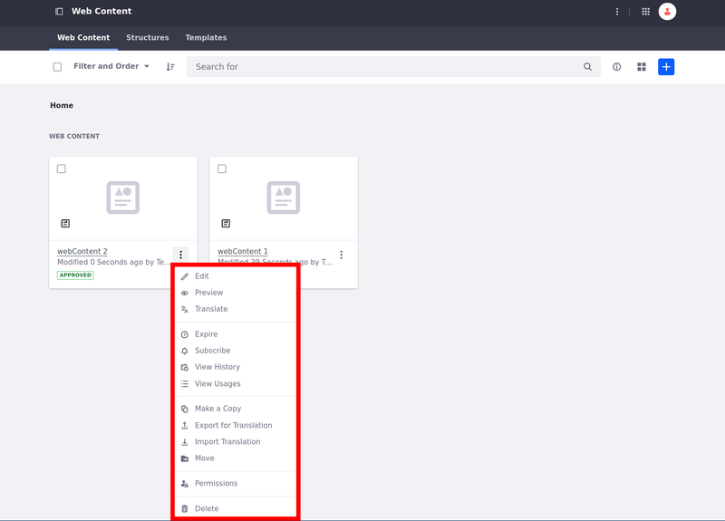
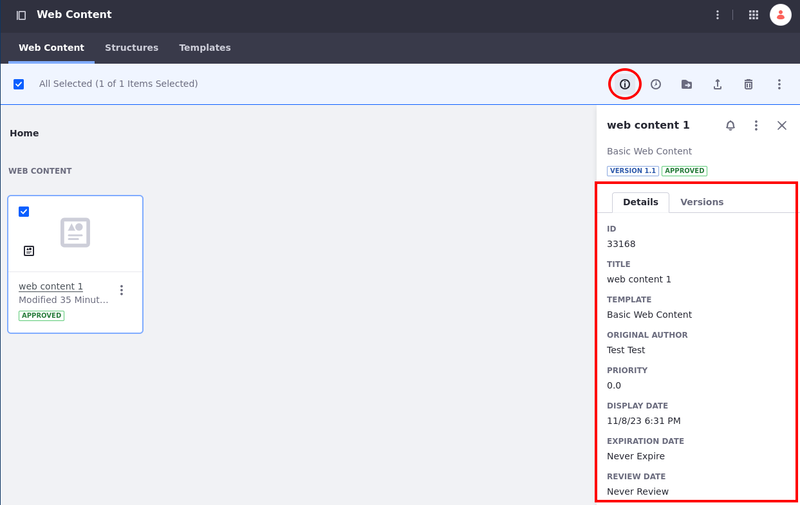
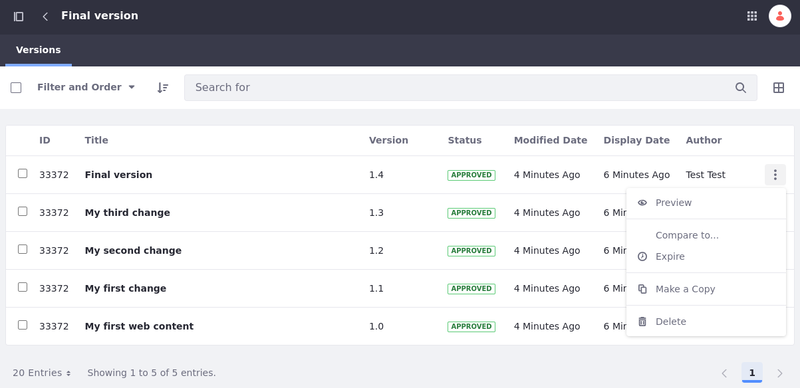

---
taxonomy-category-names:
- Content Management System
- Web Content and Structures
- Liferay Self-Hosted
- Liferay PaaS
- Liferay SaaS
uuid: d8d93c4a-64c2-4d5a-b869-06908584f19a
---

# Managing Web Content Articles

Once you've added articles to your web content library, you can manage them via the web content UI. To access management actions for an article, click its *Actions* button ().

| Option                                                                | Description                                                                                                                                                                                                                                              |
|:----------------------------------------------------------------------|:---------------------------------------------------------------------------------------------------------------------------------------------------------------------------------------------------------------------------------------------------------|
| Edit ()                         | Edit the article's content. Note that modifying the article increases its version number, but ownership remains with the user who initially created it.                                                                                                  |
| Preview ()                   | Show the rendered web content.                                                                                                                                                                                                                           |
| Translate ()          | Translate the web content article to the desired language. See [Translating Web Content](../../translating-pages-and-content/translating-web-content.md) for more information.                                                                           |
| Expire ()                     | Deactivate the web content article.                                                                                                                                                                                                                      |
| Subscribe ()          | Receive notifications on new and modified articles.                                                                                                                                                                                                      |
| View History ()    | View web content version history.                                                                                                                                                                                                                        |
| View Usages () | View the pages, page templates, and display page templates where the web content article is used.                                                                                                                                                        |
| Make a Copy ()                  | Duplicate the web content article. The copy uses the same name with *Copy* appended to the end.                                                                                                                                                          |
| Export for Translation ()   | Export web content for translation as `.xliff` or `.xlf` files. See [Exporting Content for Translation](../../translating-pages-and-content/translating-web-content.md#exporting-content-for-translation) for more information.                          |
| Import Translation ()     | Import the translations together as a `.zip` file or individually as `.xliff` or `.xlf` files. See [Importing Content Translations](../../translating-pages-and-content/translating-web-content.md#importing-content-translations) for more information. |
| Move ()                  | Relocate the article to a different folder.                                                                                                                                                                                                              |
| Permissions ()    | Manage article permissions for user roles.                                                                                                                                                                                                               |
| Delete ()                | Move the file to the [Recycle Bin](../../recycle-bin/recycle-bin-overview.md).                                                                                                                                                                           |

!!! tip
    Using folders can provide additional organization and article management capabilities, including workflow and permissions.

## Using The Info Panel

In the info panel, the article's information is organized into two tabs: [Details](#info-panel-details-tab) and [Versions](#info-panel-versions-tab).

To access an article's info panel, select the *article* and click *Toggle Info Panel* () on the Applications Menu.

### Info Panel Details Tab

The Details tab includes the following information about web content articles.

| Field           | Description                         |
|:----------------|:------------------------------------|
| ID              | The article's id.                   |
| Title           | The article's title.                |
| Template        | The template used in the article.   |
| Original Author | The article's author.               |
| Priority        | The articles priority.              |
| Display Date    | The article's display date.         |
| Expiration Date | When the article expires.           |
| Review Date     | When the article is set for review. |

<!-- !!! warning
    Selecting *All* or *Date Range* can make the publishing process take a long time, especially if you have many versions. Instead, publish small incremental changes to avoid large publishing processes that can take a long time to execute. -->

<!-- I'm not sure if this admonition fits here. I mean... this section is about the info panel details tab which has the options enumerated above. There is nothing here about staging or even about the options menu next to the global menu. I am under the impression that this was added in a draft and forgotten. Eric -->

### Info Panel Versions Tab

The Versions tab displays the 10 most recent versions of the selected web content article. To view all available versions, click the *View More* button at the bottom of the versions tab or click the article's *Actions* button () and select *View History*.

| Option                                                 | Description                                                                                                                                                          |
|:-------------------------------------------------------|:---------------------------------------------------------------------------------------------------------------------------------------------------------------------|
| Preview ()    | Show the rendered web content article version.                                                                                                                       |
| Expire ()      | Deactivate the web content article version.                                                                                                                          |
| Compare to                                             | Show the difference between the selected version and another version. This opens a new page that shows additions, deletions and formatting changes between versions. |
| Make a Copy ()   | Creates a new web content article identical to the version selected. The copy uses the same name with *Copy* appended to the end.                                    |
| Delete () | Deletes the selected version.                                                                                                                                        |

## Managing Web Content Article Visibility

Web content articles can be viewed by guests by default or you can restrict their visibility to specific roles.

Set the article's visibility during creation or by setting the View permission for a specific web content article.

To set the article's visibility during creation,

1. [Create a new web content article](./adding-a-basic-web-content-article.md)

1. At the bottom right of the Properties tab, select an available *Viewable by* option under Permissions: Anyone (Guest Role), Site Members, or Owner.

   You can also set permissions for Guests and Site Members by clicking on *More Options*. See [Assigning Permissions to Web Content Articles](./assigning-permissions-to-web-content-articles.md) to learn more.

   <!-- This article is under KM review and was added in LRDOCS-12873. It'll probably be published before. Eric -->

To set the View Permission for a web content article,

   {bdg-secondary}`Liferay DXP 2024.Q2+/Portal 7.4 GA120+` You can also set the permissions using the `Publish With Permissions` options when publishing a web content article.

After that, you can easily identify which articles are visible for guests and which ones are not.

Articles with visibility restrictions have an icon () next to it.

!!! tip
    The xx icon is only shown in the List and Table views.

## Related Topics

- [Adding a Basic Web Content Article](./adding-a-basic-web-content-article.md)
- [Filtering and Sorting Web Content Articles](./filtering-and-sorting-web-content-articles.md)
- [Using Expiration and Review Dates in Web Content](./using-expiration-and-review-dates-in-web-content.md)