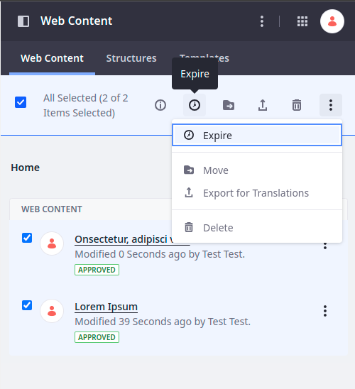
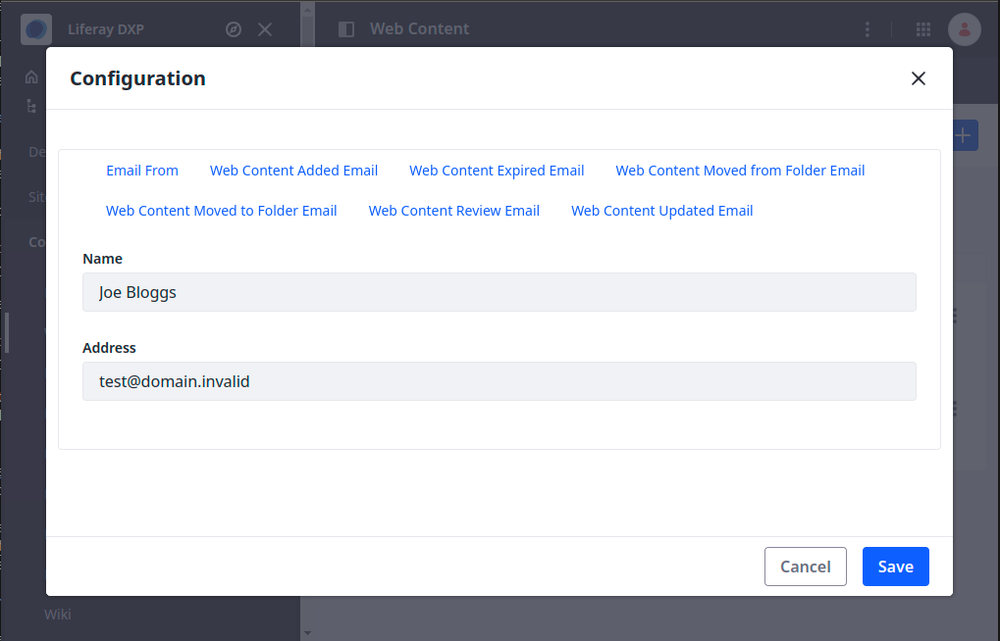

---
taxonomy-category-names:
- Content Management System
- Web Content and Structures
- Liferay Self-Hosted
- Liferay PaaS
- Liferay SaaS
uuid: d7dd0107-4961-4ce5-b2d0-812e81269edb
---
# Using Expiration and Review Dates in Web Content

> Available: Liferay DXP/Portal 7.4+

You can set expiration and review dates for web content articles to manage time-sensitive content. When enabled, file owners, reviewers, or folder subscribers are [notified via email](#configuring-notification-emails) of articles that have reached their expiration or review date at configurable intervals, based on the Web Content system setting.

When an article expires, it is deactivated and cannot be used or edited. To reactivate the article, you must change its expiration date or disable article expiration. While expired, the article cannot be accessed.

By contrast, when an article requires review, it remains available for use. Reaching the article's review date only triggers user notifications and does not affect the article's availability.

## Enabling Expiration and Review Dates

By default, web content articles never expire or require review. You can change this, however, when creating or editing articles. 


When editing multiple articles, expiration is done through the toolbar or action menu.



To activate expiration or review, uncheck the *Never Expire* or *Never Review* checkbox. The default review and expiration dates are set to one year from the time of activation. Change the dates if needed.

Liferay checks for articles that have reached their expiration or review dates at a specific [check interval](#configuring-the-check-interval).

## Configuring the Check Interval

By default, Web Content checks article expiration and review dates every 15 minutes. You can customize this.

1. Click *Global Menu* () &rarr; *Control Panel* &rarr; *System Settings* &rarr; *Web Content* &rarr; *Web Content*.

1. Use the Check Interval field to set the minutes between article checks.

   

1. Click *Save* when finished.

Now the system checks for expiration or review dates according to the interval you set.

```{warning}
If you require this feature to be disabled, [blacklist](../../../system-administration/installing-and-managing-apps/managing-apps/blacklisting-osgi-components.md) the component. Do not enter zero or a negative number for the interval.
```

## Configuring Notification Emails

When an article expires or requires review, Liferay sends a notification email to the article's owners, reviewers, or any users subscribed to the folder containing the article. There's a default notification message, but you can customize it.

1. Navigate to the Web Content application in a site or asset library.

1. Click the _Actions_ button () in the Application Bar and select *Configuration*.

1. In the modal window, choose the *Web Content Review Email* or *Web Content Expired Email* tabs.

   

1. Draft the desired notification message.

1. Click *Save* when finished.

## Related Topics

* [Creating Web Content Articles](./creating-web-content-articles.md)
* [Filtering and Sorting Web Content Articles](./filtering-and-sorting-web-content-articles.md)
