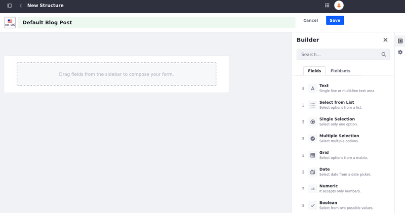

---
toc:
  - ./web-content-structures/creating-structures.md
  - ./web-content-structures/configuring-structure-fields.md
  - ./web-content-structures/managing-structures.md
  - ./web-content-structures/mapping-repeatable-fields-to-fragments.md
  - ./web-content-structures/assigning-permissions-to-structures-and-templates.md
  - ./web-content-structures/whats-new-with-web-content-structures-in-7-4.md
taxonomy-category-names:
- Content Management System
- Web Content and Structures
- Liferay Self-Hosted
- Liferay PaaS
- Liferay SaaS
uuid: ce21c1ff-7459-4812-9782-e61c9f43e69d
---

# Web Content Structures

Web content structures are the building blocks for web content articles. They determine the information you can include when writing web content. Structures provide these key benefits:

- Improve manageability for administrators of web content
- Ensure web content articles contain the proper information
- Make it easier for users to create content

To understand these benefits, consider the example of an online news magazine. Each article must contain the same type of information: a title, a subtitle, an author, and one or more pages of text and images that comprise the body of the article.

With only basic content creation, each author could submit articles with different types of information. For example, some authors may include a subtitle, while others may not. This requires the magazine editor to spend time reviewing the articles to make sure they contain the right information.

To solve this problem, the editor can provide a structure that defines the required information for each article, so writers know exactly what elements a complete article requires.

When you use structures, you enforce a format for your content, so writers know exactly what elements a complete article needs. In this situation, the editor of the magazine provides a form that can be formatted automatically using a [template](./web-content-templates/creating-web-content-templates.md).

Using structures, the magazine editor must no longer spend time updating every article to a particular format, and writers can save time formatting their content.

You create a structure by adding elements such as text fields, checkboxes, or multi-selection lists. You can also add specialized application fields to the structure, such as an image uploader, or a web content selector.

You drag and drop the elements into the structure, choosing the elements and order that to fit your business need. Additionally, you can group elements into repeatable blocks.

Display page creators can then [map these fields](../../site-building/creating-pages/page-fragments-and-widgets/using-fragments/configuring-fragments/fragment-sub-elements-reference.md#mapping-settings) (including [repeatable fields](./web-content-structures/mapping-repeatable-fields-to-fragments.md)) to [editable page fragments](../../site-building/creating-pages/page-fragments-and-widgets/using-fragments.md) to use custom styles and formatting.
