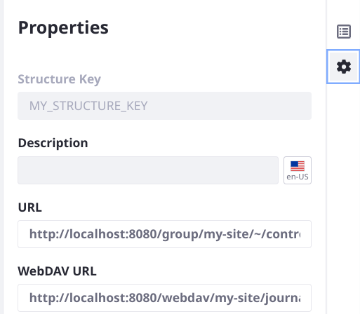

---
taxonomy-category-names:
- Content Management System
- Web Content and Structures
- Liferay Self-Hosted
- Liferay PaaS
- Liferay SaaS
uuid: f69fd720-0df2-4a33-8aeb-ebaa3e0bcfdf
---

# What's New with Web Content Structures in 7.4?

As of Liferay 7.4, web content structures have been migrated from using Dynamic Data Mapping (DDM) to Data Engine (DE) as the backend framework for building forms.


The Data Engine framework brings new changes and enhancements to web content structures.

## New and Improved Field Types

Field types have been added and improved as part of the move to Data Engine:

- The Select from List field's options can be ordered alphabetically (use the advanced settings of the Select from List field).
- Configure a Numeric field as an integer or decimal field.
- The Grid field is a new field type in web content and documents and media. See [Forms Field Type Reference](../../../process-automation/forms/creating-and-managing-forms/forms-field-types-reference.md) for more information.
- The HTML field was replaced by the Rich Text field, which includes a convenient tool bar.

!!! warning
    **Boolean field versus Multiple Selection field:** Data Engine did not initially include a Boolean field. Instead, Boolean fields in upgraded structures were migrated to use the Data Engine's Multiple Selection field, using the same label and just one option. Some issues can arise from this, for example if templates were built on structures with Boolean fields. In Liferay 7.4 Update/GA 23, the Boolean field type is added to Data Engine. Upgraded structures after Update 23 successfully convert 7.3 DDM Boolean fields to 7.4 DE Boolean fields in web content structures. If your installation was upgraded before this change, you must manually change these single-option Multiple Selection fields to Boolean fields by editing the affected structures.

## Child Structures are Replaced by Structure Fieldsets

Structures backed by DDM could include child structures that inherited all the parent's fields and settings. This relationship no longer exists in Liferay 7.4 because you can now create fieldsets, with which you can create reusable fieldsets for your structures. Fieldsets improve the editing experience since you can see what the structure looks like as you edit.

!!! warning
    A fieldset is reusable across multiple structures. Editing it within a single structure causes changes to all the structures at once.

    If a fieldset or structure is being used in web content, editing produces a warning to users:

   

To work with fieldsets,

1. Go to the *Site Menu* () and navigate to *Content and Data* &rarr; *Web Content*.

1. Select the *Structures* tab.

1. Click *New* to create a new structure.

1. In the web content structure form builder view (), click the *Fieldsets* tab.

1. Click *Create New Fieldset*. Name the fieldset.

1. Add and configure its fields. Click *Save*.


When you begin creating a new structure, any existing fieldset or structure can be selected in the Fieldsets tab. The basic web content structure is included as an out-of-the-box fieldset.

## Structure Definition Source Changes

Structures in DE are represented by JSON (it was XML in DDM). Rather than editing code in the web content structures UI, you can now import and export the structure definition to work with the structure's source JSON locally.

!!! warning
    Be careful working with the JSON structure source as it can be more complicated than it appears at first glance. For example, when adding a field to the structure, you must update both the `dataDefinitionFields` array and the `defaultDataLayout` element.

### Exporting a Structure's JSON

1. Go to the *Site Menu* () and navigate to *Content and Data* &rarr; *Web Content*.

1. Click the *Structures* tab.

1. If there's no existing structure, [create one](./creating-structures.md) and save it.

1. In the main structures list view, open the structure's *Actions* menu () and click *Export as JSON*.

### Importing a Structure's JSON to Overwrite an Existing Structure

To overwrite an existing structure's JSON,

1. Go to the *Site Menu* () and navigate to *Content and Data* &rarr; *Web Content*.

1. Click the *Structures* tab.

1. If there's no existing structure, [create one](./creating-structures.md) and save it.

1. In the main structures list view, open the structure's *Actions* menu () and click *Import and Override*.

1. Upload the JSON file.


### Importing a Structure's JSON to Create a New Structure

To import a new structure,

1. Go to the *Site Menu* () and navigate to *Content and Data* &rarr; *Web Content*.

1. Click the *Structures* tab.

1. Open the *Options* menu () for web content in the upper right corner of the screen.

1. Click *Import Structure*.

   

## Flexible Structure Layout

Previously, structure fields could be ordered on the form and nested to create a hierarchical view of the form. The Data Engine representation of the structure adds the ability to define columns.


Add two form fields next to each other in the structure builder and drag the edge of a field to resize the columns.

In addition to columns, use field groups to lock a subset of the structure's fields together for easy management. Create a field group by dropping a field on top of another field.

## Setting the Web Content Structure Key

!!! warning
    You can set the structure key manually when creating a new structure (as documented below) or when [importing JSON as a new structure](#importing-a-structures-json-to-create-a-new-structure). You cannot update an existing structure's key, even when [importing and overwriting an existing structure](#importing-a-structures-json-to-overwrite-an-existing-structure).

1. Open the *Global Menu* () and go to the *Control Panel* tab.

1. Go to *Configuration* &rarr; *System Settings* &rarr; *Web Content* (under Content and Data).

1. Click *Administration*. Uncheck *Autogenerate Structure Key* and click *Update*.

1. Go to the *Site Menu* () and navigate to *Content and Data* &rarr; *Web Content*. Open the Structures tab and add a new structure.

1. Add a field and name the structure. To set the structure key manually, open the *Properties sidebar* by clicking the configuration icon ().

1. Edit the *Structure Key* field, adding your custom value (e.g., `MY_STRUCTURE_KEY`).

1. Save the structure.

With the new Data Engine-backed structures, the export process strips the structure key out of the JSON. This means that importing the definition (for example, into a new site) generates a new structure key. If you wish to keep the structure key across an export-import process or perhaps provide a new custom key, you must edit the exported JSON.

To add a custom structure key to the [exported JSON](#structure-definition-source-changes),

1. Open the exported JSON file (e.g., `Structure_my structure_42153_20220721144913685.json`).

1. Add a `"dataDefinitionKey"` element before the `"dataDefinitionField"` element:
   ```json
   {
      "availableLanguageIds": ["en_US"],
      "contentType": "journal",
      "dataDefinitionKey": "MY_STRUCTURE_KEY",
      "dataDefinitionFields": [{"..."}]
   }
   ```

1. [Import](#importing-a-structures-json-to-create-a-new-structure) the structure definition file and verify that the key was imported by checking in the Properties tab.

   

## Related Topics

- [Web Content Structures](../web-content-structures.md)
- [Creating Structures](./creating-structures.md)
