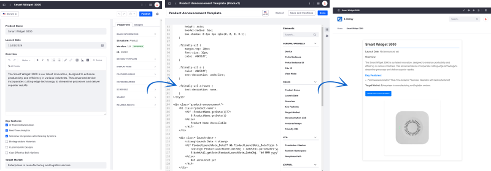

---
toc:
  - ./web-content-templates/creating-web-content-templates.md
  - ./web-content-templates/embedding-widgets-in-web-content-templates.md
  - ./web-content-templates/using-taglibs-in-web-content-templates.md
  - ./web-content-templates/mapping-web-content-templates-to-fragments.md
taxonomy-category-names:
- Content Management System
- Web Content and Structures
- Liferay Self-Hosted
- Liferay PaaS
- Liferay SaaS
uuid: b9291e1c-bc73-4a38-9d84-7c0443e33433
---

# Web Content Templates

Web content templates provide a powerful way to streamline content creation and management. With templates, you can define consistent layouts and structures, ensuring that your web content aligns with your brand and functional requirements.

Learn how to [create templates](./web-content-templates/creating-web-content-templates.md), [embed widgets](./web-content-templates/embedding-widgets-in-web-content-templates.md), [use tag libraries](./web-content-templates/using-taglibs-in-web-content-templates.md), and [map templates to fragments](./web-content-templates/mapping-web-content-templates-to-fragments.md).

