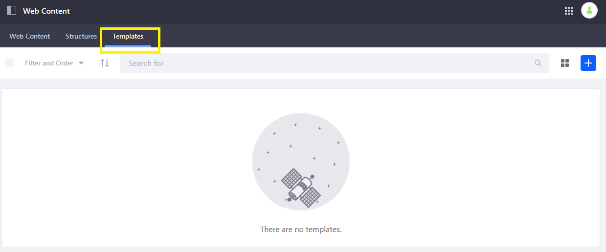
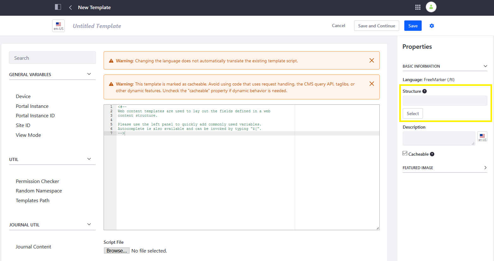
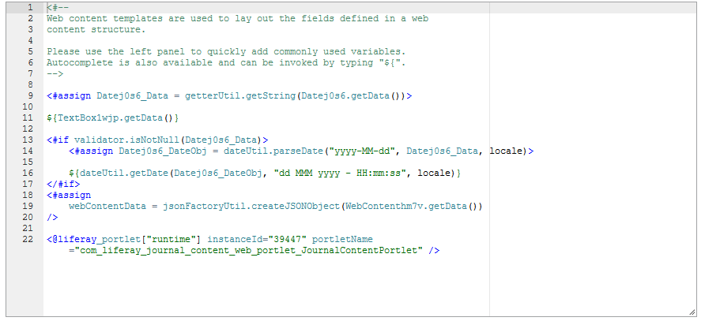
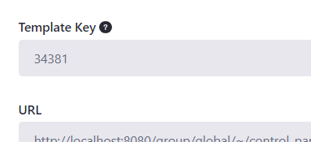

---
taxonomy-category-names:
- Content Management System
- Web Content and Structures
- Widgets
- Liferay Self-Hosted
- Liferay PaaS
- Liferay SaaS
uuid: 639e26cd-ceb4-4590-a380-56777ab455a1
---

# Embedding Widgets in Web Content Templates

You can embed core or custom widgets, instanceable or not, in web content templates. Below is an example of embedding a web content widget in FreeMarker:

```markup
<@liferay_portlet["runtime"] portletName="com_liferay_journal_content_web_portlet_JournalContentPortlet" />
```

To embed widgets in your web content templates,

1. Navigate to your site's (the default DXP site in this example) *Site Administration*.

1. Open the *Site Menu* (), expand *Content and Data, and go to *Web Content*.

1. Select the *Templates* tab.

   

1. Click *New*. Enter a name for the template (for example, *Template 1*).

1. Click *Select* from the *Properties* section to choose the structure (for example, *Structure 1*).

   

1. Paste your macro (for example, `<@liferay_portlet["runtime"] portletName="com_liferay_journal_content_web_portlet_JournalContentPortlet" />`) in the Template Editor. Depending on whether your portlet is instanceable, you may need to enter the portlet ID.

   

1. Click *Save* when finished.

!!! important
    The `theme` variable is no longer injected into the FreeMarker context.

## Embedding Other Templates

In addition to embedding widgets in templates, you can embed a template within another template. This allows for reusable code, JavaScript library imports, scripts, or macros.

Below is an example of embedding a template in FreeMarker:

```markup
<#include "${templatesPath}/[template-key]" />
```

You can find the *Template Key* when editing a previously published template.



## Related Topics

- [Web Content Templates](../web-content-templates.md)
- [Page Fragments and Widgets]../../../site-building/creating-pages/page-fragments-and-widgets.md
