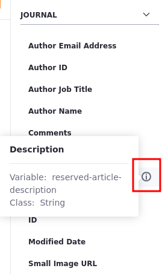

# Using Taglibs in Templates

Liferay's taglibs are accessible when developing templates in FreeMarker. There is no need to instantiate these taglibs within your FreeMarker template; they're already provided for you automatically. You can access these taglibs by indicating the Tag Library Descriptor's (TLD) file name with underscores.

When you're using DXP's template editor, you can find variables on the right side of the template editor. To place one of the variables onto the template editor,

1. Open the *Product Menu*(  ) and select *Content & Data* &rarr; *Web Content*.
1. Click on the *Templates* tab and click *Add*(  ).
1. In the Web Content Editor, position your cursor where you want the variable placed.
1. Click the variable name.

If the variable name doesn't give you sufficient information on its functionality, you can hover the information icon (  ) for a more detailed description.



The interactive template editor is available for the FreeMarker, Velocity, and XSL languages. Depending on the language you select, the variable content changes so you're always adding content in the language you've chosen. Autocomplete can be invoked by typing `*${*` which opens a menu of available variables. The editor inserts the variable into the template editor when it is chosen.

```{note}
The `utilLocator`, `objectUtil`, and `staticUtil` variables for FreeMarker are disabled by default. These variables are vulnerable to remote code execution and privilege escalation, and should only be enabled for trusted template developers. 
```

After you've saved your template, DXP provides a WebDAV URL and static URL. These values access the XML source of your structure. You can find these URLs by returning to your template after it's been saved and expanding the *Details* section. For more information on WebDAV and the uses of the WebDAV URL, reference the [WebDAV Access](../../documents-and-media/publishing-and-sharing/accessing-documents-with-webdav.md) section.

## Using Reserved Variables Under Journal

You can also access reserved variables under `Journal` in the variables panel. 

The Freemarker Template Expression structure for those variables is `${.vars["reserved-article-[variable-here]"].data}`. 

So, if you want to get the author's email address, for example, you must use: `${.vars["reserved-article-author-email-address"].data}`

Here is a list of variables you can use:

| Reserved Variable | Use  |
| :--- | :--- |
| Author Email Address | The author's email address. |
| Author ID | The author's ID. |
| Author Job Title | The author's job title. |
| Author Name | The author's name. |
| Comments | The author's comments under *More Information* in account settings. |
| Create Date | The article's date of creation |
| Description | The article's description. |
| Display Date | The display date provided under Schedule. |
| ID | The article's ID. |
| Modified Date | The last date the article was modified. |
| Small Image URL | The URL for the feature image. |
| Tags | The article's TAG. |
| Title | The article's title. |
| URL Title | The article's URL version of the title. |
| Version | The article's current version. |


## Related Topics

* [Embedding Widgets in Templates](./embedding-widgets-in-templates.md)
