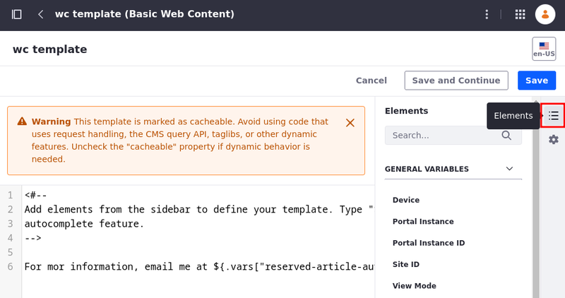
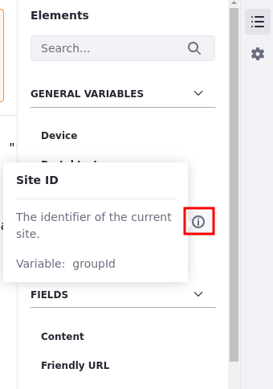

---
taxonomy-category-names:
- Content Management System
- Web Content and Structures
- Liferay Self-Hosted
- Liferay PaaS
- Liferay SaaS
uuid: eccdd0ca-296f-46eb-a737-fe3100650be6
---

# Using Taglibs in Web Content Templates

Liferay's taglibs are accessible when developing templates in FreeMarker. There is no need to instantiate these taglibs within your FreeMarker template; they're already provided for you automatically. You can access these taglibs by indicating the Tag Library Descriptor's (TLD) file name with underscores.

When you're using DXP's template editor, you can find variables on the right side of the template editor under the Elements tab. To place one of the variables onto the template editor,

1. Open the *Site Menu* () and select *Content & Data* &rarr; *Web Content*.

1. Click the *Templates* tab and click *New*.

1. Select the *Elements* tab on the right side of the page.

1. In the Web Content Editor, position your cursor where you want the variable placed.

1. Click the variable name.

If the variable name doesn't give you sufficient information on its functionality, hover over the information icon () for a more detailed description.

The interactive template editor is available for the FreeMarker, Velocity, and XSL languages. Depending on the language you select, the variable content changes so you're always adding content in the language you've chosen. Autocomplete can be invoked by typing `*${*` which opens a menu of available variables. The editor inserts the variable into the template editor when it is chosen.

!!! note
    The `utilLocator`, `objectUtil`, and `staticUtil` variables for FreeMarker are disabled by default. These variables are vulnerable to remote code execution and privilege escalation, and should only be enabled for trusted template developers.

After you save your template, DXP provides a WebDAV URL and static URL. These values access the XML source of your structure. You can find these URLs by returning to your template after saving it and expanding the *Details* section. For more information on WebDAV and the uses of the WebDAV URL, reference the [WebDAV Access](../../documents-and-media/publishing-and-sharing/accessing-documents-with-webdav.md) section.

## Reserved Variables Under Journal

Here is a list of reserved variables you can find under Journal, what they return, and the methods called:

| Reserved Variable | Return | Method |
| :--- | :--- | :--- |
| Article ID | The article's reserved ID. | `journalArticle.getArticleId()` |
| Author Email Address | The author's email address. | `journalArticle.user.getEmailAddress()` |
| Author ID | The author's ID. | `journalArticle.getUserId()` |
| Author Job Title | The author's job title. | `journalArticle.user.getJobTitle()` |
| Author Name | The author's full name. | `journalArticle.user.getFullName()` |
| Comments | The author's comments under *More Information* in account settings. | `journalArticle.user.getComments()` |
| Create Date | The article's date of creation. | `journalArticle.getCreateDate()` |
| Description | The article's description. | `journalArticle.getDescription(languageId)` |
| Display Date | The display date provided under Schedule. | `journalArticle.getDisplayDate()` |
| External Reference Code | The article's external reference code. | `journalArticle.getExternalReferenceCode()` |
| ID | The article's ID. | `journalArticle.getId()` |
| Modified Date | The last date the article was modified. | `journalArticle.getModifiedDate()` |
| Resource Primary Key | The resource primary key value. | `journalArticle.getResourcePrimKey()` |
| Small Image URL | The URL for the feature image. | `journalArticle.getArticleImageURL(themeDisplay)` |
| Tags | The article's tags. | `AssetTagLocalServiceUtil.getTagNames(JournalArticle.class.getName(), journalArticle.getResourcePrimKey())` |
| Title | The article's title. | `journalArticle.getTitle(languageId)` |
| URL Title | The article's URL version of the title. | `journalArticle.getUrlTitle()` |
| Version | The article's current version. | `journalArticle.getVersion()` |

## Related Topics

- [Embedding Widgets in Web Content Templates](./embedding-widgets-in-web-content-templates.md)
