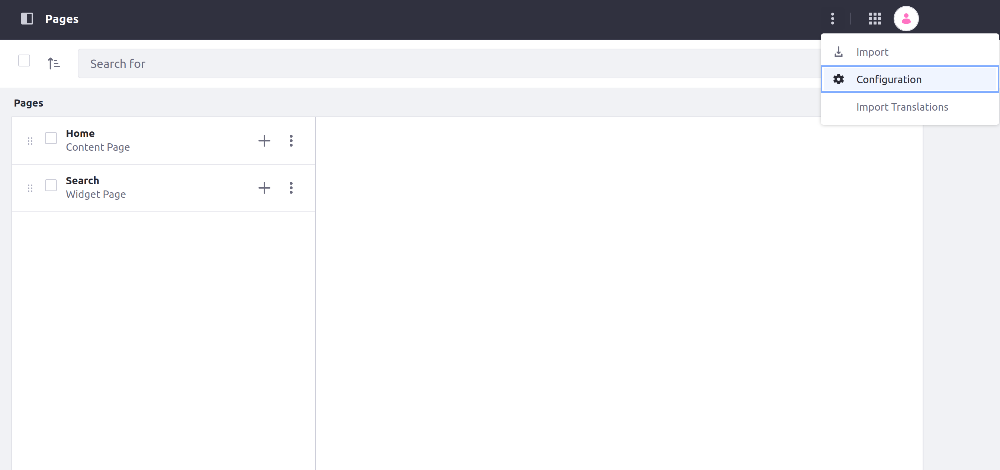
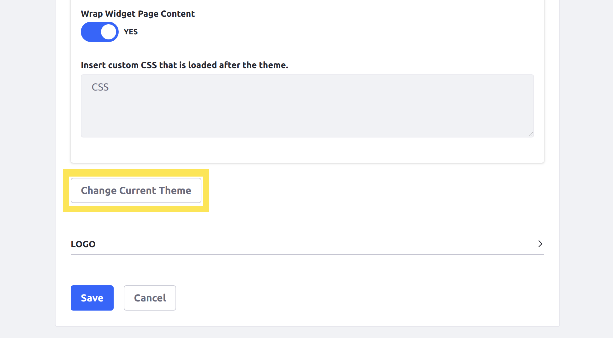
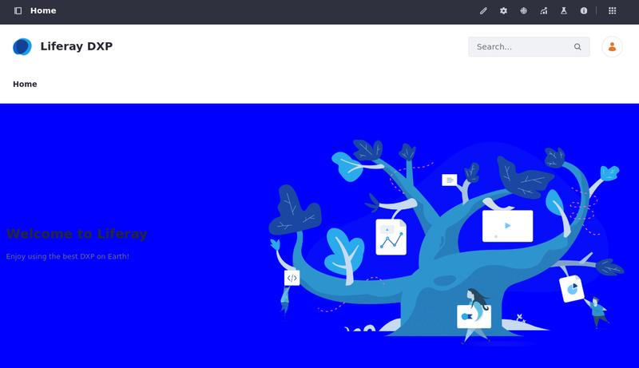

---
taxonomy-category-names:
- Sites
- Site Appearance and Design
- Liferay Self-Hosted
- Liferay PaaS
- Liferay SaaS
uuid: 6169fc69-527b-4f9d-82d3-6e503510b928
---
# Changing Your Site's Appearance

Liferay has many ways to customize your site's appearance. Your site's favicon and theme are two of the first elements you may want to change. Themes set a default look and feel for your site, while the favicon is an icon that identifies your site in the user's browser tab.

## Changing Your Site's Favicon

```{include} /_snippets/run-liferay-portal.md
```

Then, follow these steps:

1. Open the *Site Menu* () and navigate to *Site Builder* &rarr; *Pages*.

1. Click *Actions* () in the Application Bar and select *Configuration*.

   

1. Under Favicon, click *Select Favicon* ().

   

1. Select or upload an image.

1. Click *Save*.

Your site uses the chosen image for its favicon.

## Changing Your Site's Theme

By default, Liferay instances use the Classic theme, but you can deploy and use custom themes.

### Deploy a New Theme

1. Download and unzip the Acme Sample Blue Theme WAR file:

    ```bash
    curl https://resources.learn.liferay.com/dxp/latest/en/getting-started/changing-your-sites-appearance/resources/liferay-5b2v.zip -O
    ```

   ```bash
   unzip liferay-5b2v.zip
   ```

1. Go to the folder where the .war file is placed and deploy it:

    ```bash
    docker cp liferay-5b2v-theme.war [docker-container-id]:[path-to-deploy-folder]
    ```

!!! note
    To replace `[docker-container-id]`, use `docker ps` to find the liferay/portal container's ID. The `[path-to-deploy-folder]` is `opt/liferay/deploy`.

This loads the sample theme into your DXP instance. You can check your console for the following message to confirm the theme successfully deployed:

```
2023-12-21 16:01:20.836 INFO  [fileinstall-directory-watcher][BundleStartStopLogger:68] STARTED liferay-5b2v-theme_1.0.0 [1617]
```

### Change Your Site's Theme

1. Open the *Site Menu* () and navigate to *Site Builder* &rarr; *Pages*.

1. Click *Actions* () in the Application Bar and select *Configuration*.

   

1. Under Theme, click *Change Current Theme*:

   

1. Select the sample theme: *Acme Sample Blue Theme*.

1. Click *Save*.

Navigate to the Home page and confirm the background color is now blue.



## What's Next

Additionally, you can use [style books](../site-building/site-appearance/style-books/using-a-style-book-to-standardize-site-appearance.md) to further customize design elements and [master page templates](../site-building/creating-pages/defining-headers-and-footers/master-page-templates.md) to design the header and footer for content pages. See [Site Appearance](../site-building/site-appearance/site-appearance.md) for a complete overview of customizing the look and feel of your site.

There are many themes available on the [Liferay Marketplace](../system-administration/installing-and-managing-apps/using-marketplace.md) that can be used to quickly achieve a professional look and feel.

You can also learn how to [create your own theme](../site-building/site-appearance/themes/introduction-to-themes.md).

<!-- ## Changing Your Site's Logo

Coming soon! -->
