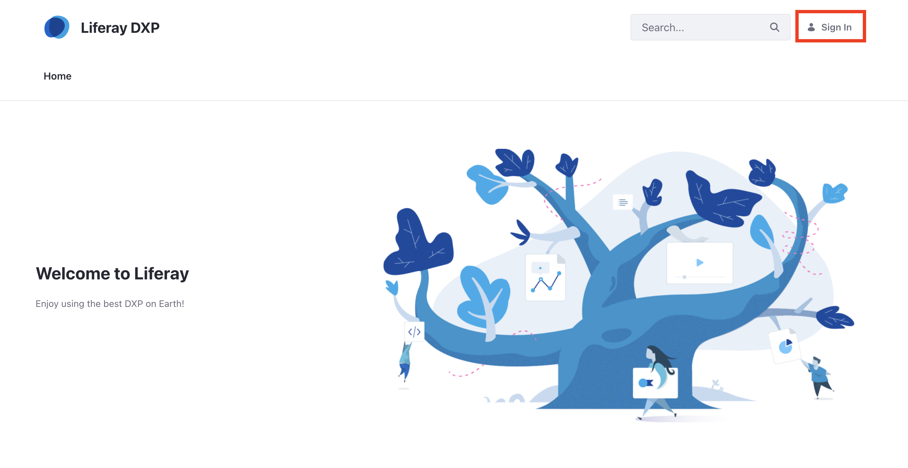
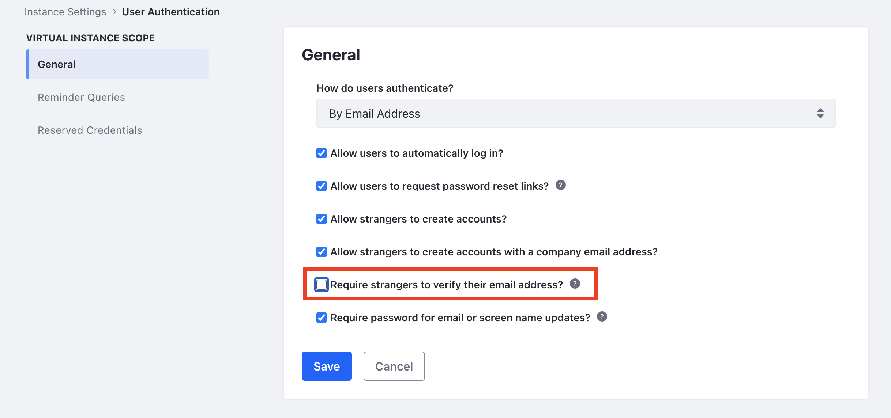

# Introduction to the Admin Account

The Admin User account is created by default in any new installation of Liferay DXP and has full permissions to modify every facet of a Liferay DXP instance. The Admin User can create, modify, and delete Sites, Users, pages, and perform all Site administrative tasks.

## Accessing Liferay DXP as the Admin User

1. Open a browser to `http://localhost:8080`.

1. Click the _Sign In_ link.

    

    ```{note}
    If a Liferay DXP bundle is being used, you may be presented with the [Setup Wizard](../installation-and-upgrades/installing-liferay/running-liferay-for-the-first-time.md). Follow the on-screen instructions to configure your Admin user.
    ```

1. Enter the default admin credentials to log in.

    * Email address: `test@liferay.com`
    * Password: `test`

1. Upon first sign in, you will be required to change your password. Input a new password (e.g. _learn_) and click _Save.

```{warning}
In a production environment, you should not use the default admin account. Instead, create admin accounts specific to your business. See the steps below.
```

## Configuring the Admin User

### Changing the Login Password

1. Click the _User Avatar_ and navigate to _Account Settings_ &rarr; _Password_.

1. Enter your _Current Password_ and provide a new password.

    

### Changing Account Information

1. Click _User Avatar_ &rarr; _Account Settings_.

    

1. In the _Information_ tab, change or add User information as needed.

    

## Signing Out

To log out of your account:

1. Click _User Avatar_ &rarr; _Sign Out_.

    

## Creating a New Admin User

Now that you know how to log in, we strongly recommend that you create a new admin account for everyday use.

To create a new admin account follow these steps:

1. See [configuring mail](../installation-and-upgrades/setting-up-liferay/configuring-mail.md) to set up Liferay with your email service. Liferay sends an email to the new user's email address upon account creation. 

    To skip this step, disable the feature to require strangers to verify their email address". Navigate to _Control Panel_ &rarr; _Instance Settings_ &rarr; _User Authentication_. Uncheck the box for _Require strangers to verify their email address?_.

    

1. Create a new User. See [Adding Users](../users-and-permissions/users/adding-and-managing-users.md) to learn how.

1. Click the *Roles* link in the left navigation pane (on the Edit User page under General).

    

1. Click *Select* beside *Regular Roles*.

1. Select the *Administrator* Role from the list (click *Choose*). The dialog box disappears and the Role is added to the list of Roles associated with your account. Scroll to the bottom and click _Save_.

1. (Optional) If you did not [configure mail](../installation-and-upgrades/setting-up-liferay/configuring-mail.md) in the step above, set an initial password for this new user. Click the _Password_ link in the left navigation pane. Input a password for the user, reenter the password, and click _Save_.

The user is now a portal administrator. Log out and then log back in with your new user account.

## What's Next

Continue our Getting Started walkthrough by familiarizing yourself with the [DXP Global Menu](./navigating-dxp.md).

Learn more about [configuring how users log into DXP](../installation-and-upgrades/securing-liferay/authentication-basics.md).
