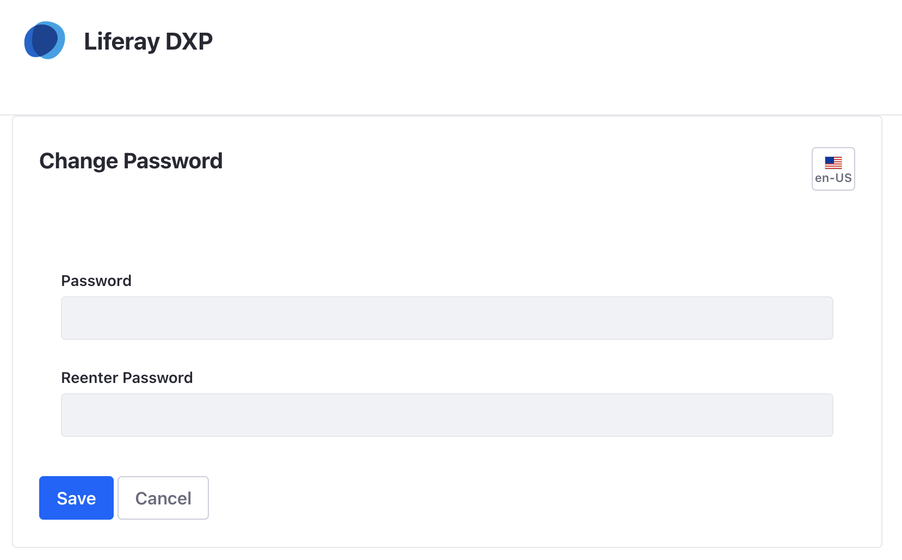

# Starting with a Docker Image

The latest versions of Liferay are available as Docker images on Docker Hub. They're in two categories:

- [Liferay/Portal](https://hub.docker.com/r/liferay/portal)
- [Liferay/DXP](https://hub.docker.com/r/liferay/dxp)

Follow the steps below to download, launch, and begin touring the latest releases of Liferay. 

```{important}
Don't have Docker? Go here first: [Linux](https://docs.docker.com/install/linux/docker-ce/ubuntu/) | [Windows](https://docs.docker.com/docker-for-windows/install/) | [OSX](https://docs.docker.com/docker-for-mac/install/)
```

## Get Started with Liferay Portal

Liferay Portal is the open source and community supported platform for building compelling and flexible web experiences.

1. Start a new Liferay Portal instance by running

    ```bash
    docker run -it -m 8g -p 8080:8080 [$LIFERAY_LEARN_PORTAL_DOCKER_IMAGE$]
    ```

    ```{tip}
    Wait until you see `org.apache.catalina.startup.Catalina.start Server startup in [x] milliseconds` to indicate startup completion.
    ```

1. Sign in to Liferay at `<http://localhost:8080>` using the email address _test@liferay.com_ and the password _test_. 

1. When prompted, change your password (e.g. _learn_) and click _Save.

    

```{warning}
In a production environment, you should not use the default admin account. Instead, create admin accounts specific to your business.
```

## Get Started With Liferay DXP

Liferay DXP is the commercially supported and enterprise ready platform used around the world, built on the foundation of Liferay Portal. Starting with the Docker image is simple and includes a trial license.

1. Start a new Liferay DXP instance by running

    ```bash
    docker run -it -m 8g -p 8080:8080 [$LIFERAY_LEARN_DXP_DOCKER_IMAGE$]
    ```

1. Sign in to Liferay at `<http://localhost:8080>` using the email address _test@liferay.com_ and the password _test_.

1. When prompted, change your password (e.g. _learn_) and click _Save.

    

```{warning}
In a production environment, you should not use the default admin account. Instead, create admin accounts specific to your business.
```

## What's Next

Continue our Getting Started walkthrough and learn about logging in for the first time using [the Admin account](./introduction-to-the-admin-account.md).

Doing more than just checking things out? See the [Installing a Liferay-Tomcat Bundle](../installation-and-upgrades/installing-liferay/installing-a-liferay-tomcat-bundle.md) to learn more.

Learn more about [using Docker images](../installation-and-upgrades/installing-liferay/using-liferay-docker-images.md).
