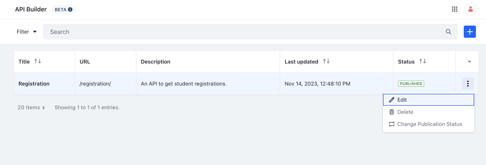
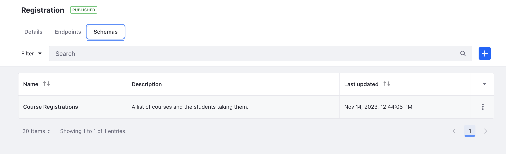
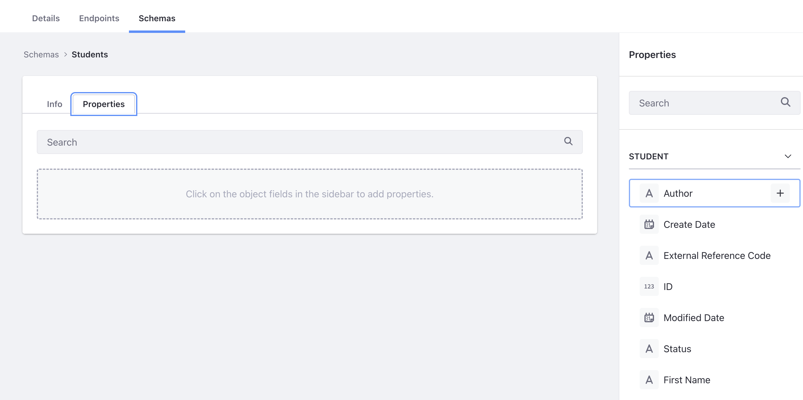
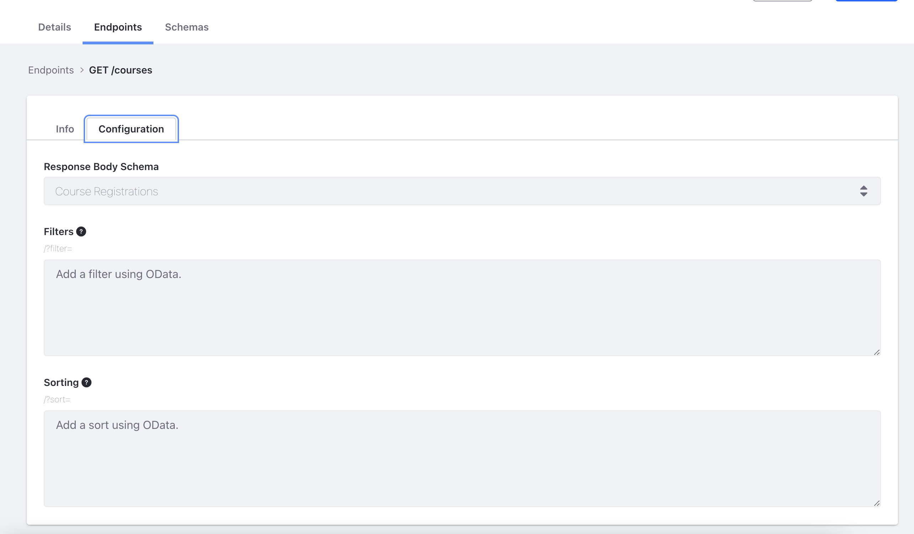
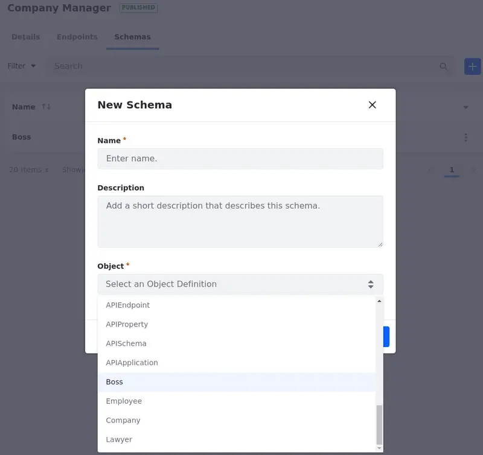
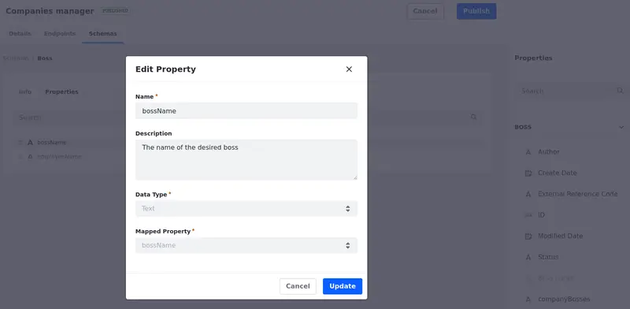

# API Builder
{bdg-secondary}`Liferay DXP 2023.Q4+/Portal 7.4 GA102+`
{bdg-link-primary}`[Beta Feature](../system-administration/configuring-liferay/feature-flags.md#beta-feature-flags)`

!!! important
    This feature is currently behind a [beta feature flag](../system-administration/configuring-liferay/feature-flags.md#beta-feature-flags) (LPS-178642). API endpoints currently support retrieving and creating collections of entities.

The API builder makes it easy for you to create custom API applications in Liferay. Create API schemas and endpoints that meet your exact needs.

## Using the API Builder

Each API application can house multiple endpoints and schemas. This is similar to Liferay's out-of-the-box API applications. For example, the `headless-admin-user` API application houses endpoints for `accounts`, `organizations`, `roles`, `user-accounts`, etc.

!!! note
    The API Builder is configured at an instance-level scope. Create different API applications that are unique to each virtual instance. To re-create an API application in another instance, use the [data migration center](./consuming-apis/data-migration-center.md).

To access the API Builder application,

1. Open the *Global Menu* (), select the *Control Panel* tab, and click *API Builder* under Object.

1. A list of your custom API applications appears.

   The title, URL, description, last update, and status appear for each API application.

   

From the API Builder, you can also [create](#creating-custom-api-applications) and [manage](#managing-custom-api-applications) custom API applications.

### Creating Custom API Applications

1. While in the [API Builder](#using-the-api-builder), click *Add* () and fill in the requested information.

1. Add the Title, the URL, and (optionally) a description for your API.

   The URL has a limit of 255 characters, and it must contain only numbers, letters, or dashes.

1. Click *Create*.

### Managing Custom API Applications

While in the [API Builder](#using-the-api-builder), use the Actions menu () next to the API application to manage it. Select an available option:

**Edit**: Edit your API application.

You can also click on the API application's name to edit it.

While editing an API application, you can create new [endpoints](#creating-and-managing-endpoints) and [schemas](#creating-and-managing-schemas) that work like Liferay's out-of-the-box API applications.

**Delete**: Delete your API application.

**Change Publication Status**: Change your publication status from published to unpublished or vice versa.

An API application must be published before use. Once published, the generated APIs have the same set of features as Liferay's out-of-the-box APIs (i.e. pagination, filtering, sorting, etc.)

## Creating and Managing Endpoints

{bdg-secondary}`Liferay DXP 2024.Q1+/Portal 7.4 GA112+`

API endpoints are the specific URL locations that accept requests.

To see, manage, and create endpoints,

1. Start [editing your API application](#managing-custom-api-applications) and select the *Endpoints* tab to see a list of your custom endpoints.

   The method, URL path, description, and last update are shown for each endpoint.

To create a new endpoint,

1. Click *Add* () and enter your details.

   

1. Click *Create*.

   Once the endpoint is created, you can configure it using the Configuration tab.

   There are different configurations depending on the selected method. See [Creating a GET Method Endpoint](#creating-a-get-method-endpoint) and [Creating a POST Method Endpoint](#creating-a-post-method-endpoint) for more information.

To manage endpoints, use the Actions menu () next to the endpoint and select an available option:

**Edit**: Edit your endpoint.

You can also click on the endpoint's path to edit it.

**Copy URL**: Copy your endpoint's URL.

**Delete**: Delete your endpoint.

### Creating a GET Method Endpoint

The GET method requests and retrieves data from a specified source. Using the GET method you can retrieve information from a collection or a single element (i.e. you can retrieve a list of products, or you can retrieve information from a single product).

To create an endpoint using the GET method,

1. While [creating an endpoint](#creating-and-managing-endpoints), select the GET method.

1. {bdg-secondary}`Liferay DXP 2024.Q1+/Portal 7.4 GA112+` Select the *Retrieve Type*. Retrieve a Collection or a Single Element.

   Depending on the type you selected, there are different configurations for the Path and in the Configurations tab.

1. Select the *Scope* for your endpoint based on your object's scope. Endpoints can be scoped for the Instance(Company) or a Site.

1. Enter the *Path* you want to use in your endpoint.

   {bdg-secondary}`Liferay DXP 2024.Q1+/Portal 7.4 GA112+` If you selected Single Element as your Retrieve Type, you must add a parameter to the path. (e.g. if you want information from a single product, you need to provide a product ID as a parameter).

1. (Optional) Add a *Description* to your endpoint.

1. Click *Create*.

Once the endpoint is created, select the *Configuration* tab for additional settings. {bdg-secondary}`Liferay DXP 2024.Q1+/Portal 7.4 GA112+` Depending on the Retrieve Type you chose, different settings appear. In the configuration tab,

1. Select the *Response Body Schema*. [Create a Schema](#creating-and-managing-schemas) and apply it to the endpoint to define the structure and format of the data that is returned by the API in response to a client's request.

{bdg-secondary}`Liferay DXP 2024.Q1+/Portal 7.4 GA112+` If you selected Collection as your Retrieve Type,

1. Apply *Filters* to your endpoint.

   JSON filtering can be incorporated into the endpoint. For example, `filter=lastName eq 'Smith'` could be used to filter the endpoint for entries that contain a last name Smith.

1. Apply *Sorting* parameters to your endpoint.

   JSON sorting can be incorporated. For example `sort=firstName:asc` could be used to sort the entries alphabetically by first name.

   See [API query parameters](./consuming-apis/api-query-parameters.md) to learn more about filtering and sorting.

1. Click *Publish*.



{bdg-secondary}`Liferay DXP 2024.Q1+/Portal 7.4 GA112+` If you selected Single Element as your Retrieve Type,

1. Select the *Path Parameter Property*. This is the object field that is mapped to the provided parameter in the endpoint's path. It can be a system or custom field (e.g. `id` and `externalReferenceCode` are system fields and `employeeId` is a custom field.).

1. (Optional) Add a *Path Parameter Description*.

1. Click *Publish*.



Once the endpoint is created, you can see it on your API explorer page `http://localhost:8080/o/api`.

### Creating a POST Method Endpoint

In the API Builder, the POST method is used to create [object](../liferay-development/objects/creating-and-managing-objects/creating-objects.md) entries.

<!-- for now, at least. I'll have to change it once new features come out. - Eric -->

To create an endpoint using the POST method,

1. While [creating an endpoint](#creating-and-managing-endpoints), select the POST method.

1. Select the *Scope* for your endpoint based on your object's scope. Endpoints can be scoped for the instance (Company) or a site.

1. Enter the *Path* you want to use in your endpoint.

1. (Optional) Add a *Description* to your endpoint.

1. Click *Create*.

Once the endpoint is created, select the *Configuration* tab for additional settings. In the configuration tab,

1. Select the *Request Body Schema*. [Create a Schema](#creating-and-managing-schemas) and apply it to the endpoint to define the structure and format of the data that the client should include in the request body when creating a resource on the server.

   The request body must contain all mandatory properties from the main object, and it can only contain properties from the main object.

   If the schema is not selected, the API endpoint won't work, and it won't show in the API application explorer page.

   !!! warning
       You can use relationship-type properties in your schema to define relationships between entities. The created entities can be related to existing object entries through their ID.

       Although you can define related entities as properties, the values provided for these related entities in the POST request are ignored. Therefore, it's not possible to create related entities when creating a new entry using the POST method.

       <!-- Waiting on LPD-1184 for this feature. Then, I can remove this admonition. - Eric -->

1. (Optional) Select the *Response Body Schema*. [Create a Schema](#creating-and-managing-schemas) and apply it to the endpoint to define the structure and format of the data that the server sends back to the client in response to the POST request.

   If you don't select a response body schema, an empty response is returned when the API is executed successfully.

Once the endpoint is created, you can see it on your API explorer page `http://localhost:8080/o/api`.

### Creating a POST Method Endpoint Through an API Call

If you are creating the POST endpoint through API calls, keep these points in mind:

- {bdg-secondary}`Liferay DXP 2024.Q1+/Portal 7.4 GA112+` POST endpoints must have `singleElement` as their retrieve type. This ensures that only the information related to the posted entry is requested.

- {bdg-secondary}`Liferay DXP 2024.Q1+/Portal 7.4 GA112+` An error occurs if you use `singleElement` as retrieve type and define a path parameter (e.g. `/api/users/{userId}` where `{userId}` is the path parameter) during the API call to create a POST endpoint.

- POST endpoints without a request body schema don't work. 

Here's an example of a CURL command you can use to create a POST endpoint:

```json
curl -X 'POST' \
  'http://localhost:8080/o/headless-builder/endpoints/' \
  -H 'accept: application/json' \
  -H 'Content-Type: application/json' \
  -u 'test@liferay.com:learn' \
  -d '{
  "externalReferenceCode": "post-boss-endpoint-erc",
  "description": "This is an endpoint to post a Boss entry",
  "httpMethod": "post",
  "name": "Post Boss",
  "path": "/boss",
  "r_apiApplicationToAPIEndpoints_c_apiApplicationERC": "companies-manager-erc",
  "r_requestAPISchemaToAPIEndpoints_c_apiSchemaERC": "boss-schema-erc",
  "r_responseAPISchemaToAPIEndpoints_c_apiSchemaERC": "boss-schema-erc",
  "retrieveType": "singleElement",
  "scope": "company"
}'
```

Here's how it works, in sections: 

```json
curl -X 'POST' \
  'http://localhost:8080/o/headless-builder/endpoints/' \
  -H 'accept: application/json' \
  -H 'Content-Type: application/json' \
  -u 'test@liferay.com:learn' \
```

This section of the command specifies the HTTP request method as POST, defines the URL to which the POST request is being sent (http://localhost:8080/o/headless-builder/endpoints/), sets the Accept and the Content-Type header for the request to JSON format, and includes basic authentication with the specified user and password (-u 'test@liferay.com:learn').

```json
  -d '{
  "externalReferenceCode": "post-boss-endpoint-erc",
  "description": "This is an endpoint to post a Boss entry",
  "httpMethod": "post",
  "name": "Post Boss",
  "path": "/boss",
  "r_apiApplicationToAPIEndpoints_c_apiApplicationERC": "company-manager-erc",
  "r_requestAPISchemaToAPIEndpoints_c_apiSchemaERC": "boss-schema-erc",
  "r_responseAPISchemaToAPIEndpoints_c_apiSchemaERC": "boss-schema-erc",
  "retrieveType": "singleElement",
  "scope": "company"
}'
```

This section specifies the data sent in the request body. In this case, a JSON payload contains different properties:

`"externalReferenceCode"`: Defines the endpoint's external reference code (ERC).

`"description"`: Defines the endpoint's description.

`"httpMethod"`: Defines the endpoint's Method.

`"name"`: Define the endpoint's Name.

`"path"`: Defines the endpoint's Path.

`"r_apiApplicationToAPIEndpoints_c_apiApplicationERC"`: Points to an ERC to specify the API Application where the endpoint is added.

`"r_requestAPISchemaToAPIEndpoints_c_apiSchemaERC"`: Points to an ERC to specify the schema used for the endpoint's request body.

`"r_responseAPISchemaToAPIEndpoints_c_apiSchemaERC"`: Points to an ERC to specify the schema used for the endpoint's response body.

{bdg-secondary}`Liferay DXP 2024.Q1+/Portal 7.4 GA112+` `"retrieveType"`: Defines the endpoint's Retrieve Type.

`"scope"`: Defines the endpoint's scope.

## Creating and Managing Schemas

API schemas specify what entities are returned (or received) by your API.

To see, manage, and create schemas,

1. Start [editing your API application](#managing-custom-api-applications) and select the *Schemas* tab to see a list of your schemas.

   The name, description, and last update are shown for each schema.

To create a new schema,

1. Click *Add* () and enter your details.

   Select a name, add a description (optional), and select the object definition associated with the schema.

   

1. Click *Create*.

   Once the schema is created, you can [configure its properties](#configuring-and-managing-schema-properties) using the Properties tab.

To manage schemas, use the Actions menu () next to the schema and select an available option:

**Edit**: edit your schema.

You can also click on the schema's name to edit it.

**Delete**: delete your schema.

### Configuring and Managing Schema Properties

1. To configure the schema properties, start [editing a schema](#creating-and-managing-schemas) and select the *Properties* tab.

1. Select the entities you want to include in your schema.

   To add an entity to the schema, click the entity's name or the *Add* icon () next to it.

   Select entities available from your [Liferay object](../liferay-development/objects/creating-and-managing-objects.md). If the object has [object relationships](../liferay-development/objects/creating-and-managing-objects/relationships.md), the entities from those objects can be selected also.

   You can use the search bar to find entities.

1. Manage the entities. You can rearrange, rename, or exclude them.

   Use the move handle next to the property name to rearrange your properties.

   Hover your mouse over the property name to see the Edit () and the Delete () actions.

   You can edit the object's property name and description. For example, for the `Boss` object in the screenshot, change `Boss Name` to `bossName`, so it matches the mapped property.

   

1. Click *Publish*.

## Next Steps

- [Building a Sample API Application](./api-builder/building-a-sample-api-application.md)
