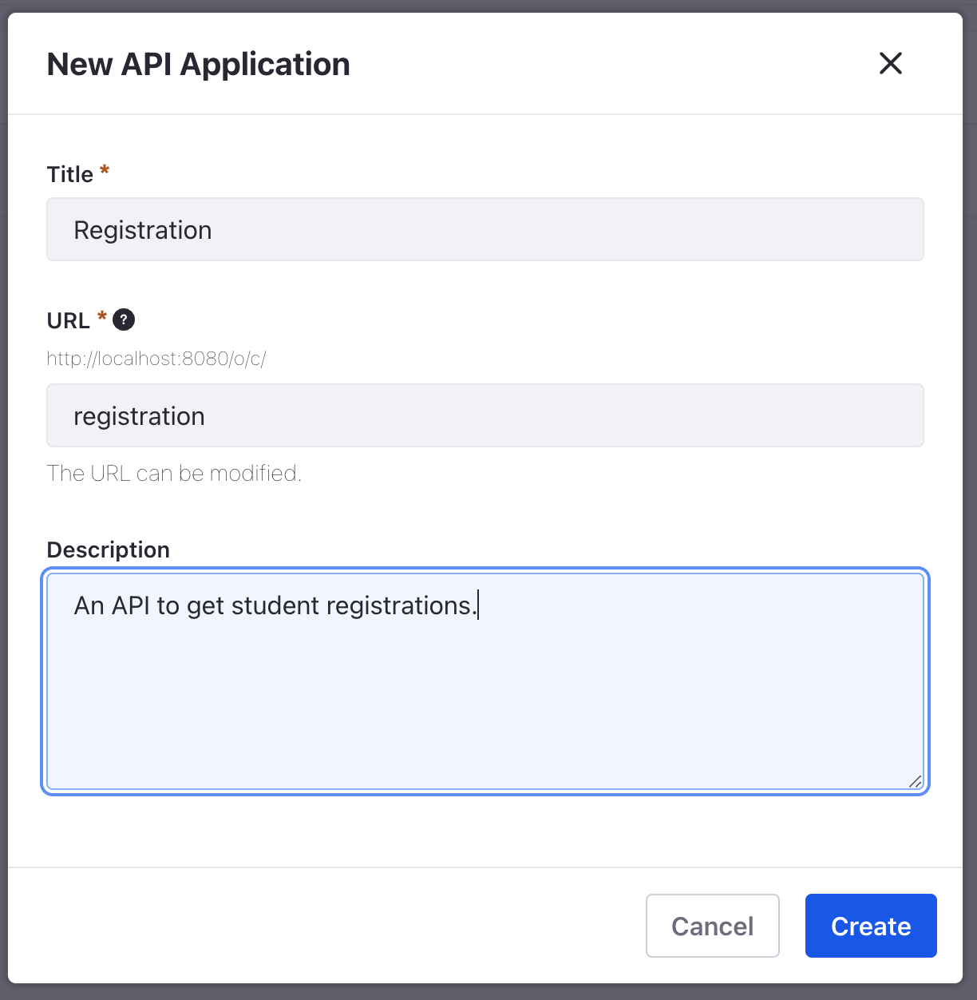
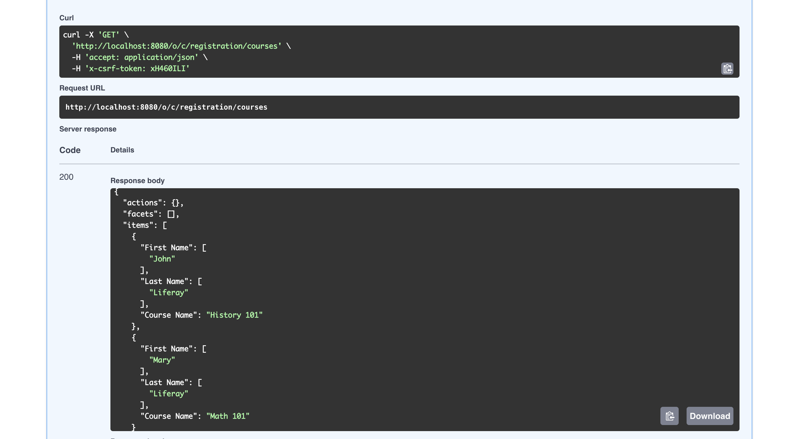

# Building a Sample API Application

{bdg-secondary}Liferay DXP 2023.Q4+/Portal 7.4 GA102+
{bdg-link-primary}`[Beta Feature](../../system-administration/configuring-liferay/feature-flags.md#beta-feature-flags)`

```{important}
The API builder is a beta feature that currently only supports Liferay objects.
```

Follow the steps below to see a mock API application example.

To enable the API builder,

1. Navigate to _Global Menu_ () &rarr; _Control Panel_ &rarr; _Instance Settings_.

1. Click _Feature Flags_ under _Platform_.

1. Select _Beta_ in the left navigation. Toggle _API Builder_ on. The API builder is now enabled.

## Adding Sample Objects and Entries

```{include} /_snippets/run-liferay-dxp.md
```

Then, follow these steps:

1. On the command line, run the following script to create a `Student` object.

	```bash
	student=$(curl \
		-H "Content-Type: application/json" \
		-X POST \
		"http://localhost:8080/o/object-admin/v1.0/object-definitions" \
		-d "{\"label\": {\"en_US\": \"Student\"}, \"name\": \"Student\", \"panelCategoryKey\": \"control_panel.object\", \"pluralLabel\": {\"en_US\": \"Students\"}, \"scope\": \"company\"}" \
	  -u "test@liferay.com:learn" | jq -r ".id")

	curl \
		-H "Content-Type: application/json" \
		-X POST \
		"http://localhost:8080/o/object-admin/v1.0/object-definitions/${student}/object-fields" \
		-d "{\"businessType\": \"Text\", \"label\": {\"en_US\": \"First Name\"}, \"name\": \"firstName\", \"required\": false}" \
		-u "test@liferay.com:learn"

	curl \
		-H "Content-Type: application/json" \
		-X POST \
		"http://localhost:8080/o/object-admin/v1.0/object-definitions/${student}/object-fields" \
		-d "{\"businessType\": \"Text\", \"label\": {\"en_US\": \"Last Name\"}, \"name\": \"lastName\", \"required\": false}" \
		-u "test@liferay.com:learn"

	curl \
		-H "Content-Type: application/json" \
		-X POST \
		"http://localhost:8080/o/object-admin/v1.0/object-definitions/${student}/publish" \
		-u "test@liferay.com:learn"
	```

1. Navigate to _Global Menu_ () &rarr; _Control Panel_ &rarr; _Objects_. Verify that a new `Student` object was created.

1. On the command line, run the following script to create a `Course` object.

	```bash
	course=$(curl \
		-H "Content-Type: application/json" \
		-X POST \
		"http://localhost:8080/o/object-admin/v1.0/object-definitions" \
		-d "{\"label\": {\"en_US\": \"Course\"}, \"name\": \"Course\", \"panelCategoryKey\": \"control_panel.object\", \"pluralLabel\": {\"en_US\": \"Courses\"}, \"scope\": \"company\"}" \
		-u "test@liferay.com:learn" | jq -r ".id")

	curl \
		-H "Content-Type: application/json" \
		-X POST \
		"http://localhost:8080/o/object-admin/v1.0/object-definitions/${course}/object-fields" \
		-d "{\"businessType\": \"Text\", \"label\": {\"en_US\": \"Course Name\"}, \"name\": \"courseName\", \"required\": false}" \
	  -u "test@liferay.com:learn"
	```

1. Navigate to _Global Menu_ () &rarr; _Control Panel_ &rarr; _Objects_. Click on the `Course` object that was just created.

1. Click the _Relationships_ tab. Click _Add_ ().

1. Enter the following valuses to define the new relationship.

   | Field | Value |
   | :--- | :--- |
 	| Label | Enrollment |
   | Name | enrollment |
   | Type | One to Many |
   | One Record Of | Course |
   | Many Records of | Student |

   Click _Save_.

1. Click the _Details_ tab. Click _Publish_.

## Adding Sample Courses and Students

1. On the command line, run the following script to create two courses and two students.

	```bash
	math101=$(curl \
		-H "Content-Type: application/json" \
		-X POST \
		"http://localhost:8080/o/c/courses" \
		-d "{\"courseName\": \"Math 101\"}" \
		-u "test@liferay.com:learn" | jq -r ".id")

	curl \
		-H "Content-Type: application/json" \
		-X POST \
		"http://localhost:8080/o/c/students" \
		-d "{\"r_enrollment_c_courseId\":${math101}, \"firstName\": \"Mary\", \"lastName\": \"Liferay\"}" \
		-u "test@liferay.com:learn"

	history101=$(curl \
		-H "Content-Type: application/json" \
		-X POST \
	  "http://localhost:8080/o/c/courses" \
		-d "{\"courseName\": \"History 101\"}" \
		-u "test@liferay.com:learn" | jq -r ".id")

	curl \
		-H "Content-Type: application/json" \
		-X POST \
		"http://localhost:8080/o/c/students" \
		-d "{\"r_enrollment_c_courseId\":${history101}, \"firstName\": \"John\", \"lastName\": \"Liferay\"}" \
		-u "test@liferay.com:learn"
	```

## Creating an API Application

1. Navigate to _Global Menu_ () &rarr; _Control Panel_ &rarr; _API Builder_.

1. Click _Add_ (). Enter the title, URL, and description for the new API application.

   

   | Field | Value |
   | :--- | :--- |
   | Title | Registration |
   | URL | registration |
   | Description | An API to get student registrations. |

   Click _Create_.

1. Click the _Schemas_ tab. Click _Add_ ().

1. Enter the name, description, and object for the new schema.

   | Field | Value |
   | :--- | :--- |
   | Name | Course Registrations |
   | Description | A list of courses and the students taking them. |
   | Object | Course |

   Click _Create_.

1. Click the newly created schema's _Properties_ tab. Add the `Course Name` field by clicking on _Course Name_ in the left menu.

   

1. In the left menu, click _View Related Objects_. Click _Student_ to expand the attributes. Add the `First Name` and `Last Name` fields by clicking on _First Name_ and _Last Name_ in the left menu. Click _Save_ in the top right corner.

1. Next, click the _Endpoints_ tab. Click _Add_ ().

1. Enter the scope, path, and description for the new API endpoint.

   | Field | Value |
   | :--- | :--- |
   | Scope | Company |
   | Path | courses |
   | Description | An endpoint to get a list of courses and its students. |

	Click _Create_.

1. Click the _Configuration_ tab in the newly created API endpoint. Under Response Body Schema, select the _Course Registrations_ schema you created in the previous step. Click _Publish_ in the top right of the page.

1. Test out the new API application by navigating to the API explorer (e.g. <http://localhost:8080/o/api?endpoint=http://localhost:8080/o/c/registration/openapi.json>).

   Click the _GET courses_ endpoint and click _Execute_.

   

   The custom API application returns a list of courses and the students taking the courses.
