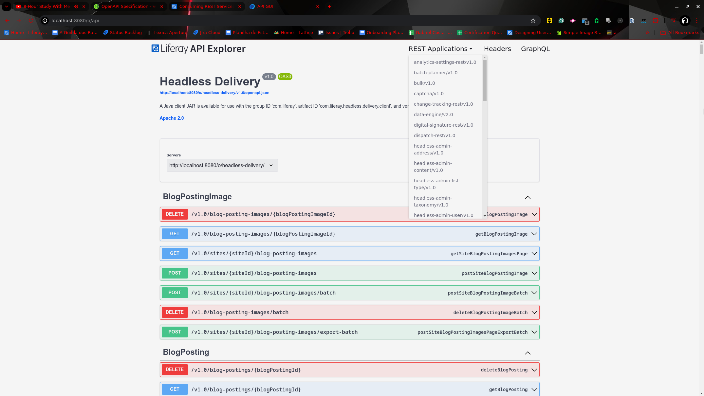

---
toc:
  - ./consuming-apis/consuming-rest-services.md
  - ./consuming-apis/consuming-graphql-apis.md
  - ./consuming-apis/data-migration-center.md
  - ./consuming-apis/api-query-parameters.md
  - ./consuming-apis/batch-engine-api-basics-importing-data.md
  - ./consuming-apis/batch-engine-api-basics-exporting-data.md
  - ./consuming-apis/making-unauthenticated-requests.md
  - ./consuming-apis/using-external-reference-codes.md
  - ./consuming-apis/api-headers-reference.md
uuid: 31e2f6fc-5394-4d53-bc3d-d098eda6adb5
taxonomy-category-names:
- Platform
- Multi-Channel Experiences (Headless Delivery)
- API Development
- Liferay Self-Hosted
- Liferay PaaS
- Liferay SaaS
---

# Consuming APIs

APIs, or Application Programming Interfaces, serve as the bridge between different software applications, allowing them to communicate and exchange data. By consuming external APIs, developers can use existing functionality and data sources to upgrade their applications without building everything from scratch.

## Consuming REST Services

Liferay provides a full REST API framework for interacting with platform functionality. You can access and manipulate data, create custom integrations, and build complete applications.

Liferay's REST APIs comply with the [OpenAPI standard](https://www.openapis.org), enabling developers to use what they know. The APIs are documented through Liferay's API Explorer, offering detailed information on endpoints and their usage.

## Consuming GraphQL APIs

Liferay fully supports [GraphQL](https://graphql.org) APIs, and you can search these APIs directly through the API explorer, which provides an organized view of available queries, mutations, and schemas.

## Data Migration Center

Liferay's Data Migration Center streamlines the transfer of data between Liferay instances. Whether you're upgrading systems, consolidating environments, or migrating data to a new platform, this feature simplifies the process. By exporting and importing object definitions and entries, organizations can move content, configurations, and user data without manual intervention. This automation reduces errors, saves time, and ensures data integrity.

## Batch Engine API - Importing and Exporting data

Liferay’s Headless Batch Engine provides REST APIs to import and export data. These APIs support CSV, JSON, XLSX, and can work with a large dataset. Additionally, some APIs can filter data during export. For advanced users, customization through code is available for importing and exporting processes.

With Batch Engines, you can transfer large volumes of data between different systems or Liferay instances, integrate Liferay with other systems by importing data from external sources or exporting data for use in other applications, and export data in formats suitable for reporting and analysis.

## Using External Reference Codes

With *External Reference Codes* (ERCs), you have easy data synchronization and mapping between different systems. By using a common reference point, data can be transferred and updated consistently across platforms. During data migration processes, you can use ERCs to track and match records before and after the migration, trace the history of data changes, and track previous data.

When interacting with external systems or databases through APIs, ERCs can serve as unique identifiers for records, facilitating data synchronization and mapping.

In short, Liferay offers a full set of tools for working with its data outside its user interface. Read on to learn more.
