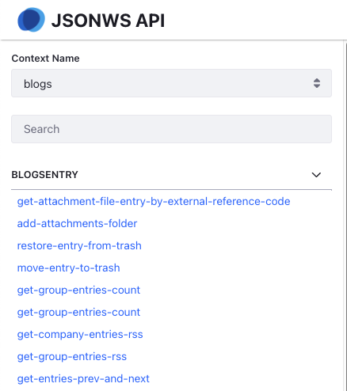

# Configuring JSON Web Services

Liferay’s services are exposed as JSON web services out-of-the-box. This is enabled by default. You can access these services via the API page at `http://[address]:[port]/api/jsonws`.

You can use a set of portal properties to fine-tune how JSON web services work in your Liferay instance. You can find these, and other properties, in the [portal properties reference documentation](https://resources.learn.liferay.com/reference/latest/en/dxp/propertiesdoc/portal.properties.html).

## Disabling JSON WS

Use this portal property in the `portal-ext.properties` file to disable JSON web services.

```properties
json.web.service.enabled=false
```

## Disabling Discoverability

To disable access to these services at `http://[address]:[port]/api/jsonws`, use:

```properties
jsonws.web.service.api.discoverable=false
```

## Disabling HTTP Methods

When using strict HTTP method mode, you can filter web service access based on the HTTP methods used by the services. For example, if you want your Liferay instance’s JSON web services to work in read-only mode, disable all HTTP methods except `GET`:

```properties
jsonws.web.service.invalid.http.methods=DELETE,POST,PUT
```

Using this, all requests that use `DELETE`, `POST`, or `PUT` HTTP methods are ignored.

## Strict HTTP Methods

All JSON web services are mapped to `GET` or `POST` HTTP methods. If a service method name starts with `get`, `is` or `has`, the service is read-only and is bound to the `GET` method. Otherwise, it’s bound to `POST`.



By default, Liferay doesn't check HTTP methods as it works in the non-strict HTTP method mode. To enable strict mode, use the following property:

```properties
jsonws.web.service.strict.http.method=true
```

When using strict mode, you must use the correct HTTP methods to call service methods.

## Controlling Public Access

Even with strict HTTP mode, you may want to disable HTTP methods. Each service method knows whether a given user has permission to invoke the chosen action. If you’re concerned about security, you can restrict access to exposed JSON APIs by permitting or restricting certain JSON web service paths.

The property `jsonws.web.service.paths.includes` denotes patterns for JSON web service action paths that are allowed. To enable access to all exposed methods, specify `*`. Leaving the right side of the symbol `=` empty allows any path except for the ones excluded using `jsonws.web.service.paths.excludes`

The property `jsonws.web.service.paths.excludes` denotes patterns for JSON web service action paths that aren’t allowed even if they match one of the patterns set in `jsonws.web.service.paths.includes`.

Note that these properties support wild cards. For example, if you set `jsonws.web.service.paths.includes=get*,has*,is*`, Liferay makes all read-only JSON methods publicly accessible. All other JSON methods are disabled.

Remember: if a path matches both the `jsonws.web.service.paths.includes` and `jsonws.web.service.paths.excludes` properties, the `jsonws.web.service.paths.excludes` property takes precedence.