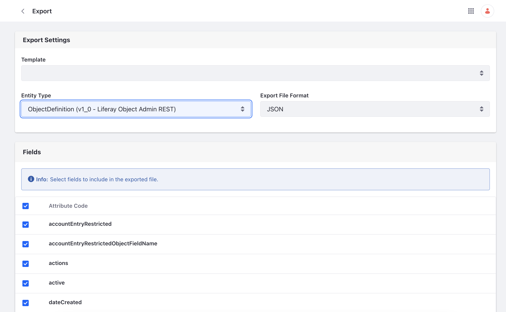
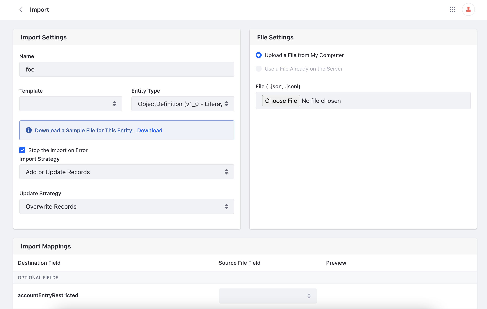
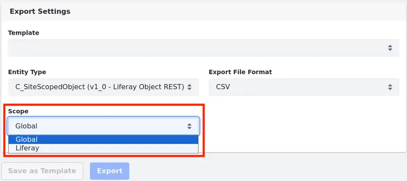
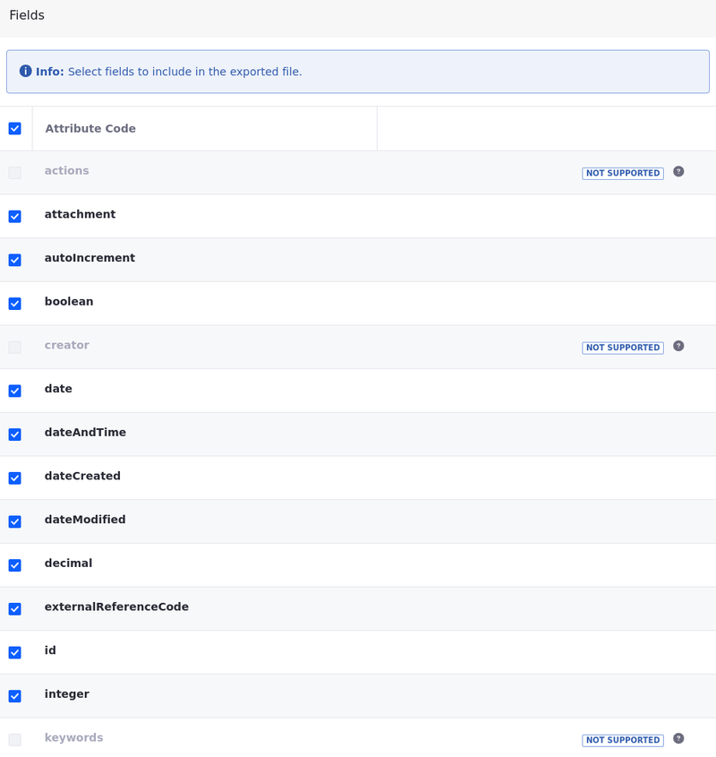
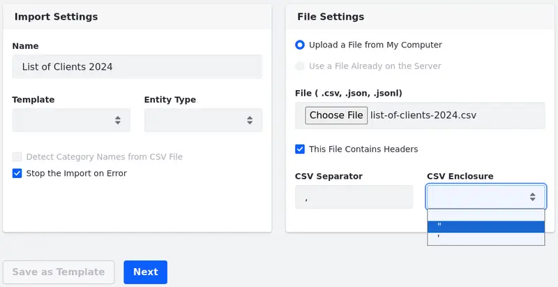

# Data Migration Center

{bdg-secondary}`Liferay DXP 2023.Q4+/Portal 7.4 GA102+`
{bdg-link-primary}`[Beta Feature](../../system-administration/configuring-liferay/feature-flags.md#beta-feature-flags)`

!!! important
    This feature is currently behind a beta feature flag (COMMERCE-8087). The data migration center currently only supports the import and export of object definitions, object entries, and API applications. Read [Beta Feature Flags](../../system-administration/configuring-liferay/feature-flags.md#beta-feature-flags) for more information.

The data migration center makes it easy for you to move your object definitions and object entries between Liferay installations.

To access the data migration center,

1. Navigate to *Global Menu* () &rarr; *Applications* &rarr; *Data Migration Center*.

   

1. Click the *Import and Export* tab to see a list of import and export tasks and their status. Click the *Actions* () icon next to export/import tasks to download files from previous tasks.

1. Click the *Templates* tab to see a list of import and export templates.

With the data migration center, you can

- [Export Object Definitions](#exporting-object-definitions)
- [Import Object Definitions](#importing-object-definitions)
- [Export Object Entries](#exporting-object-entries)
- [Import Object Entries](#importing-object-entries)

## Exporting Object Definitions

1. Click *Add* () and select *Export File*.

1. (Optional) In the next page, select an export *Template* if using a previously saved template.

1. Choose `ObjectDefinition (v1_0 - Liferay Object Admin REST)` as the Entity Type.

   If the `ObjectDefinition (v1_0 - Liferay Object Admin REST)` option is not showing, select a different export file format: JSON, JSONL, or JSONT.

1. Select one of the Export File Formats.

   !!! note
       The data migration center only supports the JSON and JSONL file format for importing object definitions.

       If exporting to use in conjunction with batch client extensions, select the JSONT file format. JSONT is required for `*.batch-engine-dat.json` files.

   <!-- The team plans to support CSV in the future as well - Eric -->

1. Under the Fields section, select the object definition fields you want to export.

   You must select at least one field.

   

1. (Optional) Click *Save as Template* to save the export settings for future use. Give the template a name and click *Save*.

1. Finally, click *Export* to export the [object definitions](../../liferay-development/objects.md).

1. A window appears to display the export task. When the job finishes, click *Download* to download a zip file to your local machine.

   !!! note
       Closing the window doesn't stop the export/import task. Once it's finished, you can download the file from the Import and Export tab.

   

## Importing Object Definitions

1. Click *Add* () and select *Import File*.

1. In the next page, enter a *Name* for the new import task.

1. (Optional) Select an import *Template* if using a previously saved template.

1. Choose `ObjectDefinition (v1_0 - Liferay Object Admin REST)` as the Entity Type.

1. Check the box to have the import task stop or continue upon error.

1. Under Import Strategy, choose to Add or Update Records or Only Add New Records.

   With Only Add New Records, if an entity already exists, the import task fails with an error. Select *Add or Update Records* instead to have the data migration center overwrite the existing entity or create a new one if it doesn't exist.

1. Under Update Strategy, choose Update Changed Record Fields or Overwrite Records.

   With Overwrite Records, the whole entity is updated. With Update Changed Record Fields, only the fields defined in the import file are updated, and the rest of the existing values are left alone.

1. Under file settings, click *Choose File* and locate the file that contains the [object definitions](../../liferay-development/objects.md) to import.

   !!! note
       The data migration center only supports the JSON and JSONL file format for importing object definitions.

   

1. Under Import Mappings, make your mapping changes by selecting the drop-down list under Source File Field.

   

1. (Optional) Click *Save as Template* to save the export settings for future use. Give the template a name and click *Save*.

1. Click *Next* to continue the import. In the pop-up window, click *Start Import*.

1. The pop-up window shows the progress of the import task. Click *Close* when completed.

   If an error occurs in the import task, return to the main data migration page and click *Options* () to download an error report.

1.  Navigate to *Global Menu* () &rarr; *Control Panel* &rarr; *Objects* to verify the imported object definition.

## Exporting Object Entries

To export object entries, follow most of the process as if you were [Exporting Object Definitions](#exporting-object-definitions).

Here are the main differences:

-  Instead of choosing `ObjectDefinition (v1_0 - Liferay Object Admin REST)` as the Entity Type, select the object you want to export (e.g. `C_YourObject (v1_0 - Liferay Object REST)`). See [creating and managing objects](../../liferay-development/objects/creating-and-managing-objects.md) to learn more about objects.

-  {bdg-secondary}`Liferay DXP 2024.Q1+/Portal 7.4 GA112+` If your object definition is site-scoped, you can define a *Scope* by selecting a site from a list and exporting entries from the selected site.

   

-  {bdg-secondary}`Liferay DXP 2024.Q1+/Portal 7.4 GA112+` You can select comma-separated values (CSV) files as the Export File Format.

   The header is always included in the generated CSV file.

   When using the CSV format, see which fields are supported and can be selected for export in the Fields list.

   !!! important
       CSV files currently support these field types: Aggregation, Attachment, Boolean, Date, Date and Time, Decimal, Encrypted, Formula, Integer, Long Integer, Long Text, Multiselect Picklist, Picklist, Precision Decimal, Rich Text, and Text. Object Definitions are not supported.

   

## Importing Object Entries

To import object entries, follow most of the process as if you were [Importing Object Definitions](#importing-object-definitions).

!!! note
    Make sure your object exists before attempting to import its entries.

Here are the main differences:

-  Instead of choosing `ObjectDefinition (v1_0 - Liferay Object Admin REST)` as the Entity Type, select the object you want to import (e.g. `C_YourObject (v1_0 - Liferay Object REST)`). See [creating and managing objects](../../liferay-development/objects/creating-and-managing-objects.md) to learn more about objects.

-  {bdg-secondary}`Liferay DXP 2024.Q1+/Portal 7.4 GA112+` If your object definition is site-scoped, you can define a *Scope* by selecting a site from a list and importing entries to the selected site.

-  {bdg-secondary}`Liferay DXP 2024.Q1+/Portal 7.4 GA112+` You can import object entries from comma-separated values (CSV) files.

   Add a CSV file and configure whether it has headers.

   Define the CSV separator---a character used to separate individual fields within a CSV file. Typically, this is a comma, but you can use different characters like semicolons or pipes.

   Also, specify the CSV enclosure, which encloses the entire field within the enclosure characters. You can use double or single quotation marks.

   For example: if you define a comma as the separator and double quotation marks as the enclosure, and you have a field like "New York, USA", the comma is not considered a separator because it's enclosed within the double quotation marks. Rather than two fields ("New York" and "USA"), you have only one ("New York, USA")

   If the CSV file contains unsupported field types, no file format error is shown, and the process tries to load the entries.

   !!! important
       CSV files currently support these field types: `dateandtime`, `date`, `decimal`, `integer`, `longint`, `longtext`, `precisiondecimal`, `richtext`, `text`, and `picklist`.

   

## Related Topics

- [Creating and Managing Objects](../../liferay-development/objects/creating-and-managing-objects.md)
- [Batch Client Extensions](../../liferay-development/importing-exporting-data.md)
- [Batch Engine API Basics - Importing Data](./batch-engine-api-basics-importing-data.md)
- [Batch Engine API Basics - Exporting Data](./batch-engine-api-basics-exporting-data.md)
