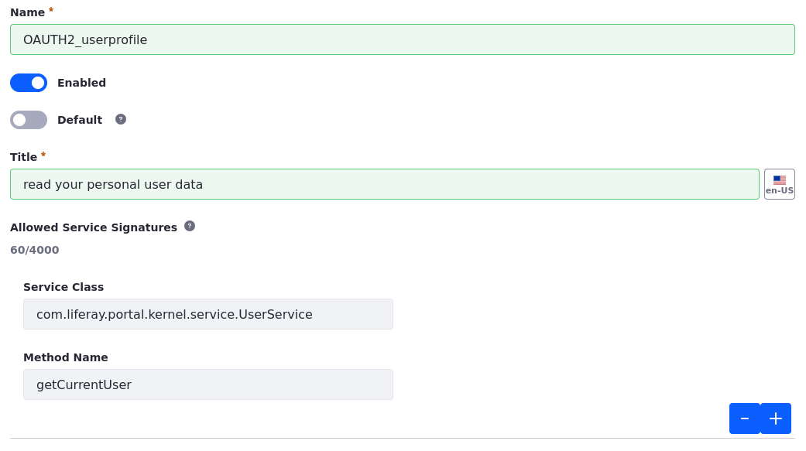
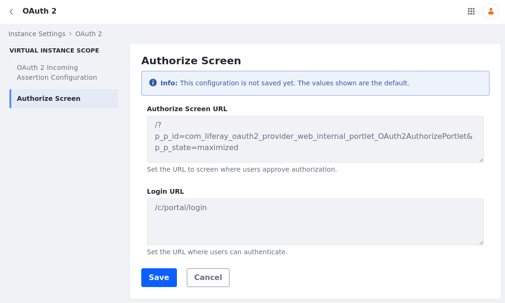

# OAuth 2 Scopes

In OAuth 2.0, applications are granted access to limited subsets of user data. These are called *scopes* (not to be confused with Liferay scopes). You can create them in two ways:

* Administrators can create a Service Access Policy for the scope.

* Developers can create a JAX-RS endpoint. By default, the JAX-RS endpoint generates scopes based on the HTTP verbs it supports. A special annotation overrides this behavior and registers specific scopes.

## Creating a Scope for a JSONWS Service

The most common way to create a scope is to create a [Service Access Policy](../../installation-and-upgrades/securing-liferay/securing-web-services/setting-service-access-policies.md) prefixed with the name `OAUTH2_`. This naming convention causes the policy to appear in the OAuth application configuration screen as a scope.

For example, to give access to the application to retrieve the user's profile information for their email address, 

1. Open the *Global Menu* () and navigate to *Control Panel* &rarr; *Security* &rarr; *Service Access Policy*.

1. Click *New* and create a policy per the information below.

   | Field         | Value                                           |
   | :------------ | :---------------------------------------------- |
   | Name          | OAUTH2_userprofile                              |
   | Enabled       | True                                            |
   | Default       | False                                           |
   | Title         | read your personal user data                    |
   | Service Class | `com.liferay.portal.kernel.service.UserService` |
   | Method Name   | `getCurrentUser`                                |

   

   Note that the policy is not a default policy, and that it grants access only to one method in the `UserService`. This is a JSONWS web service generated by Service Builder. You can view a list of all available services in your installation at this URL: `http://[host]:[port]/api/jsonws/`

1. Open the *Global Menu* () and navigate to *Control Panel* &rarr; *Security* &rarr; *OAuth2 Administration*. 

1. Select *Fragment Renderer*. 

   When you create a policy and prefix it with `OAUTH2_`, it appears in the *Scopes* tab.

   

1. You can find the newly created scope under `PORTAL SERVICES`. Select the checkbox and click *Save*.

!!! note
    There's another scope called *read your personal user data*. This is one of the many out-of-the-box scopes that comes with Liferay.

## Creating the Authorization Page

This step is optional. Users need an interface to authorize access to their accounts, and one is provided automatically. If, however, you want to customize the page, you can create an authorization page in your site.

1. Open the *Global Menu* () and navigate to *Control Panel* &rarr; *Instance Settings* &rarr; *Security* &rarr; *OAuth 2* &rarr; *Authorize Screen*.

   This screen displays the Authorize Screen URL field with this default value: `/?p_p_id=com_liferay_oauth2_provider_web_internal_portlet_OAuth2AuthorizePortlet&p_p_state=maximized`. This corresponds to an internal portlet.

   

1. Set the desired URL for the Authorize Screen (e.g., `/authorize`).

1. Navigate to the site and open the *Site Menu* (). Then, navigate to *Site Builder* &rarr; *Pages*.

1. Click *New* and choose *Page*.

   !!! note
       For Liferay DXP 7.3 and earlier, create a Private Page. Only authenticated users can access Private Pages.

1. Choose the *Full Page Application* type.

1. Give the page the same name you configured in step 2.

1. Turn the *Hidden from Navigation Menu Widget* switch on. You don't want this page showing up in your Site navigation.

1. On the page that appears next, verify the Friendly URL matches the URL you configured in step 2.

1. Under *Full Page Application*, choose *Application Authorization Request*.

1. Click *Save*.

You can now use the default or custom UI to go through the authorization process.
