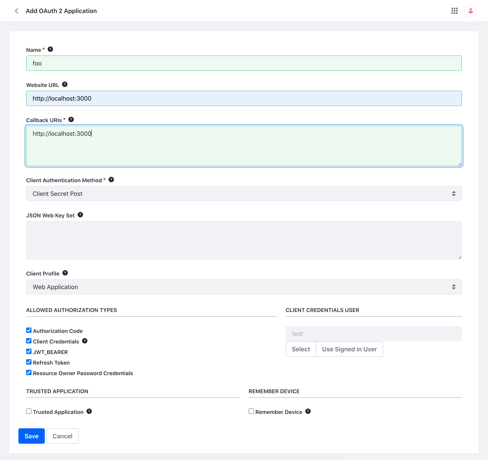
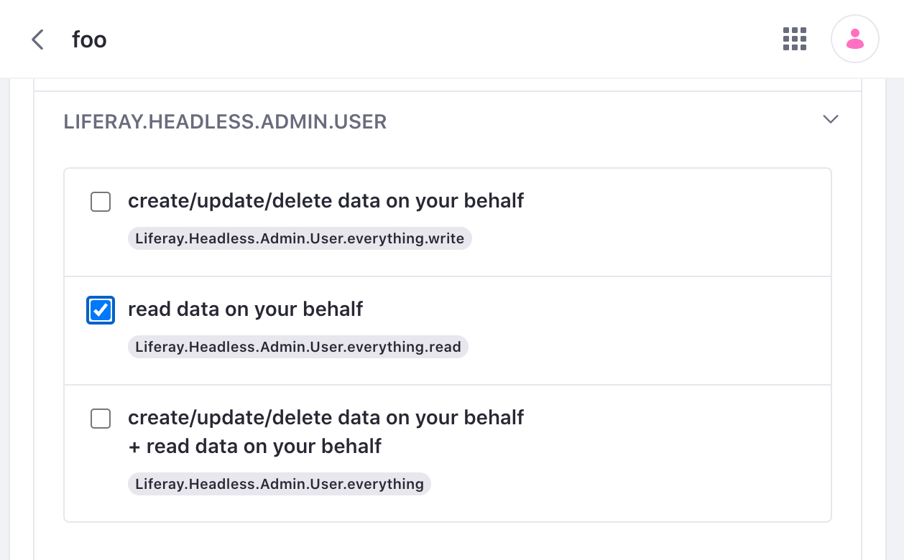
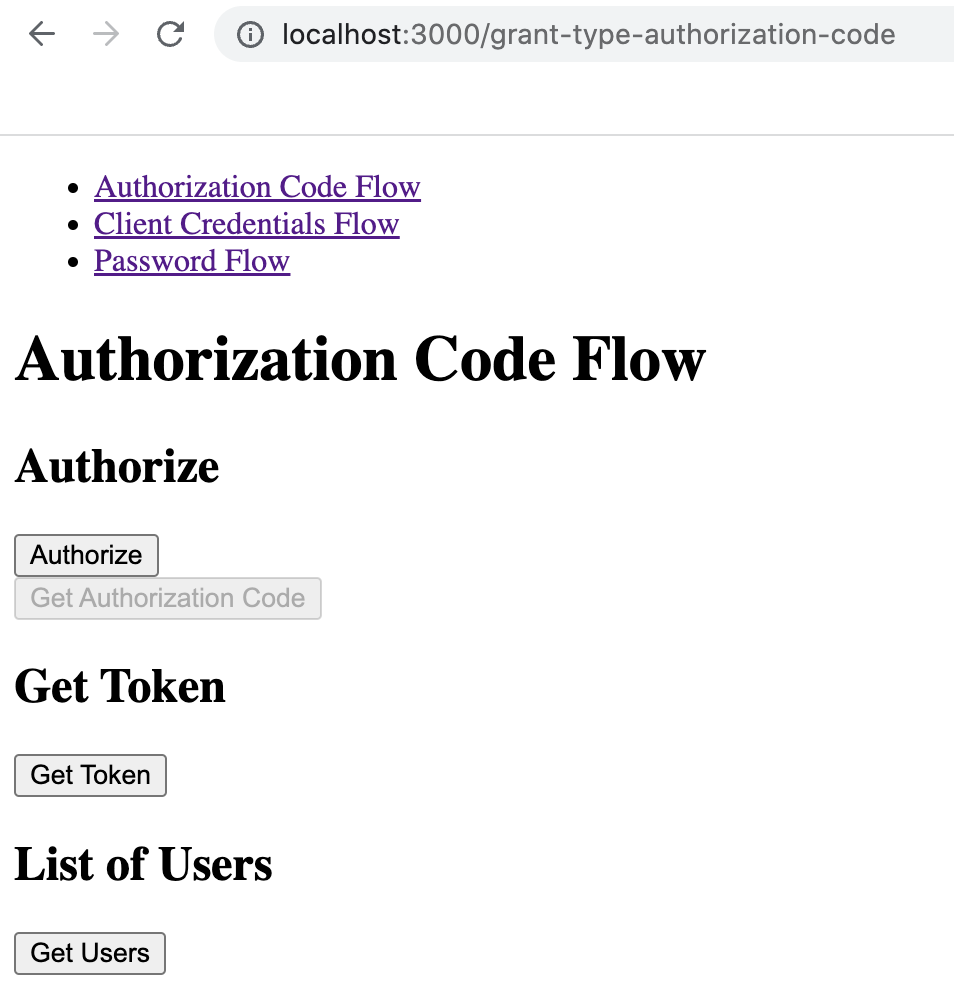

# Securing Your App with OAuth2

With Liferay's OAuth 2 Administration tool, you can [Create OAuth2 Applications](./creating-oauth2-applications.md) that you can use to authorize remote services with your third-party applications. Here you'll see how to create a simple React application that utilizes OAuth2 to consume Liferay REST APIs. The sample app demonstrates three different token-based authentication flows: Authorization Code flow, Client Credentials flow, and Password flow. 

## Set Up Liferay DXP

```{include} /_snippets/run-liferay-dxp.md
```

1. Open the *Global Menu* () and navigate to *Control Panel* &rarr; *Security* &rarr; *OAuth 2 Administration*

1. Click the *Add Icon* () to create a new OAuth2 application. 

1. Give the application a name (e.g. Foo). Set the Website URL as `http://localhost:3000`. Set the Callback URI as `http://localhost:3000/grant-type-authorization-code`. Click *Save*.

   

1. Copy the Client ID and Client Secret to your clipboard. You'll use these values in the sample React app. To access the Client Secret, click the *Edit* button and a window will open for you to copy the value.

1. Click on the Scopes tab. Scroll down and click `LIFERAY.HEADLESS.ADMIN.USER`. Check the box for `read data on your behalf`. 

   

   Click *Save*. Your OAuth2 Application now has read privileges for the Admin User API category.

## Deploy the Sample React App

1. Download and unzip the [OAuth2 React App](./liferay-c2b6.zip).

   ```bash
   curl https://learn.liferay.com/dxp/latest/en/headless-delivery/using-oauth2/liferay-c2b6.zip -O
   ```

   ```bash
   unzip liferay-c2b6.zip
   ```

   ```bash
   cd liferay-c2b6.zip
   ```

1. Verify you have `node` and `yarn` installed. If you don't, run the following command and follow the prompts:

   ```bash
   ./setup_tutorial.sh
   ```

1. Add your Liferay OAuth Client ID and Client Secret to the app's config files. Navigate to the `utils` folder of `grant-type-authorization-code`. 

   ```bash
   cd liferay-c2b6.zip/c2b6-remote-app/src/grant-type-authorization-code/utils
   ```

   Open the `config.js` file. Paste your Client ID and Client Secret values. Do the same for the `config.js` files in `grant-type-client-credentials` folder and `grant-type-password` folder.

1. Navigate back to the app's root directory and start the React server.

   ```bash
   cd liferay-c2b6.zip/c2b6-remote-app
   ```

   ```bash
   yarn start
   ```

### Authorization Code Flow

The Authorization Code flow is different from the other flows in that the application requires browser interaction. The user must login with their credentials and approve authorization before permission is granted to the app.

1. In the React app, click *Authorization Code Flow* at the top of the page. Click *Authorize*.

   

1. You are redirected to the login page of your Liferay instance. Input your username and password (e.g. *test@liferay.com:learn*) and click *Sign In*. On the authorization page, click *Authorize*. 

1. You are redirected to the React app. Click *Get Authorization Code*. Next, click *Get Token*. The application makes a request to Liferay for an access token.

1. Click *Get Users*. The React app makes a REST API call to Liferay using token-based authentication and returns list of Liferay users.

### Client Credentials Flow

The Client Credentials flow is typically used for application to server interaction and does not involve any users. 

1. In the React app, click *Client Credentials Flow* at the top of the page. 

1. Click *Get Token*. The application makes a request to Liferay for an access token.

1. Click *Get Users*. The React app makes a REST API call to Liferay using token-based authentication and returns list of Liferay users.

### Password Flow

In the Password flow, authentication happens with the React app passing the username and password directly in the request. 

```{warning}
Passing a username and password directly in the request carries risk. In most use cases, this flow is not recommended
```

1. In the React app, click *Password Flow* at the top of the page. 

1. Click *Get Token*. The application makes a request to Liferay for an access token.

1. Click *Get Users*. The React app makes a REST API call to Liferay using token-based authentication and returns list of Liferay users.

