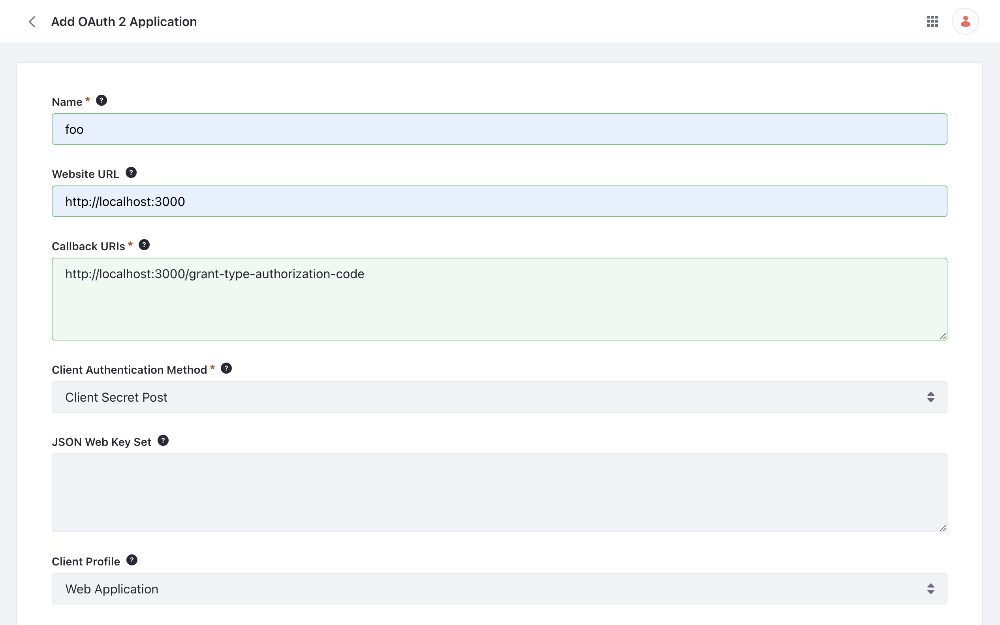
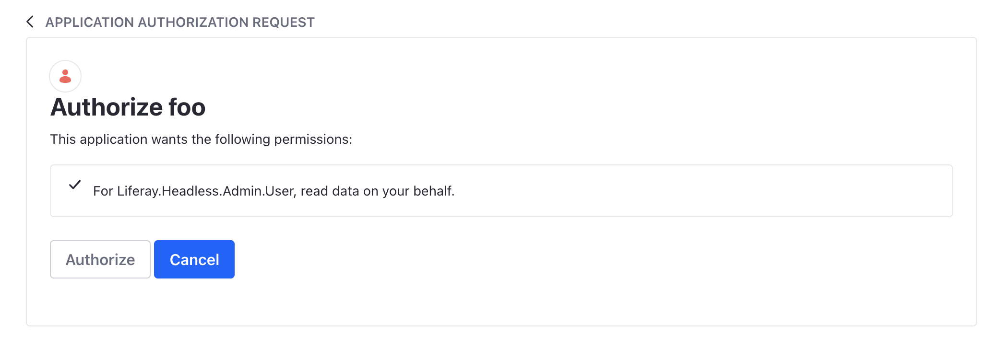
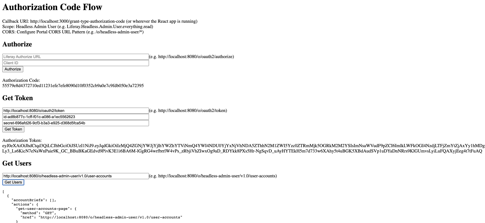

# Using OAuth2 to Authorize Users

You can create applications that access Liferay's headless REST APIs using the OAuth 2.0 authorization protocol. The provided sample React app demonstrates three different OAuth2 token-based authentication flows: authorization code flow, client credentials flow, and password flow. For more details on the OAuth2 Administration panel see [Creating an OAuth2 Application](./creating-oauth2-applications.md)

## Set Up Liferay DXP

```{include} /_snippets/run-liferay-dxp.md
```

1. Open the *Global Menu* () and navigate to *Control Panel* &rarr; *Security* &rarr; *OAuth 2 Administration*.

1. Click *Add* () to create a new OAuth2 application.

1. Give the application a name (e.g., foo). Set the Website URL as `http://localhost:3000` and the Callback URI as `http://localhost:3000/grant-type-authorization-code`. Click *Save*.

   

1. Copy the Client ID and Client Secret to your clipboard. To get the Client Secret click *Edit*. Copy the value from the pop-up window.

   These values are needed later in the sample React app.

1. Click the _Scopes_ tab at the top of the page. Scroll down, click _LIFERAY.HEADLESS.ADMIN.USER_, then check the box for _read data on your behalf_.

   

   Click *Save*. Your OAuth2 Application now has read privileges for the Admin User API category.

1. Next, open the *Global Menu* (), click the *Control Panel* tab, and go to *System Settings* &rarr; *Security Tools*.

1. Go to the *Portal Cross-Origin Resource Sharing (CORS)* tab and click *Default Portal CORS Configuration*.

1. Add a *URL Pattern* with the value `/o/headless-admin-user/*` and click *Save*. This enables CORS for the `headless-admin-user` category of APIs.

## Deploy the Sample React App

1. Download and unzip the [OAuth2 React App](./liferay-c2b6.zip).

   ```bash
   curl https://resources.learn.liferay.com/dxp/latest/en/headless-delivery/using-oauth2/liferay-c2b6.zip -O
   ```

   ```bash
   unzip liferay-c2b6.zip
   ```

   ```bash
   cd liferay-c2b6
   ```

1. Verify that `node` and `yarn` are installed. If not, run the setup script and follow the prompts:

   ```bash
   ./setup_tutorial.sh
   ```

1. Navigate into the app's root directory and start the React server.

   ```bash
   cd c2b6-custom-element
   ```

   ```bash
   yarn install && yarn start
   ```

### Authorization Code Flow

The authorization code flow requires users to log in with their credentials and approve authorization before permission is granted to the app. This additional step is avoided with the other flows.

1. Open the React app running at <http://localhost:3000>, then click *Authorization Code Flow* at the top of the page.

1. Enter `http://localhost:8080/o/oauth2/authorize` for the Liferay authorize URL. Paste the client ID from your clipboard. Click _Authorize_.

1. If you're not already logged in, you are redirected to the Liferay login page before being sent to the authorization page. Enter your username and password (e.g. *test@liferay.com:learn*) and click *Sign In*. On the authorization page, click *Authorize*. If you are already logged in, you are sent directly to the authorization page.

   

   You are redirected back to the React app. Note the authorization code that is used to make the next API call appears.

1. Enter `http://localhost:8080/o/oauth2/token` for the Liferay token URL. Paste the client ID and client secret from your clipboard. Click _Get Token_. Note the authorization token that can be used to make future REST API calls appears.

   !!! note
       If requesting a token on the same instance, Liferay produces no network traffic.

1. Enter `http://localhost:8080/o/headless-admin-user/v1.0/user-accounts` for the Liferay get user URL. Click *Get Data*. The React app makes a REST API call to Liferay using token-based authentication and returns a list of Liferay users.

   

### Client Credentials Flow

The client credentials flow is used typically for server to server interaction and does not involve any users.

1. Open the React app running at <http://localhost:3000>, then click *Client Credentials Flow* at the top of the page.

1. Enter `http://localhost:8080/o/oauth2/token` for the Liferay token URL. Paste the client ID and client secret from your clipboard. Click *Get Token*. Note the authorization token that can be used to make future REST API calls appears.

1. Enter `http://localhost:8080/o/headless-admin-user/v1.0/user-accounts` for the Liferay get user URL. Click *Get Data*. The React app makes a REST API call to Liferay using token-based authentication and returns a list of Liferay users.

### Password Flow

In the password flow authorization, the React app passes the username and password directly in the request.

!!! warning
   In a password flow, the username and password are directly exposed to the application. Thus the user must trust the application. Passing the username and password in the API request also carries risk. Using password flow is not recommended.

1. Open the React app running at <http://localhost:3000>, then click *Password Flow* at the top of the page.

1. Enter `http://localhost:8080/o/oauth2/token` for the Liferay token URL.

1. Paste the client ID and client secret from your clipboard.

1. Enter your username and password (e.g. *test@liferay.com:learn*).

1. Click *Get Token*. Note the authorization token that can be used to make future REST API calls appears.

1. Enter `http://localhost:8080/o/headless-admin-user/v1.0/user-accounts` for the Liferay get user URL. Click *Get Data*. The React app makes a REST API call to Liferay using token-based authentication and returns a list of Liferay users.

## Examine the Code

The React app's `components` folder defines the UI elements and logic for handling the events fired by clicking buttons. For example, the `Authorize.js` file redirects to the authorization page, `Token.js` fetches the access token, and `Users.js` fetches the list of users. Each authorization flow uses some or all of these components.

The API request to get an authorization token and the GET request is defined in the `Requests.js` file in the `utils` folder.

```
src
├── components
│   ├── Authorize.js
│   ├── Token.js
│   ├── Users.js
├── routes
│   ├── grant-type-authorization-code
│   |   ├── AuthorizationCode.js
│   ├── grant-type-client-credentials
│   |   ├── ClientCredentials.js
│   ├── grant-type-password
│   |   ├── Password.js
├── utils
│   ├── Requests.js
├── App.js
└── index.js
```

### Authorization Grant Type

The `AuthorizationCode.js` file of the `grant-type-authorization-code` flow uses all three components (`Authorize.js`, `Token.js`, and `Users.js`)

```{literalinclude} ./using-oauth2-to-authorize-users/resources/liferay-c2b6-overlay/src/routes/grant-type-authorization-code/AuthorizationCode.js
:dedent: 3
:language: javascript
:lines: 16-35
```

In the code, the `Authorize.js` component handles the first step. A request for authorization is made when the *Authorize* button is clicked.

```{literalinclude} ./using-oauth2-to-authorize-users/resources/liferay-c2b6-overlay/src/components/Authorize.js
:language: javascript
:lines: 3-67
```

Along with the redirect, a one-time authorization code is passed back to the app in the URL (e.g. `http://localhost:3000/grant-type-authorization-code?code={code}`).

The `Token.js` component handles the next step. Clicking *Get Token* calls the `getAuthToken` function in the `Requests.js` file.

```{literalinclude} ./using-oauth2-to-authorize-users/resources/liferay-c2b6-overlay/src/components/Token.js
:language: javascript
:lines: 3-98
```

In the `Token.js` component, the parameters `client_id`, `client_secret`, `code`, `grant_type`, and `redirect_uri` are sent in this API request. If the parameters are valid, Liferay returns a JSON response containing the access token.

Example response:

```json
{
  "access_token": "2fda85abec524112dae612d35e9f9abd71650d364dee47c645b7574c6bffe91",
  "token_type": "Bearer",
  "expires_in": 600,
  "scope": "Liferay.Headless.Admin.User.everything.read"
}
```

The `Users.js` component parses the response for the `access_token`.

Finally, clicking *Get Data* calls the `getUsers` function in the `Requests.js` file.

### Client Credentials Grant Type

The `ClientCredentials.js` file of the `grant-type-client-credentials` flow uses two components (i.e. `Token.js` and `Users.js`).

```{literalinclude} ./using-oauth2-to-authorize-users/resources/liferay-c2b6-overlay/src/routes/grant-type-client-credentials/ClientCredentials.js
:language: javascript
:lines: 6-31
```

In the `Token.js` component, the parameters `client_id`, `client_secret`, and `grant_type` are sent in the API request. If the parameters are valid, Liferay returns a JSON response containing the access token.

The `Users.js` component parses the response for the `access_token`.

Finally, clicking *Get Data* calls the `getUsers` function in the `Requests.js` file.

### Password Grant Type

The `Password.js` file of the `grant-type-password` flow uses two components (i.e. `Token.js` and `Users.js`).

```{literalinclude} ./using-oauth2-to-authorize-users/resources/liferay-c2b6-overlay/src/routes/grant-type-password/Password.js
:language: javascript
:lines: 6-31
```

In the `Token.js` component, the parameters `client_id`, `client_secret`, `grant_type`, `password`, and `username` are sent as parameters in the API request. If the parameters are valid, the Liferay server returns a JSON response containing the access token.

The `Users.js` component parses the response for the `access_token`.

Finally, clicking *Get Data* calls the `getUsers` function in the `Requests.js` file.

## Related Topics

- [Using OAuth 2.0](../using-oauth2.md)
- [Creating an OAuth2 Application](./creating-oauth2-applications.md)
- [Authorizing Account Access with OAuth2](./authorizing-account-access-with-oauth2.md)
- [OAuth 2 Scopes](./oauth2-scopes.md)