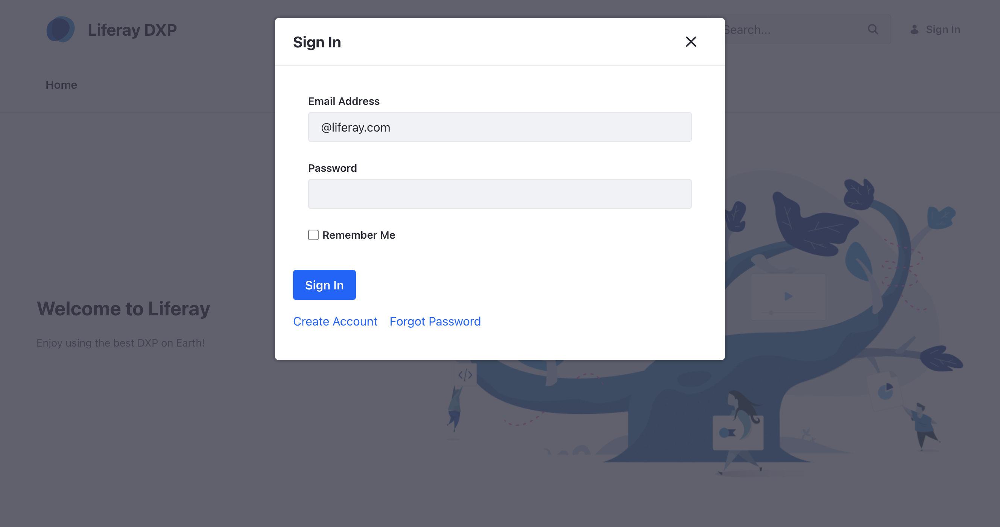
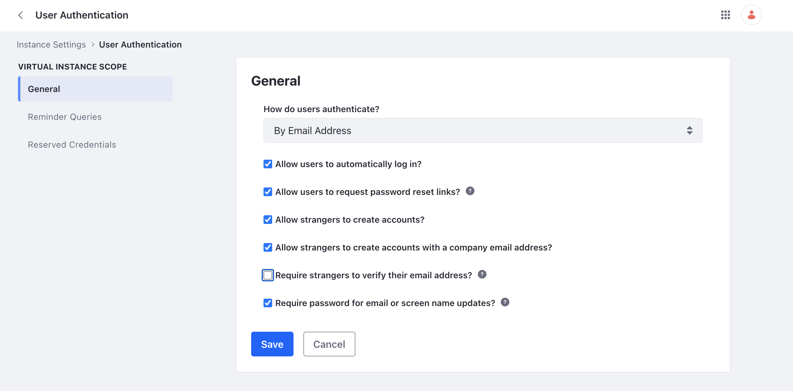
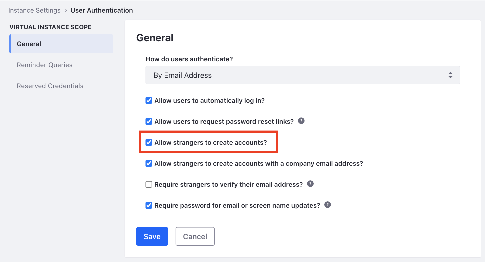
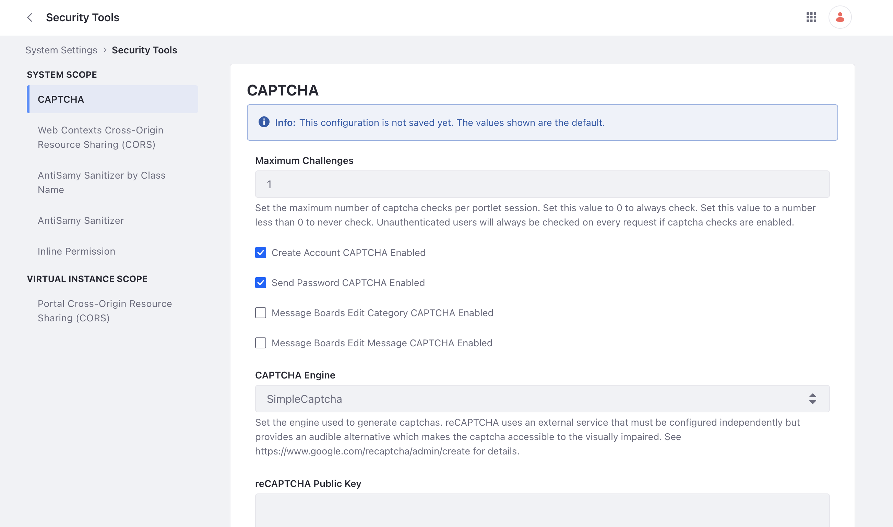

# Authentication Basics

By default, Liferay DXP uses the *Sign In* widget to authenticate users.

!!! note
    The Sign In widget appears on the default home page at `http[s]://[server-name:port]/web/guest/home`. If the Sign In widget is unavailable on any page, it can be accessed directly via its URL: `http[s]://[server-name:port]/c/portal/login`.



You can configure other methods of authenticating users and/or applications:

- [LDAP](../../users-and-permissions/connecting-to-a-user-directory/connecting-to-an-ldap-directory.md)
- [SAML](./configuring-sso/authenticating-with-saml/saml-authentication-process-overview.md)
- [Kerberos](./configuring-sso/authenticating-with-kerberos.md)
- [OpenID Connect](./configuring-sso/using-openid-connect.md)
- [Token-Based solutions](./configuring-sso/token-based-authentication.md)
- [OAuth 2.0](../../headless-delivery/using-oauth2.md)

[Authentication Verifiers](./securing-web-services/using-authentication-verifiers.md) can manage authentication for remote applications, and [Authentication Pipelines](../../liferay-development/building-applications.md) define the ways users are validated by one or several systems.

## Sign In Widget Configuration

To access the configuration menu for the sign in widget,

1. Open the page that contains the sign in widget in edit mode and click *Actions* () &rarr; *Configuration*.

1. You can configure several options here.

   - Authentication Type - See [Authentication Types](#authentication-types) for more information.
   - Email From - Set the name and email address for the sender of system-generated emails (includes the password reset notification email).
   - Password Reset Notification - Set the subject and contents of the password reset notification email.

1. Click *Save* to apply a new configuration.

!!! note
    Starting from Liferay DXP 2024.Q3/GA132, both the *Email From* and *Password Reset Notification* settings have been removed from the sign in widget through a [beta feature flag](../../system-administration/configuring-liferay/feature-flags.md#beta-feature-flags). They are now available at the instance level. To access these settings, open the *Global Menu* () and go to *Control Panel* &rarr; *Instance Settings* &rarr; *Email*. You can find the *Email Sender* and *Password Reset Notification* settings here.

## Authentication Types

Users can be configured to log in using one of three authentication types:

| Authentication Type | Description                                             | Used by Default? |
| :------------------ | :------------------------------------------------------ | :--------------- |
| Screen Name         | Determined by administrator or user at account creation | No               |
| Email Address       | Determined by administrator or user at account creation | Yes              |
| User ID             | Automatically generated when the account is created     | No               |

!!! note
    Only one authentication type can be used at a time.

Regardless of the authentication type, users must always enter a password. You can create [Password Policies](../../users-and-permissions/roles-and-permissions/configuring-a-password-policy.md) to define password length, password format, expiration periods, and more.

*Authentication Type* can be configured through the Control Panel or a properties file.

### Configuring Authentication Type Through the Control Panel

1. Navigate to the Control Panel.

1. Click *Configuration* &rarr; *Instance Settings* &rarr; *Platform* &rarr; *User Authentication*.

1. Choose an option under the *How do users authenticate?* selector.

   

### Configuring Authentication Type Using Properties

To use the [`portal-ext.properties`](https://learn.liferay.com/dxp/latest/en/installation-and-upgrades/reference/portal-properties.html) file, paste in the below properties and uncomment the desired authentication type:

```properties
company.security.auth.type=emailAddress
#company.security.auth.type=screenName
#company.security.auth.type=userId
```

## Using and Configuring the Sign In Widget

The Sign In widget calls the various mechanisms (the portal database, an LDAP server, a SAML identity provider, or any of the ways users can authenticate) that authenticate users. Its behavior can be configured and customized in several ways.

### Disabling Guest Account Creation

1. Navigate to the Control Panel &rarr; *Configuration* &rarr; *Instance Settings* &rarr; *Platform* &rarr; *User Authentication*.

1. Uncheck *Allow strangers to create accounts?*.

1. Click *Save*.

   

### Preventing Password Resets

If users should not be able to reset their own passwords, you can configure this from the same screen:

1. Navigate to the Control Panel &rarr; *Configuration* &rarr; *Instance Settings* &rarr; *Platform* &rarr; *User Authentication*.

1. Uncheck *Allow users to request password reset links?*.

1. Click *Save*.

### Disabling the Password Section During Account Creation

{bdg-secondary}`Liferay DXP 2023.Q4+/Portal 7.4 GA92+`

If the [*Allow Custom Password at Account Creation*](../../system-administration/configuring-liferay/virtual-instances/users.md#fields) field is unchecked, the password fields are unavailable at the time of account creation from the Sign In widget. This also applies to users invited by email for account creation.

### Configuring CAPTCHA or reCAPTCHA

Prevent bots from creating and logging into accounts by enabling CAPTCHA or reCAPTCHA:

1. Navigate to the Control Panel &rarr; *Configuration* &rarr; *System Settings* &rarr; *Security Tools* &rarr; *CAPTCHA*.

   

   !!! note
       By default, *Create Account CAPTCHA* and *Send Password CAPTCHA* are enabled. If necessary, enable Message Boards CAPTCHA.

1. Choose a CAPTCHA engine. By default, Simple CAPTCHA is enabled. You can also select Google's reCAPTCHA, which requires you configure the external service separately. If you select reCAPTCHA, supply your public and private key from Google.

1. The other options allow developers to customize the Simple CAPTCHA engine.

1. Click *Save* when finished.

!!! important
    Since {bdg-secondary}`Liferay DXP 2024.Q1.8/Portal 7.4 GA120`, the Gogo shell and server administration pages (for a site admin) enforce captchas, even if the **Maximum Challenges** field is set to a negative number. These pages are not available without selecting a captcha engine.

    To disable captchas for these pages, add `captcha.enforce.disabled=true` to your `portal-ext.properties` file. You should only do this for testing with Continuous Integration (CI).

## Related Topics

- [Securing Liferay](../securing-liferay.md)
- [Introduction to Securing Web Services](./securing-web-services.md)
- [Configuring a Password Policy](../../users-and-permissions/roles-and-permissions/configuring-a-password-policy.md)
