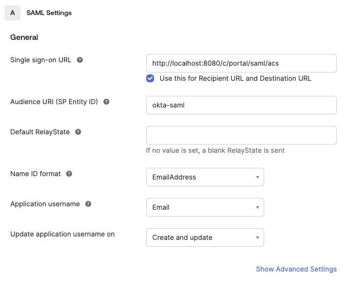
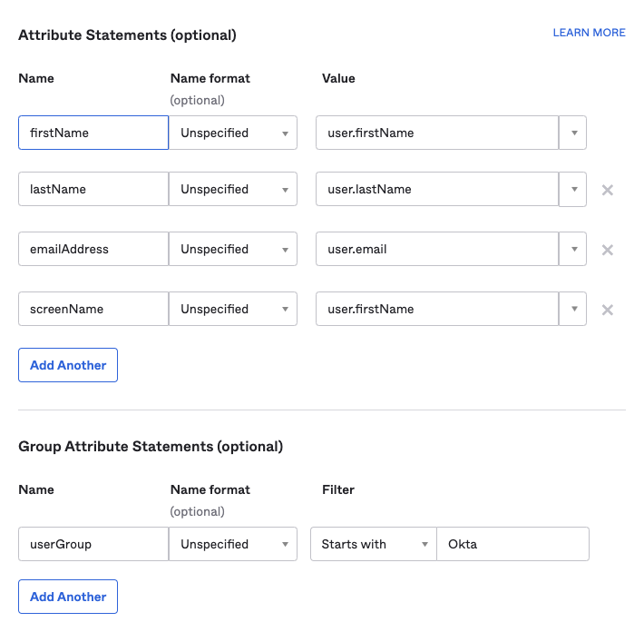
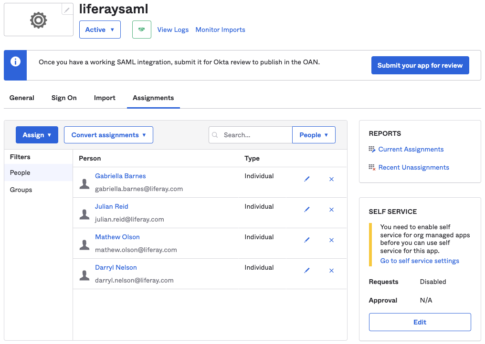
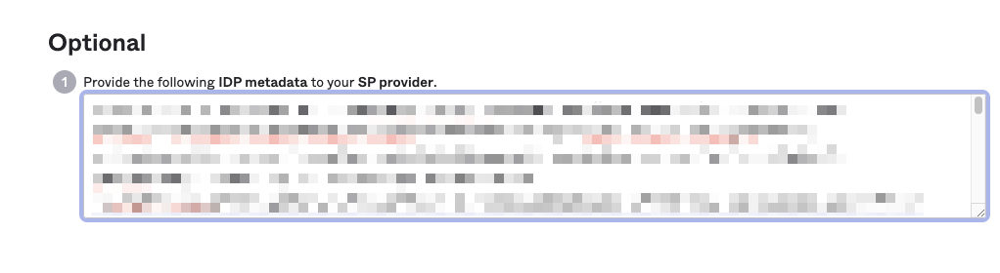
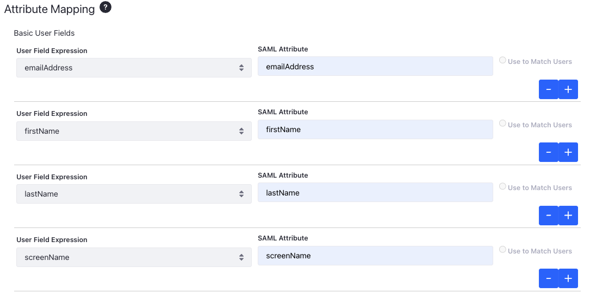
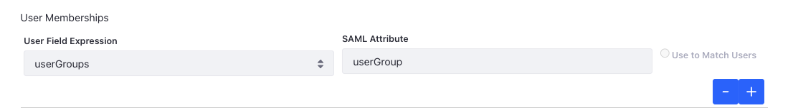
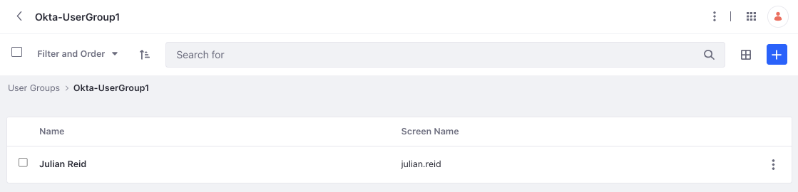

# Importing User Groups' Memberships from an External IdP through SAML

!!! warning
    This feature was released behind a [dev feature flag](../../../../system-administration/configuring-liferay/feature-flags.md#dev-feature-flags). It was made Generally Available (GA) in Liferay DXP 2024.Q2/GA120. You must not use this feature in production for earlier versions where it's behind a dev feature flag.


You can import users' user group membership from external identity providers (IdPs). This requires only configuring the necessary fields when registering the IdP. The XML structure varies by IdP, so your first step is to find the multi-valued attributes for user groups from your IdP.

For example, uses Okta's structure for user groups looks like this:

```xml
<saml2:Attribute Name="userGroup" NameFormat="urn:oasis:names:tc:SAML:2.0:attrname-format:unspecified">
      <saml2:AttributeValue xmlns:xs="http://www.w3.org/2001/XMLSchema"
                           xmlns:xsi="http://www.w3.org/2001/XMLSchema-instance"
                           xsi:type="xs:string"
                           >Okta-UserGroup2
      </saml2:AttributeValue>
      <saml2:AttributeValue xmlns:xs="http://www.w3.org/2001/XMLSchema"
                           xmlns:xsi="http://www.w3.org/2001/XMLSchema-instance"
                           xsi:type="xs:string"
                           >Okta-UserGroup1
      </saml2:AttributeValue>
</saml2:Attribute>
```

Below is the configuration using this structure for importing user groups from an external IdP.

## Creating a SAML 2.0 App on Okta

1. Log into the Okta admin dashboard.

1. Navigate to *Applications* &rarr; *Applications*, and click *Create App Integration*. 

1. Select *SAML 2.0* and click *Next*.

1. Enter the name as *liferaysaml* and click *Next*.

1. Enter the following values under *General*, in the *SAML Settings* section: 

   **Single sign-on URL:** `http://[IP_ADDRESS]:[PORT_NUMBER]/c/portal/saml/acs` (If you're running a local Liferay instance, this would be `http://localhost:8080/c/portal/saml/acs`)

   **Audience URI (SP Entity ID):** `okta-saml`

   **Name ID Format:** `EmailAddress`

   **Application username:** `Email`

   

   This field denotes the source of the username users use to log in to Okta, which then logs them into Liferay when using SAML. 

1. Add the following values under *Attribute Statements*: 

   **firstName (Unspecified):** `user.firstName`

   **lastName (Unspecified):** `user.lastName`

   **emailAddress (Unspecified):** `user.email`

   **screenName (Unspecified):** `user.firstName`

   The values on the left are names of the SAML attributes. They map to the corresponding values on the right which specify different user fields in Okta. 

1. Add the following values under *Group Attribute Statements*:

   **userGroup (Unspecified):** *Starts with* `Okta` (This assumes that your user groups on Okta start with the prefix `Okta`. For example: `Okta-UserGroup-1`)

   

   !!! note
       The instructions above assume that you already have a set of users on Okta belonging to different groups (starting with the prefix `Okta`). Okta recommends using either [keywords or regex](https://support.okta.com/help/s/article/How-to-pass-a-user-s-group-membership-in-a-SAML-Assertion-from-Okta?language=en_US) to define group memberships. These groups are matched by their name with user groups in Liferay. 

       It is mandatory to specify a filter condition or regex for group attribute statements. The SAML attribute is sent empty if there is no filter condition or regex. 

1. Click *Next*.

1. The rest of the form is Okta-specific and has no effect on the configuration. Select whatever suits you best and click *Finish*. 

## Saving the Metadata

The last step before moving to your Liferay instance is to save the SAML metadata. 

1. Navigate to *Applications* &rarr; *Applications*, and select *liferaysaml*.

1. You can view the *Assignments* tab by default. Click on *Assign* and select *Assign to People*. Search for users that can log into Liferay using this SAML app and click *Assign*. You can also select by groups here. 

   

1. Click *Done*. 

1. Select the *Sign On* tab. 

1. On the right side, click *View SAML setup instructions*. 

1. On the new screen, scroll down to the Optional section. Copy the entire block of XML code and paste it in a new file named `oktasamlmetadata.xml`.



## Liferay Configuration

Now, you must set Okta as a service provider in Liferay's SAML Admin. 

1. Open the *Global Menu* () and navigate to *Control Panel* &rarr; *SAML Admin*. 

1. In the General tab, enter *okta-saml* as the Entity ID. 

1. Click *Create Certificate*. 

1. In the new window, enter *okta-saml* as the *Common Name* and *learn* as the *Key Password*.

1. Click *Save*.

1. Under Identity Provider Connections, click *Add Identity Provider*.

1. Enter *Okta* as the name. 

1. Copy the entity ID from the `oktasamlmetadata.xml` file and paste it here.

1. Check the *Enabled* checkbox. 

1. Under Metadata, click *Upload Metadata XML* and select the file created earlier.

1. Set *Email Address* as the Name Identifier Format. 

1. Under Attribute Mapping, create three new basic user fields to get a total of four. Enter the information as shown:

   | User Fields  | SAML Attribute |
   | :----------- | :------------- |
   | emailAddress | emailAddress   |
   | firstName    | firstName      |
   | lastName     | lastName       |
   | screenName   | screenName     |

   

1. Under the User Memberships section, select `userGroups` from the drop-down and set its value as `userGroup`. 

   

   Both the mappings above link user attributes in Liferay with SAML attributes configured on Okta. For instance, the name of the user group SAML attribute in Okta is `userGroup`. This is mapped to the `userGroups` attribute in Liferay. 

1. Click *Save*.

Now you can go to your Liferay instance and click *Sign In*. This redirects you to the identity provider's sign in page. When you log in, you are redirected back to Liferay's home page. You can also verify the user's user group membership by opening the *Global Menu* () and navigating to *Control Panel* &rarr; *User Groups*.

   

!!! important
    Users are assigned automatically to user groups only if they are already present. Ensure that you have user groups in Liferay that correspond to the groups on Okta. If Okta sends the group information and the corresponding user group doesn't exist in Liferay, the attribute is ignored. See [Creating and Managing User Groups](../../../../users-and-permissions/user-groups/creating-and-managing-user-groups.md) to learn how to create and manage user groups. 

    If you assign users to other user groups in Liferay after signing in, these memberships are overwritten the next time you log in through the IdP. As this relates to user provisioning, it is recommended to use [LDAP](../../../../users-and-permissions/connecting-to-a-user-directory/connecting-to-an-ldap-directory.md) or [SCIM](../../system-for-cross-domain-identity-management-scim.md) to manage memberships.
