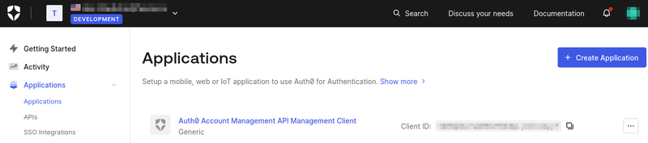
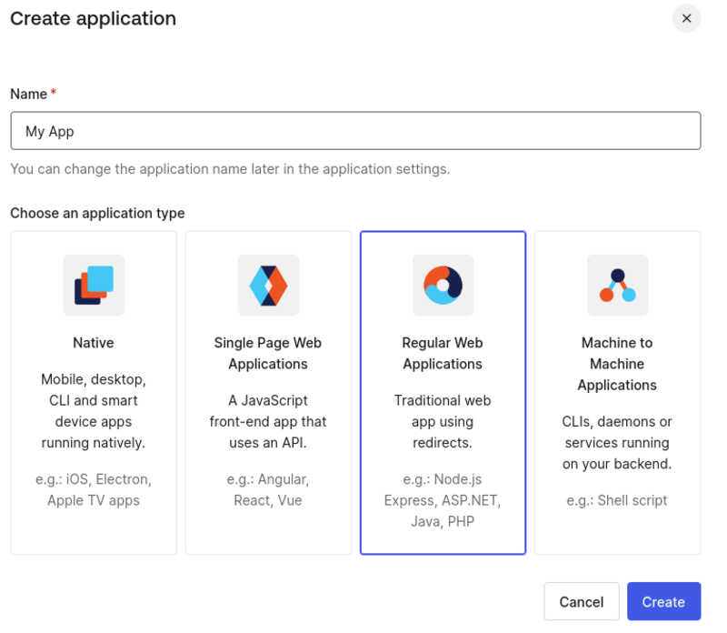
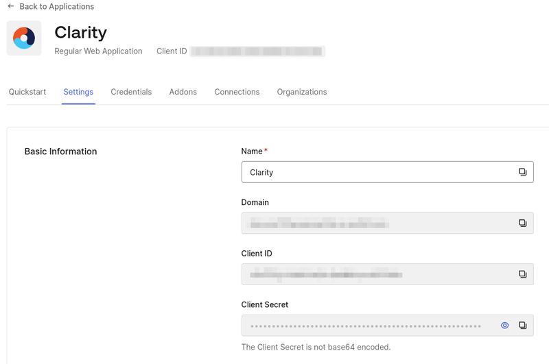
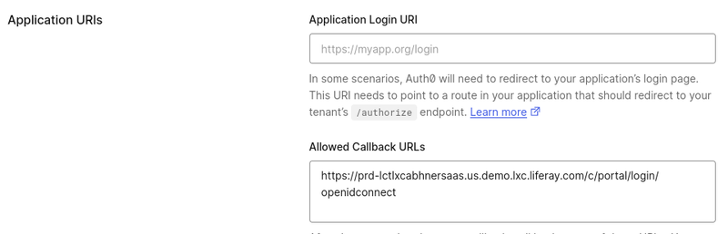
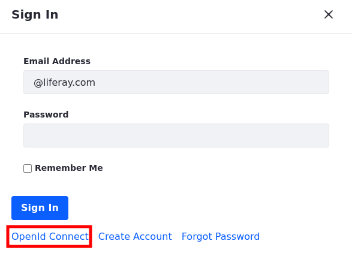
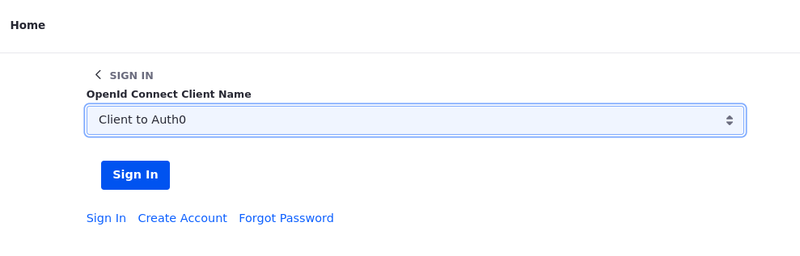
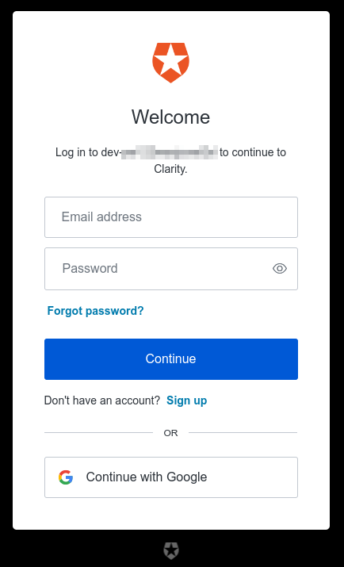

# Integrating Auth0 through OpenID Connect

Auth0 offers authentication and authorization services for your customized applications. By integrating it with OpenID Connect, a trusted authentication protocol, employees can simplify authentication while maintaining robust security by accessing their applications using Auth0's single sign-on feature.

## Auth0 Configuration

1. Log in to [Auth0](https://auth0.com/).

1. Open Auth0's dashboard

1. Select *Applications* from the side menu and create a new application.

    

1. Set a name of your choice, and choose *Regular Web Applications* for your application type.

    

1. Click *Create* to have your application ready.

1. At the Settings tab you can find the Client ID and Client Secret, which you'll use later on.

    

1. Scroll down to the Application URIs section to set the Allowed Callback URLs field, and enter `https://[your_lifray_environment]/c/portal/login/openidconnect`.

    

1. Any additional setting can be edited by opening up the Advanced Settings at the bottom of the page.

1. Click *Save Changes* to save your application settings.

1. Auth0 part is done, now you can configure your Auth0 application to Liferay DXP.

!!! note
    Create your users by navigating to User Management &rarr; Users.

## Configuring the OpenID Connect Provider Connection

Now that you have Auth0 set, you'll use Liferay's interface to configure the provider connection. All configuration is done through the provider’s Well-Known Configuration Endpoint.

!!! note
    The Auth0’s Well-known URI is `[your-default-tenant]`. To find your default tenant, navigate to your profile &rarr; Default Tenant or on the url before `/profile`.

1. On your DXP instance, navigate to *Global Menu* &rarr; *Control Panel* &rarr; *Instance Settings* &rarr; *Security* &rarr; *SSO*.

1. Go to *OpenID Connect Provider Connection* tab and add a new connection entry.

1. Fill out the fields with the requested data, as showed in the table below. These values you can find on the Well-known URL mentioned on the note above.

| Field                        | Data                                        |
|:-----------------------------|:--------------------------------------------|
| Provider Name                | Auth0 OIDC                                  |
| Scopes                       | `scopes_supported` url                      |
| Authorization Endpoint       | `authorization_endpoint` url                |
| Issuer URL                   | `issuer` url                                |
| JWKS URI                     | `jwks_uri` url                              |
| ID Token Signing Algorithms  | `id_token_signing_alg_values_supported` url |
| Subject Types                | `subject_types_supported` url               |
| Token Endpoint               | `token_endpoint` url                        |
| User Information Endpoint    | `userinfo_endpoint` url                     |
| OpenID Connect Client ID     | Under the *Settings* tab in Okta            |
| OpenID Connect Client Secret | Under the *Settings* tab in Okta            |

Be sure to click *Save* to ensure your changes are preserved.

Once that is done, OpenID Connect needs to be enabled. To enable the OpenId Connect:

1. On your DXP intance, navigate to *Global Menu* &rarr; *Control Panel* &rarr; *Configuration* &rarr; *Instance Settings*.

1. Click on *SSO* under the security section.

1. Click the *Enabled* checkbox and click *Save*.

## Sign in to Liferay DXP with using Auth0

1. Start your Liferay DXP instance

1. Click on the *Sign In* button and choose *OpenId Connect*.

    

1. Choose Auth0 from the list and sign in with your Auth0 account.

    

1. Once you click Sign In, you'll be redirected to Auth0's log in page.

    

1. Type in the email address and password for your user. You have successfully logged in.

1. Sign back in with your Liferay administrator account. Navigate to *Control Panel* &rarr; *Users and Organizations*, and verify that the account came into Liferay.