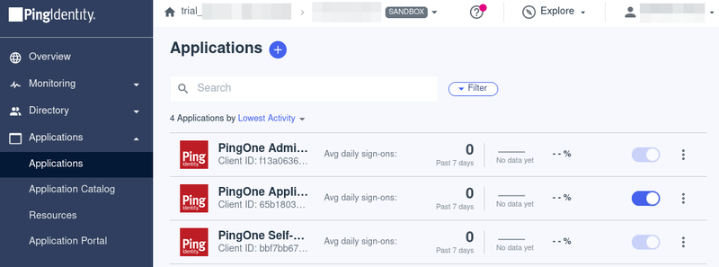
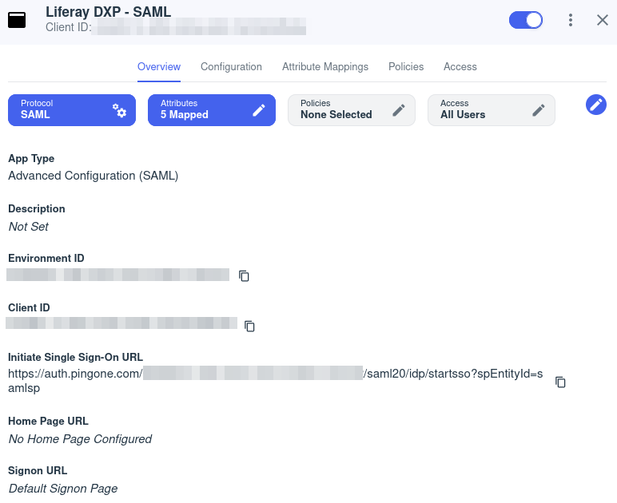
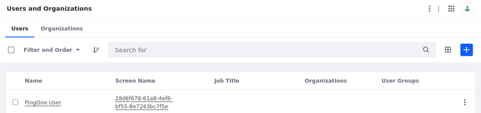

# Integrating PingOne through SAML

PingOne is a cloud-based identity as a service framework for secure identity access management. Integrating with Security Assertion Markup Language (SAML), an open-standard used for authentication, will allow you to provide your users an easy way to log into your application, by simplifying authentication while maintaining security standards.

## PingOne Configuration

1. Access your PingOne environment and sign in.

1. Go to Applications &rarr; Application, and click to add a new application.

1. Fill out the Application name and select the Application Type.

    1. Application Name: Liferay DXP - SAML

    1. Description: (Optional) You can give a description to your application

    1. Icon: (Optional) You can upload the Liferay logo

    1. Application Type: SAML Application

    

1. Click *Configure*.

1. On the SAML Configuration part, manually enter your application metadata

    1. Provide Application Metadata: select `Manually Enter`

    1. ACS URL: `https://[your_instance_url]/c/portal/saml/acs`

    1. Entity ID: `samlsp`

1. Click *Save*.

1. Navigate to the Configuration tab and click the Edit icon.

    1. Signing Certificate: choose between `Sign Response`, or `Sign Assertion & Response`

    1. Signing Algorithm: `RSA_SHA256`

    1. Encryption: Leave unchecked

    1. SLO endpoint: `https://[your_instance_url]/c/portal/saml/slo`

    1. SLO binding: `HTTP POST`

    1. Assertion validity duration (in seconds): `3000`

1. Click *Save*.

1. Navigate to the Attribute Mappings tab and add the following attributes.

    | Attributes   | PingOne Mappings |
    |:-------------|:-----------------|
    | saml_subject | Email Address    |
    | emailAddress | Email Address    |
    | firstName    | Given Name       |
    | lastName     | Family Name      |
    | screenName   | User ID          |

1. Click *Save*.

    !!! note
        Create your users by navigating to Directory &rarr; Users.

1. Navigate to the *Configuration* tab, and download the Metadata .xml file. This will be needed in the next section.

1. Enable the access to this application through the toggle switch on the top right.

## Liferay DXP Configuration

1. In Liferay DXP, navigate to *Control Panel* &rarr; *Security* &rarr; *SAML Admin*.

1. Set the SAML Role to *Service Provider*, and Entity ID to *samlsp*. Click *Save*.

1. Click *Create Certificate* under the certificate and private key section. Import your certificate or input the following:
    * Enter the common name as `pingOne-saml`.
    * Scroll down to the bottom. Input the key password as `learn`.
    * Click *Save*.

1. Go to the *Service Provider* tab.

    1. Sign Authn Requests? - Enable

    1. Sign Metadata? - Enable

    1. SSL Required - Enable

    1. Allow showing the login portlet. - Enable

    1. Enable “Require Assertion Signature?”, if you configured PingOne to `Sign Assertion & Response`

1. Click *Save*.

1. Click the *Identity Provider Connections* tab. Click *Add Identity Provider* and set the following:
    1. Name: *PingOne*
    1. Enter the entity ID (found as `entityID` in the xml file donwloaded on the previous section)
    1. Check the *Enabled* box
    1. Under the Metadata section, enter your IdP’s Metadata URL. This can be found under the Configuration tab, on your PingOne environment.
    1. Set *Name Identifier Format* to *Email Address*
    1. Enter the following attribute mappings under Basic User Fields:

        | User Field Expression | SAML Attribute |
        |:----------------------|:---------------|
        | emailAddress          | emailAddress   |
        | firstName             | firstName      |
        | lastName              | lastName       |
        | screenName            | screenName     |

    1. Click on *Save*

    

1. Go back to *General* tab and make sure the `Enabled` checkbox is checked. Click *Save*.

## Sign in to Liferay DXP using PingOne

!!! important
    Note, if you have previously logged in with PingOne, you may need to try with your browser in incognito mode.

1. Start your Liferay DXP instance

1. Click on the *Sign In* button and you should be redirected to PingOne's login page.

    

1. Type in the username and password for your user. You have successfully logged in.

1. Sign back in with your Liferay administrator account. Navigate to *Control Panel* &rarr; *Users and Organizations*, and verify that the account came into Liferay

    

<!--
Hey JR,

For some reason that I don't know, when I create a user in Liferay, than add that user to PingOne users (with the same email and username) and try signing in through PingOne, an alert pops up saying that the email is incomplete or invalid. See image below

 -->
