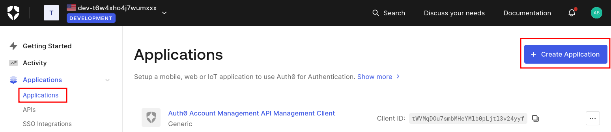
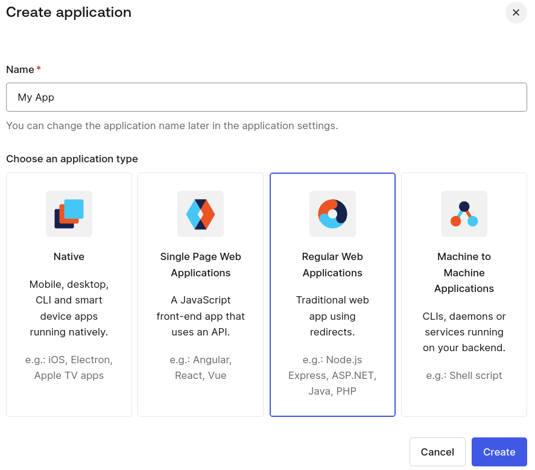
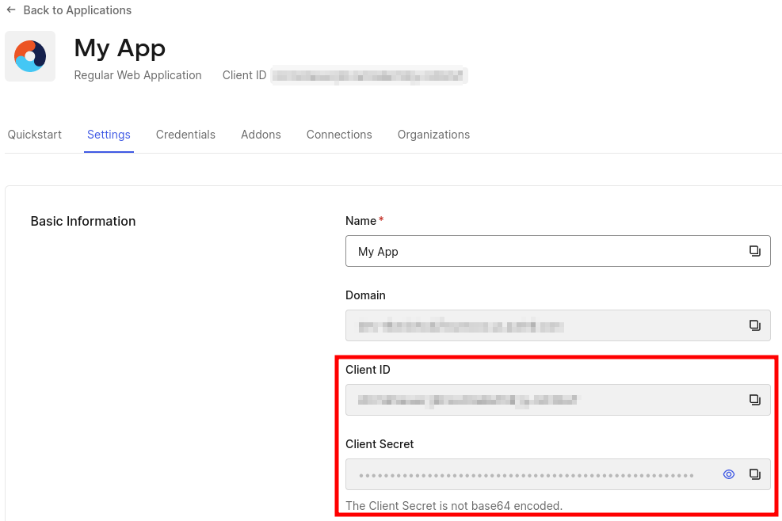
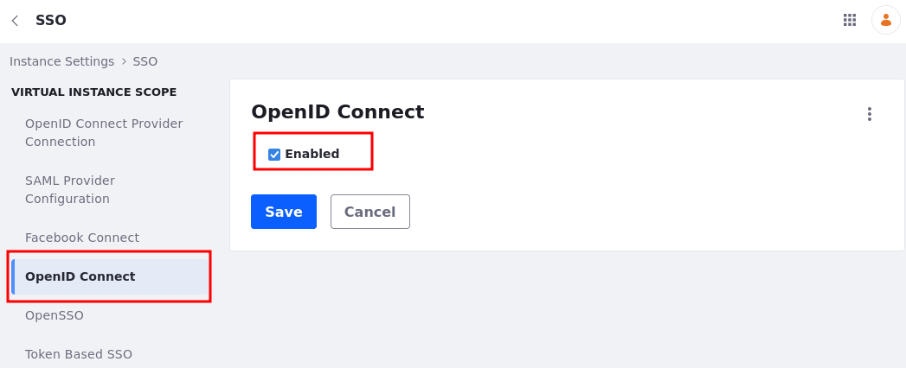
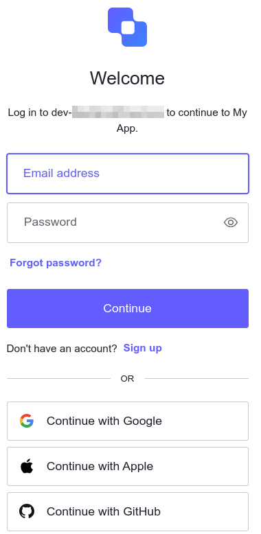

# Liferay SSO: Configuring Auth0 as an Identity Provider Via OpenID Connect

This tutorial guides you through integrating Auth0, your Identity Provider (IdP), with your Liferay environment using OpenID Connect. We endorse using an external authentication service, a best practice that simplifies user authentication while maintaining security. By integrating Auth0 with OpenID Connect, a trusted authentication protocol, employees can leverage Auth0's single sign-on feature to access applications seamlessly.

## Prerequisites
- [Auth0](https://auth0.com) account
- Liferay DXP environment
- A user who has administrative access to Auth0's dashboard
- A user who has administrative access to Liferay's Control Panel

## Auth0 Configuration

1. Log in to [Auth0](https://auth0.com/).

1. Open Auth0's dashboard

1. Select *Applications* from the side menu and create a new application.

    

1. Set a name of your choice, and choose *Regular Web Applications* for your application type.

    

1. Click *Create* to have your application ready.

1. The Client ID and Client Secret can be found in the Settings tab. You'll need them later on.

    

1. Scroll down to the Application URIs section to set the Allowed Callback URLs field, and enter `https://[your_liferay_environment]/c/portal/login/openidconnect`.

    

1. Access the Advanced Settings at the bottom of the page to edit any additional settings.

1. Click *Save Changes* to save your application settings.

1. With the Auth0 configuration complete, you can now configure your Auth0 application to Liferay DXP.

!!! note
    Create your users by navigating to User Management &rarr; Users.

## Configuring the OpenID Connect Provider Connection

Now that Auth0 is configured, use Liferay's interface to set up the provider connection. All configuration is done through the provider’s Well-Known Configuration Endpoint.

!!! note
    The Auth0’s Well-Known URI is `https://[your-default-tenant].us.auth0.com/.well-known/openid-configuration`. To find your default tenant, navigate to your profile and look for *Default Tenant*, or on the url before `/profile`.

1. On your DXP instance, navigate to *Global Menu* &rarr; *Control Panel* &rarr; *Instance Settings* &rarr; *Security* &rarr; *SSO*.

1. Go to *OpenID Connect Provider Connection* tab and add a new connection entry.

1. Fill out the fields with the requested data, as showed in the table below. These values you can find on the Well-known URL mentioned on the note above.

    | Field                        | Data                                                  |
    |:-----------------------------|:------------------------------------------------------|
    | Provider Name                | Auth0 OIDC                                            |
    | Scopes                       | `scopes_supported` url                                |
    | Authorization Endpoint       | `authorization_endpoint` url                          |
    | Issuer URL                   | `issuer` url                                          |
    | JWKS URI                     | `jwks_uri` url                                        |
    | ID Token Signing Algorithms  | `id_token_signing_alg_values_supported` url           |
    | Subject Types                | `subject_types_supported` url                         |
    | Token Endpoint               | `token_endpoint` url                                  |
    | User Information Endpoint    | `userinfo_endpoint` url                               |
    | OpenID Connect Client ID     | Under the *Settings* tab of your application in Auth0 |
    | OpenID Connect Client Secret | Under the *Settings* tab of your application in Auth0 |

Be sure to click *Save* to ensure your changes are preserved.

Once that is done, OpenID Connect needs to be enabled. To enable the OpenId Connect:

1. On your DXP instance, navigate to *Global Menu* &rarr; *Control Panel* &rarr; *Configuration* &rarr; *Instance Settings*.

1. Click on *SSO* under the security section.

1. Go to the *OpenID Connect* tab, click the *Enabled* checkbox and click *Save*.

## Validation

1. Start your Liferay DXP instance

1. Click on the *Sign In* button and choose *OpenId Connect*.

    

1. Choose *Auth0 OIDC* from the list and sign in with your Auth0 account.

    

1. Once you click Sign In, you'll be redirected to Auth0's log in page.

    

1. Type in the email address and password for your user. You have successfully logged in.

1. Sign back in with your Liferay administrator account. Navigate to *Control Panel* &rarr; *Users and Organizations*, and verify that the account came into Liferay.

## Conclusion

Congratulations! You have successfully completed this Solution Tutorial. By now, you should be able to integrate Auth0 with Liferay and authenticate users through it.

## Tips and Troubleshooting

### Callback URL mismatch

If you encounter an error like the image below, verify that your Allowed Callback URLs are configured correctly in Auth0 with the appropriate path and Hypertext Transfer Protocol (HTTP or HTTPS). You can find them in your Auth0 account by navigating to the application you created &rarr; *Settings* tab &rarr; *Application URIs* section.

