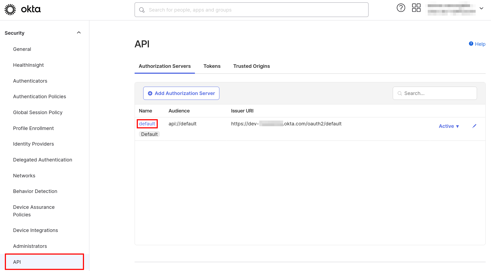
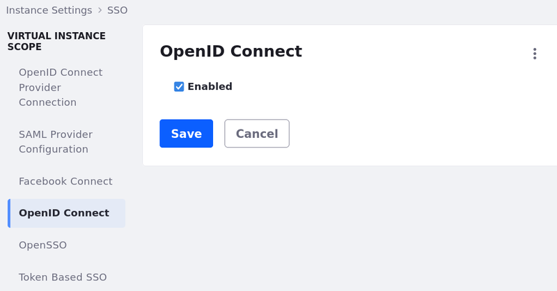
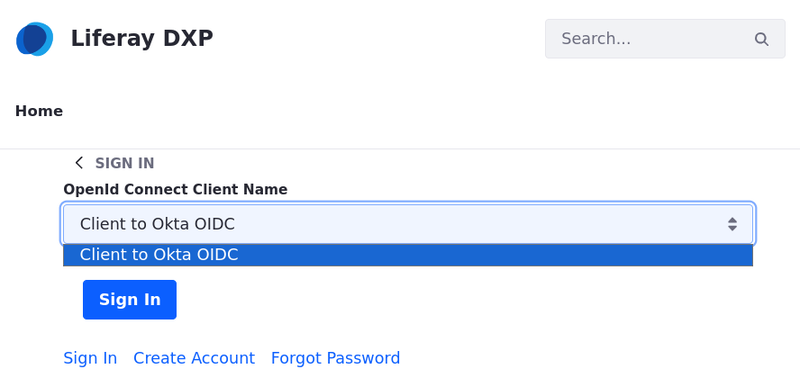

# Liferay SSO: Configuring Okta as an Identity Provider Via OpenID Connect

This tutorial guides you through the basic steps needed to integrate Okta, your Identity Provider (IdP), with your environment using OpenID Connect. Using an external authentication service is a best practice we endorse. Adding an IdP to your environment can address security concerns, streamline user management, and provide access control for a server that lacks its own robust authentication system.

## Prerequisites
- [Okta Dev](https://developer.okta.com/login/) account
- Admin access for Liferay control panel

## Okta Configuration

1. Log in to [Okta Dev](https://developer.okta.com/login/) and navigate to *Applications* &rarr; *Add Application* &rarr; *Create App Integration*.

1. Select *OIDC - OpenID Connect*, under Sign-in method, and *Web Application*, under Application type.

    

1. Enter *Liferay DXP - OIDC* as the app integration name.

1. For grant types, select *Authorization Code* and *Refresh Token*

1. Enter `https://[your_liferay_saas_environment]/c/portal/login/openidconnect` for the sign-in redirect URIs.

1. Enter `https://[your_liferay_saas_environment]` for the sign-out redirect URIs.

1. Under assignments, select *Skip group assignment for now*.

1. Click *Save*.

1. On the Assignments tab, assign users to this application.

    !!! note
        Make sure to assign yourself and provision your own user account so that you will still be able to log in as the Liferay administrator.

### Obtaining endpoint URLs

1. In your Okta Dev account, go to the side panel and navigate to *Security* &rarr; *API*.

1. Under the “Authorization Servers” tab, locate the server named `default` and click on it to edit its configuration.

    

1. Click on the "Metadata URI" link, which typically looks like this: https://dev-123456.okta.com/oauth2/default/.well-known/oauth-authorization-server

    ```json
        issuer: "https://dev-123456.okta.com/oauth2/default"
        authorization_endpoint: "https://dev-123456.okta.com/oauth2/default/v1/authorize"
        token_endpoint: "https://dev-123456.okta.com/oauth2/default/v1/token"
        registration_endpoint: "https://dev-123456.okta.com/oauth2/v1/clients"
        jwks_uri: "https://dev-123456.okta.com/oauth2/default/v1/keys"
    ```

1. This will give you the necessary URLs, with the exception of */userinfo* endpoint. You can construct that endpoint by combining your base URL with the Auth Server name. For example: *https://dev-123456.okta.com/oauth2/default/v1/userinfo*.

## Liferay OIDC Configuration

!!! note
    Your installation must have a [configured connection to a mail server](../../setting-up-liferay/configuring-mail.md) to send email notifications. Alternatively, you can disable the feature *Require strangers to verify their email address*. See [Tips and Troubleshooting](#verify-email-address) for more information.

1. On your DXP instance, navigate to *Global Menu* &rarr; *Control Panel* &rarr; *Instance Settings* &rarr; *Security* &rarr; *SSO*.

1. Go to *OpenID Connect Provider Connection* tab and add a new connection entry.

1. Fill in the fields with the data you find at the [endpoint URLs](#obtaining-endpoint-urls), as shown in the table below. You can find these values on the.

    | Field                        | Data                                                                   |
    |:-----------------------------|:-----------------------------------------------------------------------|
    | Provider Name                | Okta OIDC                                                              |
    | Scopes                       | `scopes_supported`                                                     |
    | Authorization Endpoint       | `authorization_endpoint` url                                           |
    | Issuer URL                   | `issuer` url                                                           |
    | JWKS URI                     | `jwks_uri` url                                                         |
    | Subject Types                | `subject_types_supported`                                              |
    | Token Endpoint               | `token_endpoint` url                                                   |
    | User Information Endpoint    | Follow step 4 from [obtaining endpoint URLs](#obtaining-endpoint-urls) |
    | OpenID Connect Client ID     | Under your application's *General* tab in Okta                         |
    | OpenID Connect Client Secret | Under your application's *General* tab in Okta                         |

Once that is done, OpenID Connect needs to be enabled. To enable the OpenId Connect:

1. Navigate to *Global Menu* &rarr; *Control Panel* &rarr; *Configuration* &rarr; *Instance Settings*.

1. Click on *SSO* under the security section.

1. Go to the *OpenID Connect* tab, click the *Enabled* checkbox and click *Save*.



## Validation

1. Start your Liferay DXP instance

1. Click on the *Sign In* button and choose *OpenId Connect*.

    

1. Choose *Client to Okta OIDC* from the list.

    

1. Sign in with your Okta account.

    

## Conclusion

Congratulations! You have successfully completed this Solution Tutorial. By now, you should be able to run Okta and authenticate users through it.

## Tips and Troubleshooting

### Sign-in and Sign-out Redirect URIs

If you encounter an error like the image below, verify that your sign-in and sign-out redirect URIs are configured correctly with the appropriate path and Hypertext Transfer Protocol (HTTP or HTTPS). These redirect URIs can be found by navigating to your application &rarr; General tab &rarr; General Setting &rarr; Login.


### Verify email address

By default, new users must verify their email address upon first login. To disable this requirement, deselect the "Require strangers to verify their email address" checkbox in Control Panel &rarr; Instance Settings &rarr; User Authentication. However, if you want to keep email validation enabled, a [configured connection to a mail server](../../setting-up-liferay/configuring-mail.md) is necessary for your installation.


