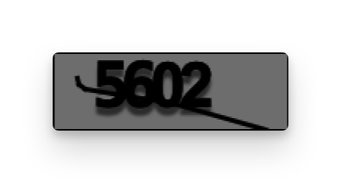

# Captcha API Basics

Liferay provides a headless API to retrieve and submit captchas using the [SimpleCAPTCHA](https://learn.liferay.com/w/dxp/installation-and-upgrades/securing-liferay/authentication-basics#configuring-captcha-or-recaptcha) engine. Using the `/captcha` endpoint from the [API Explorer](https://learn.liferay.com/dxp/latest/en/headless-delivery/consuming-apis/consuming-rest-services.html), you can add captchas in your custom implementations without using a tag library. There are two endpoints:

* `/GET` - Retrieve a Base64 encoded captcha image string and a JWT token for validation
* `/POST` - Send the answer of the captcha along with the JWT token for verification

## Getting a Captcha Challenge

```{include} /_snippets/run-liferay-dxp.md
```

Once Liferay is running,

1. Download and unzip [Captcha API Basics](./liferay-p6s7.zip).

   ```bash
   curl https://resources.learn.liferay.com/dxp/latest/en/installation-and-upgrades/securing-liferay/developer-guide/liferay-p6s7.zip -O
   ```

   ```bash
   unzip liferay-p6s7.zip
   ```

1. Use the cURL script to retrieve a captcha image string and a validation token. On the command line, navigate to the `curl` folder. Execute the `Captcha_GET_FromInstance.sh` script.

   ```bash
   ./Captcha_GET_FromInstance.sh
   ```

   The JSON response shows the captcha image string and the token:

   ```bash
   {
      "image" : "data:image/png;base64,iVBORw0KGgoAAAANSUhEUgAAAJYAAAAyCAIAAAAx7rVNAAALEklEQVR42u2c+VcTSRDHV7zAg+CqgIQYMCIQooRw6HohogEVwxlAQCUJEBCBcOgqHuyfvp+XevabNz0zTPJwNyGpH/Imma6emf5WfeuYhj/+KMsxkH/KUrRShrAMYVnKELqX7e3tdDq9v79fhu2/gDAajf6ZizQ1NemTfP369f79+5ytqKgwRu4TJ06cPXu2ubl5cnLy4ODA8gZ+/vyZTCYTiYTdAEvBPhYWFuLx+N7eXqlD2NLSklM+dfLkSdMMDx8+NCFnKQwzagFbfX09ABvxrqysbGhowIPt7nZwcPD8+fOmy/G1qqqqra3t+/fvZQhzhpAVd6nY19dnRALA7EZyamRkxHSfsVjMiLelnDp1amhoqLQghLvygFAxXmNjo3tFBWFra6ub8Z2dneo+Z2dnHSB3sJVjDiFIEIcCgUCuEMJX6L569Sonxd7eXrRGR0fdq4Ac97m5uclF3WsB9tLSUqlASBpCeqIvgYPAZp8/fwZFWMsSYFwTB3ry5ElXVxeTE97kVCQSQevMmTPuwUCX+yRk2kFl55qExpKAEBcEDBMZgtCgvbx48eLNmzeZTObZs2eWC0fO8ujRo4dZ4aC/v//p06c9PT0ej2dgYMDSca9cucIYzl66dEk/y+X0XIlfsI+RrODclsbEo5UEhGTkXq/XBOF9G3nw4AG+RXmwsbFB/WBastOnTzPmL034ESxfvnwpKahJC6d8/Pjxo6xwoINRW1urw3Pnzh2joeDf+pjXr1+XKISs6V82AhhAODEx8fHjR53BKP5kjIAt68sBXzkYHh5eXFzUQxocYLxEXV2d7nCmXzAy/d50fu7o6Mip0CxECL98+cJa5+GFYtqPNYEV4c/p6WlQ1EMg64giGD9//hy+hTP5jEajkCQ/4oVQoqU/CeQCNutuGV+NFgMni1mI73LA13Pnzpm0gsEgD1isEIIc5Rr2y2euEKJ19erVixcvsig1NTV+v7+7uxsAxsbGxsfH4/F4IpEgtpnWi3Kb1WTkzZs3UUeXwIZfkt9DaGSh0C8WoMODFmbxIivEWvDQxxAmMYV79+4BMHOGw2FsArd+nRUOGKAzMNP++PGjoBwxBwjxP+EfPsk5c4LQTq5du5ZOp8nvd3Z2wNV0ltB44cIFu7wRyJeXl0OhkE6SVOIzMzPSYMO/gUqnaCpX4FdkDmDY0/v377mf1dVV+BkP1q/LhN++fStWCI1Nk7m5uSOBUHofsViMdbHL8h2ErAQH1Secmpr68OHDp6yABxStx0ueBe8UCPFaKBp4sKSvWdnd3dVZFOOgNMSUixhCrFXGc3BUEIpAp3o66kZ0NyWJxZm4hx9ZAYx3795ZJqUqa5VgTEosHoZcv37dslABZuqKggqHuUGI88l4LJSnPUIIWXciZR4Q6gxJ6rSysoInCRg4DXzL/KZhBFe8XyIfMTWVSuGygo1l+sOFINuih5BoYTTJ9fV1lxDCY5WVlSyuw8sHh3YXeY1DXNRbAbCo8icO+KqXB3ghSEOzBD8GQKGiYtdrpVAh/yp6IuUhjREC09ZLXYGQB8ZsGRwIBGBdKIsyQHoxnZ2dOfXD2traSCwpKtDFPw5tTGMrUKJ0XBEOyKX1K2JkcCzOup8Vhjm0djEL+BavXVtbY3ARQyilxcjIiJGX8K1bt27xhNARRs0TAiGUy4oDHlm7yvqMHZlDX/Eo/wN+qdJEDg2ZzEyKa4QQRHUiJQEW5jz4JZQWdiTPU8CiZElq5qLvzkChxBK74ET15vP5bty4AbRU2Xfv3lUQqsZHJBJx86KHhNOIvSg6q+BwW1tbUr0JhJYvJZhZBT/EDj/yoN7eXukEkRZhnUVc2usouvQkoIKIiJ0Yfnt7O2RIbW7ZvtIFwPBvim7pWXMMkM7Ys+gmCPmqx+BgMKjwcPA/blWqRioTQqZkSceqRwp5EuH5ZHEJWpcvX3azW0JwdfO6juqbQMj8lOrwGNUbcDpfgpkzmYyCkAO80LKDQywEQjv8MFDhD5hcqkYpVI4bhLoQC5PJJJVWKBSCTj0ej/s345YQvn37Fo/HkwjDFHwkUIdOSKpphNCyj0ohCCThcNhyBhIxieIgDYXOz89zA4XWl/mNr3zhLoqn7e1tMvW/s0JlRkFCRCFA5vSunGLx9u3b0Wh0YWEBZ8K9SKYO1YJ1jUSqOhLGPguBzW4qcijVteHSs7OzWA8UKrlPSeydIS+F96Q5Ykz5lFtg0TnVFUZy0xV1p4TPjRlpTU2N3tOBli0JmbBtxI8HIQRSCxYmfr8LQoKi5AJkpFCfcRMfx/iinuILEi6L90MhRCjDBULLnQDcoV1xAoR4IXdSXV1Nak3iXVdXV19ffy0rBMUSgtBEXMDmnIbgOlT9do0b8sxcYyqXsyRt5iFDyS82t7S0lCiEbnqkQl/5dUpzksbGRiqcMoS2uYxDm9GBCbu6uqRrQx3tPt9BkZSS1JfCwH0xAzHmlFKZGgLHvKiQtrL+Ds9BSN8FP9mXRhIBKm7wAAbAA3VUBHvLEHu0EggECi2vOWIIeTxKCIpxApvlJj4TeeKvlF+CH1rUfGQf4EFNTRrpEPw4K4qyrYZPab+RfVhq8SNJSn5psAnCQmvQHD2Enz59WlxcJHMbHBwcGBjo6OigFvR6vYQf1h0SYxVke5Lql+JGspWUKj4Wixn3Q5DTooJBkEAyQ1NTE2Wiap0zkgtNTk5S4XEsc/LZ3t7u8/kaGhoIe9yA6q/y2dPTw1mmsrMPclGu0t3dzf0/MwgFxujoaCqVKu73hW4g3Nvbo2oeGhqS3YJq4xpLLG/JZVeZwo8BUj5TflFBU8IPDw8zzDgAXawBV5NXFup3rjI3N7e8vDw/P48RKC3ZiyY75NTuCnnnxbB4PD4xMcGEpF21tbV2rglRYzoEBVCXCblcAXa6f4sXUgsCg1o7hx2krCn4saZra2swMBX0+vr69PQ03CgdbeNg0z5gxoji7u4u2GMELLFJy6giXM0wYBgfHwdCNZJixu/3ezweuxhMwIZIwBJbkc7qcYYQnllaWoJzJDcRXxTPU3s7xUVgKoIfi4L/oSXdHIAElZmZGZYbt1Nea9Tld84yZnV1Vf4SA+yZBCqmopcXGg9+idAAN8O1cHEmx2uBUN2eUYAzGAxSwqu/2dDjN34Je2cymWObke7v729tbREOcRGA5GnxSFzteVY4kB29Y2NjOARgsxaq/SjtN1DEq/AVCXL4ltJlKn6BBjnLGEZKLxR1UNzY2OC6U1NTjOEqKDIeULkNPJswxrWAfHNzEyxBMeYoYEwchWntKhACKlGZ+P3//g3p0UPIaoIibMNKicknEglWnEdl4ThIJpMrKys4DQsKBqqZqc8ASKiDiujyyVTo8jtnGaPye9GinoHGAZIxjESRT6yE28CqAI8BQA7YXJpJPrgTZsPmSMH0XqtyTUp+jIZHPiZvKmRBwYYlY71YO1Z2NyvkAnzF7WQ1LWssNYOoW+oqr9UNiLOMkYvyyQxqa4yamUt/z0sAHqgAzK4GJXPu6+sjybLb4VccDTYjErJkJlGn8lA/VNekZTn+IF8x9uthBWKnXa+OspjyCTJ3/hOUgoawdETeYra2ttrVJzAw2Syx/3f8x5UyhEcp8DMFFWmw5d8vSq3Z3NxMakZ4LkNY6LKzs0NaS4liV59UV1dHIhFSZaJ1GcKCFuIxiTE1KOWmZVevoqLC7/dTJafT6Ty6r2UI/1MhqaYgDoVCVVVVdh3acDhMaUu5VYaw0F0zlUr19/d7vV471/T5fJZ/tWINYVmKWv4FXsR0G12tQS0AAAAASUVORK5CYII=",
      "token" : "BnDK5SupcZFFKqlBiswtjHv0tw6ptDYoICH8Y/wccQAwmJzS+pvjBxSiPkDaEwnDcuvHCWuHb4slvrdSZVy3W5N2EDNbDRjljs9ksftAkp8s3Fa6bKYiu4hYsCCCCwJA"
   }
   ```

1. Copy the value of the image field without the `data:image/png;base64,` prefix and run the following command:

   ```bash
   echo <COPIED_IMAGE_STRING> | base64 -d > captcha.png
   ```

   This saves the captcha image in the current directory with the filename `captcha.png`. Open the file to view the captcha.

   

1. From the previous JSON response, copy the value of the `token` field. You'll use this token to validate the captcha through the `/POST` endpoint.

1. Alternatively, call the REST service using the Java client. Navigate into the `java` folder and compile the source files:

   ```bash
   javac -classpath .:* *.java
   ```

1. Run the `Captcha_GET_FromInstance` class.

   ```bash
   java -classpath .:* Captcha_GET_FromInstance
   ```

## Examine the cURL Command

The `Captcha_GET_FromInstance.sh` script calls the REST service with a cURL command.

```{literalinclude} ./captcha-api-basics/resources/liferay-p6s7.zip/curl/captcha-api-basics.sh
    :language: bash
```

Here are the command's arguments:

| Arguments                                                  | Description                             |
| :--------------------------------------------------------- | :-------------------------------------- |
| `"http://localhost:8080/o/captcha/v1.0/captcha/challenge"` | Specify the REST service endpoint.      |
| `--user "test@liferay.com:learn"`                          | Enter basic authentication credentials. |

!!! note
    Basic authentication is used here for demonstration purposes. For production, you should authorize users via [OAuth2](https://learn.liferay.com/dxp/latest/en/headless-delivery/using-oauth2.html). See [Using OAuth2 to Authorize Users](https://learn.liferay.com/dxp/latest/en/headless-delivery/using-oauth2/using-oauth2-to-authorize-users.html) for a sample React application using OAuth2.

## Examine the Java Class

The `Captcha_GET_FromInstance.java` class retrieves a captcha string and token by calling the `CaptchaResource` service.

```{literalinclude} ./captcha-api-basics/resources/liferay-p6s7.zip/java/Captcha_GET_FromInstance.java
   :dedent: 1
   :language: java
   :lines: 13-39
```

This class invokes the REST service using only three lines of code:

| Line (abbreviated)                                                       | Description                                                                 |
| :----------------------------------------------------------------------- | :-------------------------------------------------------------------------- |
| `CaptchaResource.Builder builder = ...`                                  | Get a `Builder` for generating a `CaptchaResource` service instance.        |
| `CaptchaResource captchaResource = builder.authentication(...).build();` | Use basic authentication and generate a `CaptchaResource` service instance. |
| `captchaResource.getCaptchaChallenge();`                                 | Call the `captchaResource.getCaptchaChallenge` method.                      |

After retrieving the response, the token is displayed, and the `Base64` class is used to decode the image string into bytes. This gets saved as an image in the same directory. 

Note that the project includes the `com.liferay.captcha.rest.client.jar` file as a dependency. You can find client JAR dependency information for all REST applications in the API explorer in your installation at `/o/api` (e.g., <http://localhost:8080/o/api>).

!!! note
    The `main` method's comment demonstrates running the class.

!!! important
    See [CaptchaResource](https://github.com/liferay/liferay-portal/blob/[$LIFERAY_LEARN_PORTAL_GIT_TAG$]/modules/apps/captcha/captcha-rest-client/src/main/java/com/liferay/captcha/rest/client/resource/v1_0/CaptchaResource.java) for service details.

## Post Captcha Response

After retrieving the captcha image, you can use the `/POST` endpoint to submit your answer and token with a cURL or Java command. Replace `abcd` with your answer and `efgh` with your token.

### Examine the `Captcha_POST_ToInstance` cURL Command

Command:

```bash
./Captcha_POST_ToInstance.sh abcd efgh
```

Code:

```{literalinclude} ./captcha-api-basics/resources/liferay-p6s7.zip/curl/Captcha_POST_ToInstance.sh
   :language: bash
```

The `Captcha_POST_ToInstance.sh` script calls the REST service with a cURL command.

Here are the command's arguments:

| Arguments                                                 | Description                                              |
| :-------------------------------------------------------- | :------------------------------------------------------- |
| `"http://localhost:8080/o/captcha/v1.0/captcha/response"` | Specify the REST service endpoint.                       |
| `--data-raw '{ "answer": "'${1}'", "token": "'${2}'"}'`   | Enter the data to post.                                  |
| `--header "Content-Type: application/json"`               | Set the request body format to JSON.                     |
| `--request "POST"`                                        | Set the HTTP method to invoke at the specified endpoint. |
| `--user "test@liferay.com:learn"`                         | Enter basic authentication credentials.                  |

The API returns returns a 204 if the answer is valid. The JWT token has a `nonce` tracked by the `/POST` endpoint. You cannot reuse the same token if you've already sent the wrong answer.

### Examine the `Captcha_POST_ToInstance` class  

Command:

```bash
java -classpath .:*  -Danswer=abcd -Dtoken=efgh Captcha_POST_ToInstance
```

Code:

```{literalinclude} ./captcha-api-basics/resources/liferay-p6s7.zip/java/Captcha_POST_ToInstance.java
   :dedent: 1
   :language: java
   :lines: 9-23
```

The `Captcha_POST_ToInstance.java` class sends the captcha answer along with a token by calling the `CaptchaResource` service.

This class invokes the REST service using only three lines of code:

| Line (abbreviated)                                                       | Description                                                                 |
| :----------------------------------------------------------------------- | :-------------------------------------------------------------------------- |
| `CaptchaResource.Builder builder = ...`                                  | Get a `Builder` for generating a `CaptchaResource` service instance.        |
| `CaptchaResource captchaResource = builder.authentication(...).build();` | Use basic authentication and generate a `CaptchaResource` service instance. |
| `captchaResource.postCaptchaResponse(...);`                              | Call the `captchaResource.postCaptchaResponse` method.                      |

The `postCaptchaResponse()` method accepts an instance of the [`Captcha`](https://github.com/liferay/liferay-portal/blob/[$LIFERAY_LEARN_PORTAL_GIT_TAG$]/modules/apps/captcha/captcha-rest-api/src/main/java/com/liferay/captcha/rest/dto/v1_0/Captcha.java) class with the captcha answer and the JWT token. The API returns a 204 if the answer is valid. The JWT token has a `nonce` tracked by the `/POST` endpoint. You cannot reuse the same token if you've already sent the wrong answer.

### Sending an Incorrect Captcha or Using an Invalid/Expired Token

If you send an incorrect captcha answer with the correct token, you receive the following response:

```bash
{
  "status" : "BAD_REQUEST",
  "title" : "Answer is invalid",
  "type" : "CaptchaTextException"
}
```

If you send the right answer with the same token that was already used, you receive the following response:

```bash
{
  "status" : "BAD_REQUEST",
  "title" : "Token: BnDK5SupcZFFKqlBiswtjHv0tw6ptDYoICH8Y/wccQAwmJzS+pvjBxSiPkDaEwnDcuvHCWuHb4slvrdSZVy3W5N2EDNbDRjljs9ksftAkp8s3Fa6bKYiu4hYsCCCCwJA",
  "type" : "IllegalArgumentException"
}
```

You get the same response for trying to use a token that's expired.

The [API Explorer](https://learn.liferay.com/dxp/latest/en/headless-delivery/consuming-apis/consuming-rest-services.html) shows the `Captcha` services and schemas and has an interface to test each service.
